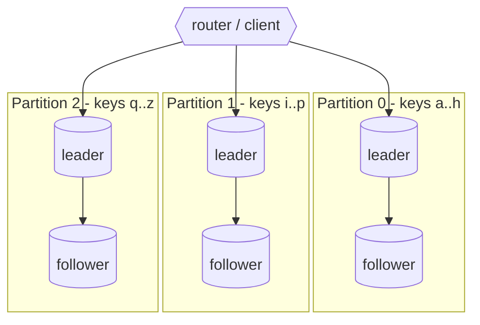
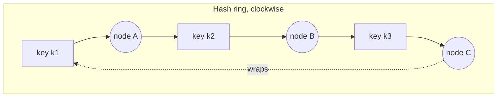

# Day 5 — Partitioning / sharding & consistent hashing

*After today you can choose a partitioning scheme for a key space, predict how
much data moves when you add a node, and spot the hot-partition failure before it
takes down a shard.*

## The core problem

Replication (Day 4) gives you many *copies of all* the data — it scales reads and
survives node loss, but every node still holds the **whole** dataset and every
write still hits the leader. When the dataset no longer fits on one node, or the
write rate saturates one leader, copies don't help. You must **partition**
(**shard**): split the data so each node holds a *disjoint subset*.

That immediately raises two questions that define the whole topic:

1. **Routing:** given a key, which node holds it? (Cheap, deterministic, no lookup.)
2. **Rebalancing:** when you add or remove a node, how much data must **move**,
   and can you keep serving while it moves?

Partitioning and replication are **orthogonal and almost always combined**: each
partition is itself replicated (a leader + followers, or a quorum set), so you
get scale *and* durability. Get the two straight in your head:

## Key concepts

### Partition strategies

| Strategy | Route by | Rebalancing cost | Range queries | Hot-spot risk |
|----------|----------|------------------|---------------|---------------|
| **Range** | key falls in `[lo, hi)` | move a range | **cheap** (scan contiguous) | **high** — sequential keys (timestamps, auto-inc IDs) all hit the newest partition |
| **Hash (modulo N)** | `hash(key) % N` | **catastrophic** — ~all keys move when N changes | impossible (scatter to all) | low if hash is good |
| **Consistent hashing** | position on a hash ring | **~K/N keys move** per node change | impossible | low with virtual nodes |
| **Fixed partition count** | `hash(key) % P`, P fixed & large | move *whole partitions* between nodes | impossible | low; even, predictable |
| **Directory / lookup** | explicit key→node map | move anything, update the map | depends | low; full control, but the map is a dependency |

### Why `hash(key) % N` is a trap

Modulo is the obvious first idea and the classic mistake. With `N=2`, key `k`
lives on `hash(k) % 2`. Add a node → `N=3` → **almost every key's `hash(k) % 3`
differs from its `hash(k) % 2`**. Concretely, going 2→3 nodes moves **~2/3 of all
keys** (you keep only the fraction that happens to map the same under both mods).
For a sharded cache this is a mass miss storm; for a sharded database it's a
full-cluster data reshuffle while you're trying to *add* capacity — the worst
possible time.

### Consistent hashing

Map both **nodes** and **keys** onto the same fixed circular hash space (say
`0 .. 2^32-1`). A key belongs to the **first node found walking clockwise** from
the key's position. Add a node → it only steals the keys in the arc between it and
its predecessor; **everything else stays put.** Adding the Nth node moves
**~1/N of the keys** (≈ 1/3 going 2→3, versus 2/3 with modulo).

**Problem:** with few nodes, arcs are uneven → skewed load. **Fix: virtual
nodes.** Place each physical node at *many* points on the ring (e.g. 100–200
"vnodes" each). Now load evens out (law of large numbers), and removing a node
spreads its keys across *all* survivors instead of dumping them on one neighbor.
Virtual nodes are how Dynamo, Cassandra, and Riak actually do it.

### The alternative most big systems actually use: a fixed number of partitions

Instead of hashing onto a continuous ring, pick a **large fixed partition count P**
up front (e.g. 256 or 1024), far more than nodes. Key → `hash(key) % P` picks a
*partition*; a separate mapping assigns partitions to nodes. Adding a node just
**reassigns whole partitions** to it — no key ever changes partition, so
rebalancing is "move partition 47 from node 1 to node 4," a bulk, resumable
operation. This is **Kafka topic partitions**, **Elasticsearch shards**, and
Dynamo/Cassandra token ranges. Downside: you must pick P large enough for your
maximum future node count and live with it (repartitioning is painful).

### Routing tiers

Who computes "key → node"?
- **Client-side (partition-aware client):** the client library knows the map and
  connects directly. Lowest latency, no proxy hop. Kafka clients, Cassandra
  drivers, Redis Cluster clients. The client must learn topology changes.
- **Routing proxy / coordinator:** a thin tier (or any node) forwards to the
  owner. Simpler clients; one extra hop; the proxy must not become the shared
  fate you were trying to escape (Day 10).
- **Gossip + consistent hashing (Uber Ringpop):** nodes gossip membership; any
  node can route; no central router. Great for stateless work distribution.

### Secondary indexes across partitions

Partitioning by primary key breaks queries on *other* attributes.
- **Local (document-partitioned) index:** each partition indexes its own rows →
  a query on a secondary field must **scatter-gather** across all partitions.
- **Global (term-partitioned) index:** the index itself is partitioned by the
  indexed term → a single-partition read, but writes now touch two partitions.
Naming this tradeoff is often the whole answer to "why is this query slow."

## The decision / tradeoffs

Design brief: shard the shortener's `short_code → long_url` key space.

- Access pattern is **point lookup by `short_code`** (a random-ish base62
  string) — no range scans on the code. So **range partitioning buys nothing**
  and risks a hot newest-partition if codes are sequential.
- You will add capacity over time → **rebalancing cost dominates the choice**.

| Option | Routing | Move on 2→3 nodes | Range queries | Verdict for shortener |
|--------|---------|-------------------|---------------|-----------------------|
| Modulo-N | `hash%N` | **~2/3** | no | rejected — reshard pain |
| Consistent hash (+vnodes) | ring walk | **~1/3**, spread evenly | no | good — cheap growth, even load |
| Fixed partitions (P=256) | `hash%P` → node map | move whole partitions | no | best at real scale — operable rebalancing |
| Range | `[lo,hi)` | move a range | yes (unused here) | rejected — no range need, hot-spot risk |

**Decision:** consistent hashing with virtual nodes for a hand-rolled client, or
a fixed-partition scheme if using a system that offers it — *because the dominant
cost is rebalancing when we add nodes, and both bound key movement to ~1/N while
modulo reshuffles ~2/3.*

## When NOT this

- **Don't shard before a single node is saturated.** Sharding adds cross-shard
  query pain, cross-shard transactions you can't do atomically, rebalancing risk,
  and operational surface. **Alternatives that win first:** vertical scaling (a
  bigger box buys a surprising amount of runway), read replicas (Day 4) for
  read-bound load, and caching (Day 6) for hot reads. Shard only when the *write*
  rate or the *dataset size* actually exceeds one node — and you can prove it.
- **Don't range-partition a write key that only ever increases** (timestamps,
  auto-increment IDs, monotonic UUIDv1). Every write lands on the newest
  partition → one hot shard while the rest idle. **Alternative that wins:**
  hash/consistent partitioning, or a compound key that mixes a high-cardinality
  prefix in (e.g. `(bucket, timestamp)`).
- **Don't reach for a custom consistent-hash ring if your datastore already
  partitions for you.** DynamoDB, Cassandra, Kafka, Vitess, Citus do this well.
  Hand-rolled sharding is a last resort, not a default.

## Real-world

- **Discord message store.** Partitions messages by **`(channel_id, bucket)`**
  where `bucket` is a coarse time window, on Cassandra→ScyllaDB. The channel_id
  spreads load across partitions (high cardinality), and the time bucket keeps a
  channel's recent messages together for the "load latest N" query while capping
  any single partition's size. **Lesson:** choose a partition key that both
  *spreads load* and *matches your dominant query* — and add a bucketing
  dimension so no single partition grows unbounded.
- **Uber Ringpop.** A library that shards *stateless* work across a fleet using
  **consistent hashing + a SWIM gossip protocol** for membership. Any node can
  route a request to the owner; membership changes propagate via gossip, moving
  only the affected arc. **Lesson:** consistent hashing isn't just for databases —
  it's how you assign *work* (which node owns this trip, this connection) with
  minimal reshuffling as the fleet scales and nodes die.
- **Kafka partitions** (your stack). A topic's partition count is the fixed-P
  scheme: producer `hash(key) % partitions` picks the partition, and ordering is
  guaranteed *within* a partition only. **Lesson:** the partition key is a design
  decision that determines both parallelism *and* ordering — and you can't
  increase partitions later without breaking key→partition stability.

## Common mistakes / gotchas

1. **`hash(key) % N` in production.** Fine until you add a node and reshuffle
   ~2/3 of the data at the worst moment. Use consistent hashing or fixed
   partitions.
2. **Low-cardinality partition key.** Partitioning users by `country` → one giant
   partition for your biggest market. The key must have enough distinct,
   evenly-distributed values.
3. **The celebrity / hot key.** Even perfect hashing can't split a *single* hot
   key — all its traffic goes to one partition. Needs app-level help: split the
   key (`user123#shard{0..9}`), cache it, or give it a dedicated partition.
4. **Assuming you can repartition later cheaply.** Kafka partition count,
   DynamoDB's historical constraints, a chosen P — these are sticky. Pick with
   your *future* node count in mind.
5. **Cross-shard transactions/joins.** A query spanning shards needs
   scatter-gather (slow, tail-latency-bound) or a distributed transaction
   (complex). Model to keep a request on **one** shard where possible.
6. **No rebalancing/observability plan.** You need to *see* per-shard load and
   size, and a runbook for adding/draining a node, before you shard — not after a
   shard falls over.

## Practice

### Exercise 1 — Predict the key movement

You shard 1,000,000 keys with `hash(key) % 2`. You add a third node. Under
**modulo**, roughly what fraction of keys change node? Under **consistent
hashing** (many vnodes), roughly what fraction move, and *where do they move
from*?

Hint 1
Modulo: a key stays only if `hash%2 == hash%3`. Consistent hashing: the new node steals arcs from existing nodes.

Hint 2
Adding the Nth node in consistent hashing should take ~1/N of the keys.

Solution sketch

- **Modulo:** ~**2/3** of keys move (~667k). A key keeps its node only when
  `hash%2` and `hash%3` coincide, which is the minority. This is why the lab
  measures ≈0.66.
- **Consistent hashing:** ~**1/3** move (~333k) — the new (3rd) node takes ~1/3
  of the ring, and those keys come **only from the two existing nodes' arcs**;
  no key moves *between* the two old nodes. With enough vnodes the 1/3 is drawn
  roughly evenly from both, so neither surviving node is overloaded during the
  move. That ~2× reduction (2/3 → 1/3) is the entire point of consistent hashing.

### Exercise 2 — Design the partition key (from the lab / Discord)

You must store 500M chat messages/day, queried almost always as "the latest 50
messages in channel X." Propose a partition key. Then explain what breaks if you
partition by `message_id` alone, and separately by `channel_id` alone.

Hint
You need load spread AND the query to hit one partition AND no partition growing forever.

Solution sketch

Partition by **`(channel_id, time_bucket)`** (bucket = e.g. day or week). Then
"latest 50 in channel X" reads the current bucket's partition for X — a single
partition, sorted by time. Load spreads across channels (high cardinality).
- **`message_id` alone:** perfectly spread, but "latest 50 in channel X" must
  scatter-gather across *every* partition — unusable at this scale.
- **`channel_id` alone:** query is single-partition, but a busy channel's
  partition grows without bound (unbounded partition = eventual hot/huge
  partition). The time bucket caps partition size and enables cheap aging-out.

### Exercise 3 — The hot partition (red-team)

Your consistent-hash ring is perfectly balanced, but one `short_code` goes viral
and takes 60% of all read traffic. Which shard suffers, why can't the ring fix it,
and name two mitigations with their downsides.

Hint
Hashing distributes *keys*, not *requests to a single key*.

Solution sketch

All 60% lands on the **one shard** that owns that key — consistent hashing spreads
distinct keys evenly but a single key is indivisible on the ring, so a celebrity
key sinks its shard. Mitigations:
- **Cache the hot key** (Day 6) in front of the shard — absorbs reads, but adds
  invalidation/staleness concerns and doesn't help hot *writes*.
- **Key splitting / fan-out** — store the value under `code#0..code#k` replicas
  and read a random one — spreads read load, but you now must keep k copies
  consistent on write (write amplification) and it only helps read-hot keys.
- (Reads-only extra: serve it from replicas of that shard — Day 4.) The general
  lesson: hot-key problems are solved *above* the partitioner, not by it.

### Exercise 4 — When NOT to shard

A service has a 200 GB Postgres doing 800 writes/s and 6,000 reads/s at p99
30 ms, on a box that's 40% CPU. Product wants "web-scale, shard it now." Make the
architect's counter-argument and the sequence you'd actually follow.

Hint
Is any single-node resource actually saturated? What cheaper scaling levers come first?

Solution sketch

Nothing is saturated: 40% CPU, modest write rate, 200 GB fits comfortably on one
node. Sharding now buys **negative** value — cross-shard query pain and
rebalancing risk for no capacity you need. Sequence: (1) **read replicas** (Day 4)
for the 6k reads/s; (2) **cache** the hot reads (Day 6); (3) **vertical scale** the
primary when writes climb; (4) monitor for the *actual* saturation signal (write
throughput ceiling, dataset outgrowing the largest box, or per-tenant isolation
needs); (5) **then** shard, choosing consistent hashing / fixed partitions. Shard
in response to a proven limit, never a slogan.

## Go deeper (offline-friendly)

- **DDIA (Kleppmann), Ch. 6 "Partitioning"** — range vs hash partitioning, skew &
  hot spots, rebalancing strategies (why *not* `hash mod N`, fixed partitions,
  dynamic partitioning), and secondary-index partitioning (local vs global).
- **Karger et al., "Consistent Hashing and Random Trees" (1997)** — the original
  consistent-hashing paper (born for web caching).
- **Discord engineering, "How Discord Stores Billions of Messages"** (and the
  ScyllaDB migration follow-up) — the `(channel_id, bucket)` partition key story.
- **Uber engineering, "Ringpop"** — consistent hashing + SWIM gossip for sharding
  stateless work.
- **Amazon Dynamo paper (2007)** — consistent hashing with virtual nodes in a
  real datastore.
- **Alex Xu, *System Design Interview* Vol. 1** — the consistent-hashing chapter
  (clean diagrams for interview framing).
- **Kafka docs** — topic partitions, keyed partitioning, and why you can't shrink
  partition count.

## Check yourself

- Why does `hash % N` move ~2/3 of keys going 2→3, while consistent hashing moves
  ~1/3? Where do the moved keys come from in each case?
- What are virtual nodes for, and what breaks without them?
- Give a partition key for a chat app and justify all three properties (spread,
  single-partition query, bounded size).
- Why can't a good hash function fix a celebrity/hot key? Name two mitigations.
- When would you NOT shard? What are the three cheaper levers you try first?
- Fixed-partition (P=256) vs consistent-hash ring — when does each win?
