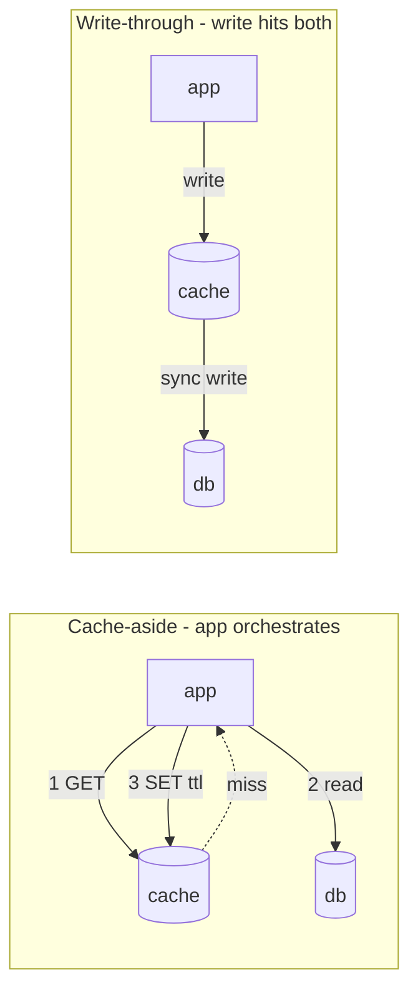

# Day 6 — Caching strategies

*After today you can pick a caching pattern per data type, predict the hit-ratio
and latency win, and design against the stampede/penetration/avalanche failures
that turn a cache from a shield into a load amplifier.*

## The core problem

Reads dominate most systems (the shortener is 10:1 read:write), and the durable
store is your slowest, most expensive tier — a Postgres point lookup is ~1 ms
warm, an aggregation far more, and it doesn't scale for free. A **cache** keeps a
copy of hot data in a fast tier (memory, ~100 μs over the network to Redis; ~100
ns in-process) close to compute, so the common read never touches the database.

The mental model: **a cache trades freshness and a new failure surface for
latency and load relief.** The instant you copy data, the copy can be stale, and
you own an invalidation problem. Phil Karlton's line — *"There are only two hard
things in Computer Science: cache invalidation and naming things"* — is about
exactly this. The architecture work is not "add Redis"; it's choosing **what to
cache, how it's written, how it's invalidated, and how it fails under load.**

## Key concepts

### Where the cache lives

| Placement | Latency | Scope | Use |
|-----------|---------|-------|-----|
| **Client / browser** | ~0 | one user | static assets, `Cache-Control` |
| **CDN / edge** | ~10–50 ms to user | global | static + cacheable GETs near the user |
| **In-process (local)** | ~100 ns | one instance | tiny, ultra-hot data; risk: N copies, N invalidations |
| **Distributed (Redis/memcached)** | ~0.1–1 ms | all instances | the shared application cache — the default |

### The four write/read patterns



- **Cache-aside (lazy loading):** the app checks the cache; on a **miss** it reads
  the DB and populates the cache with a TTL. **The default.** Only requested data
  is cached; cache and DB are decoupled (cache down ≠ writes down). Downsides:
  first read is always a miss (cold-start latency), and data can be stale until
  the TTL expires or you explicitly invalidate.
- **Read-through:** same read behavior, but the *cache library* loads from the DB
  on a miss, not the app. Cleaner app code; couples you to the cache provider.
- **Write-through:** every write goes through the cache, which synchronously
  writes the DB. Cache is always fresh; write latency = cache + DB. Wasteful if
  written data is rarely read.
- **Write-back (write-behind):** write to cache, ack immediately, flush to DB
  asynchronously. Lowest write latency and absorbs write bursts, but a cache node
  loss **loses un-flushed writes** — only for tolerant data (counters, metrics).
- **Refresh-ahead:** proactively refresh hot keys *before* they expire, so users
  never pay the miss. Great for predictable hot keys; wasteful for cold ones.

### The numbers that justify a cache

Effective read latency with hit ratio **h**, cache latency **Cₗ**, db latency **Dₗ**:

```
effective = h · Cₗ + (1 − h) · Dₗ
```

With Cₗ = 0.2 ms, Dₗ = 5 ms: at **h = 0.9** → 0.68 ms (7× faster); at **h = 0.99**
→ 0.25 ms. **Hit ratio is everything** — the last few percent of misses dominate
the tail. And it relieves the DB: at h = 0.9 the DB sees **10%** of read traffic.

Sizing: cache the **working set** ≈ the hot fraction (Pareto ~20%) of data, not
all of it (see `reference/estimation-cheatsheet.md`). Eviction policy (**LRU**,
**LFU**, TTL) governs what stays when memory is full.

### TTL vs explicit invalidation

- **TTL:** data self-expires after N seconds. Simple, self-healing, bounds
  staleness — but you're *always* stale up to the TTL, and mass-synchronized TTLs
  cause avalanches (below).
- **Explicit invalidation:** on a write, delete/update the key. Fresh
  immediately, but you must find *every* place the data is cached (hard — the
  invalidation problem), and a missed invalidation means a stale key until… never.
- **Common hybrid:** explicit invalidation on write **+** a modest TTL as a
  safety net for the invalidations you miss.

### The four cache failure modes (this is the senior content)

1. **Cache stampede / thundering herd.** A hot key expires (or is evicted); the
   next instant, hundreds of concurrent requests all miss and all hit the DB for
   the *same* key. The DB load spikes N-fold exactly when the key is hottest.
   **Fixes:** **request coalescing / singleflight** (only one request recomputes,
   the rest wait and share the result); **leases** (Facebook memcache: one
   requester gets a token to recompute, others serve slightly stale or wait);
   **stale-while-revalidate** (serve the old value while one refresh runs);
   **jittered / staggered TTLs**.
2. **Cache penetration.** Requests for keys that **don't exist** (bad IDs, an
   attack) always miss the cache and always hit the DB. **Fix:** **negative
   caching** (cache the "not found" with a short TTL) and/or a bloom filter to
   reject known-absent keys before the DB.
3. **Cache avalanche.** A large set of keys expires **at the same time** (e.g.
   everything warmed at deploy with the same TTL), or the cache tier itself
   restarts empty — the DB gets the entire read load at once and falls over.
   **Fixes:** **randomize/jitter TTLs**, warm the cache gradually, and put a
   breaker/limiter (Days 7, 9) in front of the DB.
4. **Hot key.** One key so popular it saturates a single cache node/shard (ties to
   Day 5's celebrity key). **Fixes:** replicate the key across nodes, use a local
   in-process cache in front of the distributed one, or split the key.

## The decision / tradeoffs

Design brief: add caching to the shortener's redirect path.

Choose a pattern **per data type**, not one for the whole system:

| Data | Pattern | TTL / invalidation | Why |
|------|---------|--------------------|-----|
| `short_code → long_url` mapping | **cache-aside** | long TTL (hours) + explicit invalidation on edit/delete | read-mostly, rarely changes, huge hit-ratio win on redirects |
| click counts | **write-back** (batch increments, flush periodically) | flush every N s | write-heavy, tolerant of small loss/lag; write-through would hammer the DB |
| "does this code exist?" negative results | **negative caching** | short TTL (seconds) | stops penetration from bad/expired codes |

| Pattern | Read latency | Write latency | Freshness | Failure exposure |
|---------|--------------|---------------|-----------|------------------|
| Cache-aside | fast on hit, slow on miss | unchanged | stale up to TTL | stampede on hot-key expiry |
| Write-through | fast | slow (cache+DB) | always fresh | cache write on critical path |
| Write-back | fast | fastest | fresh in cache, lags DB | data loss on cache node loss |

**Decision:** cache-aside + long TTL + explicit invalidation for the URL mapping —
*because redirects are read-mostly and the mapping rarely changes, so cache-aside
captures ~99% hit ratio with the simplest failure surface* — and add singleflight
so a hot key's expiry can't stampede the DB.

## When NOT this

- **Don't cache write-heavy or strongly-consistent data with a read-through/aside
  cache.** If data changes as often as it's read, you pay invalidation cost and
  ship staleness bugs for little hit-ratio gain. **Alternative that wins:** read
  from the primary (or a replica, Day 4) directly; use write-back *only* if the
  data tolerates loss/lag (counters).
- **Don't cache data that must be exact right now** (a bank balance at the moment
  of a transfer, remaining inventory in a flash sale decrement). A stale cached
  value here is a correctness bug, not a latency optimization. **Alternative that
  wins:** strong read from the source of truth for that specific operation.
- **Don't add a distributed cache when a single node isn't read-saturated and the
  data is tiny/hot.** An in-process map (with careful invalidation) or just the DB
  may be simpler. **Alternative that wins:** vertical scale + replicas until the
  read pressure or the DB cost actually justifies the cache's operational weight.

## Real-world

- **Facebook, "Scaling Memcache at Facebook" (NSDI 2013).** memcached as a
  massive look-aside (cache-aside) tier. The famous contributions: **leases** to
  kill the thundering herd (on a miss, memcache hands exactly one client a lease
  token to recompute the value; concurrent clients wait or serve stale, so the DB
  sees *one* query, not thousands) and to prevent stale sets; **regional pools**
  and **cold-cluster warmup** to survive avalanches; and treating **invalidation
  as the hard, first-class problem** (invalidations ride the DB's replication
  stream). **Lesson:** at scale the cache's *failure modes* — herds, staleness,
  cold starts — are the actual engineering, not the cache hit itself.

## Common mistakes / gotchas

1. **No stampede protection on hot keys.** The single most common cache outage:
   a hot key expires and the herd melts the DB. Add singleflight/leases before you
   go to prod, not after the incident.
2. **Uniform TTLs → avalanche.** Warming 100k keys at deploy with `TTL=3600`
   means they all expire in the same second an hour later. **Jitter the TTL**
   (`3600 ± rand(600)`).
3. **Caching then forgetting to invalidate.** A write updates the DB but not the
   cache → users read a stale value until the TTL. Explicit invalidation on the
   write path, or accept (and document) the TTL staleness.
4. **Treating the cache as durable.** Write-back or "cache as the DB" loses data
   on a node restart. A cache is a *derived*, disposable copy — the DB is truth.
5. **No negative caching under attack.** A flood of lookups for non-existent keys
   bypasses the cache entirely and DDoSes your DB. Cache the misses too.
6. **Ignoring cache-down behavior.** If Redis is down, does every read fall
   through and stampede the DB (turning a cache outage into a DB outage)? Put a
   limiter/breaker on the fallback path.

## Practice

### Exercise 1 — Choose the pattern per data type

For a product page you have: (a) the product's name/description; (b) its live
inventory count during a sale; (c) its review count shown as "1.2k reviews".
Pick a caching approach and TTL/invalidation for each, and justify.

<details><summary>Hint</summary>How often does each change, and what's the cost of showing a stale value?</details>
<details><summary>Solution sketch</summary>

- (a) **name/description → cache-aside, long TTL + invalidate on edit.**
  Read-mostly; staleness cost ~0; big hit-ratio win.
- (b) **live inventory during a sale → don't cache the decision** (read from
  source for the "can I buy" check); you may cache a *display* "In stock" with a
  very short TTL, but the actual reserve/decrement must be strongly consistent
  (Day 4). Caching the authoritative count causes overselling.
- (c) **review count → write-back or cache-aside with short-ish TTL.**
  Approximate "1.2k" is fine; tolerate seconds of staleness; never let it hit the
  DB per page view.
</details>

### Exercise 2 — Predict the DB relief and latency

Read path: 20,000 req/s, cache latency 0.2 ms, DB latency 5 ms. You measure a 92%
hit ratio. What's the effective read latency, and how many req/s reach the DB?
Then: what does raising the hit ratio to 98% do to the DB load?

<details><summary>Hint</summary>effective = h·Cₗ + (1−h)·Dₗ; DB QPS = (1−h)·total.</details>
<details><summary>Solution sketch</summary>

- Effective = 0.92·0.2 + 0.08·5 = **0.58 ms**. DB sees (1−0.92)·20,000 =
  **1,600 req/s**.
- At 98%: DB sees 0.02·20,000 = **400 req/s** — a **4× reduction** in DB load
  from a 6-point hit-ratio gain, and effective latency drops to
  0.98·0.2+0.02·5 = 0.30 ms. This is why the *last few percent* of hit ratio is
  where the real DB-relief money is — and why a stampede (a momentary
  hit-ratio-to-zero on a hot key) is so violent.
</details>

### Exercise 3 — Stampede (red-team, ties to the lab)

Your hottest short_code gets 3,000 req/s and has `TTL=300`. Walk exactly what
happens at the instant it expires with plain cache-aside and no protection. Then
design the fix and explain why it works.

<details><summary>Hint 1</summary>How many requests arrive during the ~5 ms it takes to recompute and re-set the key?</details>
<details><summary>Hint 2</summary>What if only ONE request were allowed to recompute?</details>
<details><summary>Solution sketch</summary>

At expiry, until the first miss recomputes and SETs (say ~5 ms), every arriving
request also misses. At 3,000 req/s that's ~**15 concurrent DB queries for the
same key** in that window (more if the DB slows under the burst, which
lengthens the window → positive feedback). Fix: **singleflight / request
coalescing** — the first miss acquires the recompute; the other ~14 *wait on the
same in-flight call* and share its result, so the DB sees **1** query. Equivalent:
a **lease** (Facebook) or a short-lived Redis lock; or **stale-while-revalidate**
(serve the expiring value while one refresh runs) so users don't even wait.
This is exactly what the lab reproduces and fixes.
</details>

### Exercise 4 — When NOT to cache

A dashboard shows each user their *own* current account balance. Reads are
frequent. An engineer proposes caching balances in Redis with a 30 s TTL to cut
DB load. Argue for or against, and give the design you'd actually ship.

<details><summary>Hint</summary>What's the business cost of a 30 s stale balance right after the user moves money?</details>
<details><summary>Solution sketch</summary>

**Against a naive 30 s cache of the authoritative balance:** right after a
transfer, the user sees a wrong balance for up to 30 s — a trust/correctness
problem, and the classic read-your-writes violation (Day 4). Ship instead:
serve the balance from the **primary** (or a read-your-writes-routed replica);
if DB load is the real concern, cache the *expensive derived views* (transaction
history pages, monthly summaries) that tolerate staleness — not the live
balance. Right-size the cache to data whose staleness is *free*, per the "when
NOT this" rule.
</details>

## Go deeper (offline-friendly)

- **"Scaling Memcache at Facebook" (Nishtala et al., NSDI 2013)** — leases,
  regional pools, cold-start, invalidation via the replication stream. The
  canonical caching-at-scale paper.
- **DDIA (Kleppmann)** — caching appears throughout (materialized views,
  derived data, the log-as-cache idea in Ch. 11–12).
- **Alex Xu, *System Design Interview* Vol. 1** — the caching chapter (patterns +
  the redirect/CDN framing for interviews).
- **Go `golang.org/x/sync/singleflight`** and **`groupcache`** (Brad Fitzpatrick)
  — read the singleflight source; it's ~100 lines and *is* the stampede fix.
- **AWS ElastiCache best-practices docs** — TTL jitter, lazy-loading vs
  write-through, and cache sizing guidance.
- **Redis docs** — eviction policies (`allkeys-lru`, `volatile-ttl`), `INFO
  stats` (keyspace hits/misses), and expiration semantics.

## Check yourself

- Cache-aside vs write-through vs write-back — one sentence each on when it wins
  and its worst failure.
- Give the effective-latency formula; compute DB QPS at 95% vs 99% hit ratio for
  10k req/s.
- Explain stampede, penetration, and avalanche — and the specific fix for each.
- Why is uniform TTL dangerous? What do you do instead?
- When would you NOT cache? Give a concrete correctness-critical example.
- How does singleflight reduce N concurrent misses to one DB query?
