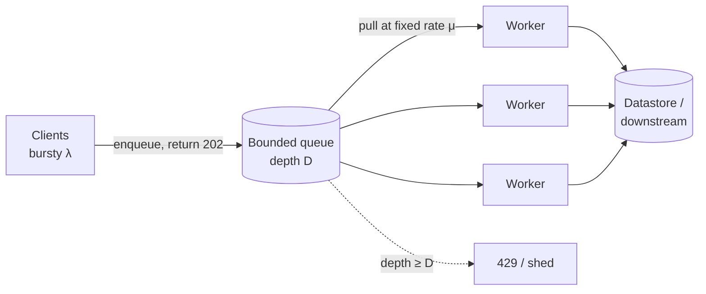

# Day 7 — Load balancing, queuing & load-leveling, backpressure

*After today you can:* protect a write path from a 10× spike with a queue, choose a
load-balancing algorithm on purpose, size a bounded queue with Little's Law, and
pick the right overflow policy (429 vs shed vs block) instead of letting a system
melt.

---

## The core problem

Every service has a **service rate** μ (requests/sec it can complete) fixed by its
slowest resource — CPU, a connection pool, a downstream. Traffic arrives at a
**arrival rate** λ that you do **not** control. When λ > μ, work piles up
*somewhere*. The only question an architect gets to answer is **where** it piles
up and **what happens when the pile is too big.**

A naive synchronous service piles work up in the worst possible place: in-flight
requests holding threads, sockets, and memory. Latency climbs, timeouts fire,
clients retry, λ rises further — a **congestion collapse**. The system does the
least useful work exactly when it is busiest.

Two levers fix this:

- **Load balancing** spreads λ across N replicas so each sees λ/N — it raises μ.
- **Load leveling** (a queue) decouples arrival from service so a burst is
  *stored* instead of *dropped or amplified* — it decouples λ from μ in time.
- **Backpressure / rate limiting** is the admission control that says "no" early,
  in a cheap and honest way, when even the queue can't save you.

The mental model is a plumbing one: a load balancer is a manifold splitting flow;
a queue is a buffer tank; backpressure is the relief valve. You need all three,
and you need to know each one's failure mode.

---

## Key concepts

### Little's Law — the one equation for this whole day

```
L = λ × W
```

`L` = average number of requests in the system, `λ` = arrival rate (req/s),
`W` = average time a request spends in the system (s). It holds for any stable
system, no assumptions.

Use it three ways:

- **Concurrency needed:** to serve λ=2000 req/s at W=50ms, you need L = 2000×0.05
  = **100 in-flight requests** → 100 threads/connections/goroutines minimum.
- **Queue wait:** if μ=1000/s and λ=1500/s, the queue grows by 500/s — it is
  **not stable**; W → ∞. A queue only levels *bursts*, never a sustained overload.
- **Queue depth budget:** a bounded queue of depth D adds at most `D/μ` seconds of
  latency. Depth 1000 behind a 1000/s worker = up to **1s** of added latency.
  That number is your design input, not an accident.

### L4 vs L7 load balancing

| | L4 (transport) | L7 (application) |
|---|---|---|
| Operates on | TCP/UDP, IP:port | HTTP headers, path, cookies |
| Sees | connections | requests |
| Examples | AWS NLB, IPVS, HAProxy TCP | AWS ALB, Envoy, nginx, HAProxy HTTP |
| Can do | fast, sticky by connection | path routing, retries, header-based routing, mTLS termination |
| Cost | ~microseconds, millions of conn/s | more CPU, buffers requests |

L4 forwards packets and never reads the payload — cheapest, lowest latency, but
can't route on `/api/v2` or retry a failed request. L7 parses each request — it
enables canary routing (Day 17), header-based sharding, and per-request retries,
at the cost of buffering and CPU.

### Balancing algorithms

| Algorithm | How | Wins when | Fails when |
|---|---|---|---|
| **Round-robin** | next server each time | homogeneous servers, uniform requests | request cost varies wildly (one slow request pins a server) |
| **Least-connections** | fewest active conns | request durations vary | connection count ≠ actual load (keep-alive) |
| **Weighted** | by capacity | heterogeneous instance sizes | weights go stale |
| **Consistent hash** | `hash(key) → server` | you need cache affinity / session stickiness | hot key → hot server |
| **Power of two choices** | pick 2 at random, send to less-loaded | large fleets; avoids herd | needs load signal |

"Power of two random choices" is the quiet workhorse of big fleets: sampling two
servers and picking the less loaded gets you almost-optimal balance with none of
the coordination cost of true least-connections.

### Queue-based load leveling



The HTTP handler does the cheapest possible thing — validate + enqueue + return
**202 Accepted** — and workers drain the queue at the rate the *downstream* can
sustain. A 10× spike inflates queue **depth**, not latency of the ingress tier.
The system trades **immediacy** for **survival**: work is done eventually, at a
controlled rate, instead of everything failing at once.

### Backpressure and bounded queues

An **unbounded** queue doesn't remove the overload problem — it relocates it to
**memory and latency**. Depth grows without limit → OOM, or (worse) requests sit
so long they've already timed out on the client when a worker finally picks them
up. That is **100% wasted work** — the system is maximally busy doing things
nobody is waiting for anymore. This is the single most important gotcha of the
whole topic: **every queue must be bounded, and full must mean something.**

Backpressure is the signal "I am full" propagating *upstream* so producers slow
down. In-process it's a blocking channel send; across a network it's an explicit
**429 Too Many Requests** + `Retry-After`; in TCP it's the receive window.

Overflow policies when the bound is hit:

- **Reject (429 / shed):** fail fast, cheap, honest. Client backs off (Day 8).
  Best default for request/response.
- **Block (backpressure):** producer waits. Good in-process; dangerous across a
  network (you've just moved the queue into the caller's threads).
- **Drop oldest / sample:** for telemetry/metrics where fresh > complete.
- **Load shedding by priority:** drop low-priority (health-check spam, retries)
  before high-priority (paying user's first attempt).

### Rate limiting — token bucket

```
capacity B tokens, refill r tokens/sec.
on request: if tokens ≥ 1 { tokens--; allow } else { 429 }
tokens = min(B, tokens + r·Δt)   // refill continuously
```

Token bucket allows **bursts up to B** while enforcing a long-run average of **r**
— usually what you want (bursty-but-bounded). Alternatives: **leaky bucket**
(strictly smooth output, no burst), **fixed window** (simple but double-rate at
window edges), **sliding-window log** (precise, more memory). In a distributed
system the bucket lives in Redis and the check-and-decrement must be **atomic**
(a Lua script), or two nodes both read "1 token left" and both allow.

---

## The decision / tradeoffs

**Synchronous write vs queue-buffered write** — the day's ADR:

| Criterion | Synchronous | Queue-buffered (202 + worker) |
|---|---|---|
| Client gets result | immediately | later (poll / webhook / event) |
| Spike behavior | latency explodes, then errors | queue depth absorbs; ingress stays flat |
| Correctness under load | degrades (timeouts, partial writes) | preserved (workers go at safe rate) |
| Complexity | low | queue + workers + status tracking |
| Right for | reads, anything needing an answer *now* | fire-and-forget writes, ingestion, notifications |

**Bounded vs unbounded queue:** always bounded. The only decision is **D** (from
Little's Law + your acceptable added latency) and the **overflow policy**.

Decision heuristic: *Does the caller need the answer in this request?* If yes →
synchronous (and protect it with a rate limiter + bulkhead, Day 9). If no → queue
it, bound the queue, and return 202.

---

## When NOT this

- **Do NOT queue a request that needs a synchronous answer.** A payment
  *authorization*, a login, "is this username taken?" — the user is staring at a
  spinner. Queuing turns a latency problem into a correctness/UX problem (now you
  need status polling, webhooks, and reconciliation for something that was one
  call). Queue the *side effects* (receipt email, analytics), not the answer.
- **Do NOT add a queue before a single instance is saturated.** A queue adds a
  moving part, a new failure mode (stuck consumers, poison messages), and
  operational surface. If p99 is fine at peak, you don't have a leveling problem.
- **Do NOT rate-limit when you can autoscale within SLA.** If capacity is elastic
  and cheap and the spike is short, scaling out beats rejecting paying customers.
  Rate-limit to protect a *hard* downstream ceiling (a legacy DB, a paid API
  quota), not as a reflex.
- **Alternative that wins:** for pure fan-out reads, a **cache + read replicas**
  (Days 4, 6) raises μ without any async complexity — use that before a queue.

---

## Real-world

- **AWS "Queue-Based Load Leveling" pattern** (also SQS's core use case): put a
  queue between a bursty producer and a rate-limited consumer so the consumer is
  provisioned for *average* load, not peak. *Lesson:* the queue converts a
  **capacity** problem into a **latency** problem — a much better problem to have,
  as long as the queue is bounded and you have a dead-letter path for poison
  messages.
- **AWS Builders' Library — "Using load shedding to avoid overload":** servers
  measure their own concurrency/queue depth and start rejecting *early* (before
  collapse), prioritizing health checks and cheap requests. *Lesson:* a server
  that sheds 20% of load at 100% utilization keeps serving the other 80%; one that
  doesn't serves 0%. Graceful degradation beats heroic effort.
- **Cloudflare / Stripe rate limiters** (token bucket in a fast store): protect
  shared infrastructure from a single noisy tenant, and give clients an honest
  `429 + Retry-After` so their backoff (Day 8) is coordinated with your recovery.
  *Lesson:* rate limiting is **fairness** infrastructure, not just DoS defense.
- **Little's Law in capacity planning** (queueing theory, ~1961): the reason a
  thread pool of 200 can't serve 5000 req/s of 100ms work — it caps you at
  200/0.1 = 2000 req/s regardless of CPU. *Lesson:* concurrency limits are
  latency multipliers; know your `L = λW` before you tune anything.

Log your one-line takeaway in `reference/real-world-case-studies.md` (Day 7).

---

## Common mistakes / gotchas

1. **Unbounded queues.** The default `SynchronousQueue`→`LinkedBlockingQueue` swap,
   an unbounded channel, an SQS with no consumer alarm — all defer OOM/latency-∞ to
   3am. Bound everything.
2. **Retries stacking on top of a full queue.** A queue rejects → client retries →
   λ effectively doubles during the exact incident. Backpressure and retry policy
   (Day 8) must be designed *together*; 429 must trigger backoff, not immediate
   retry.
3. **Timeouts longer than the max queue wait.** If a request can sit in the queue
   for 5s but the client times out at 2s, workers burn capacity on dead requests.
   Set a per-item deadline and drop expired items *before* processing.
4. **Balancing on connections when you mean load.** Least-connections + HTTP
   keep-alive counts idle connections as load. Balance on a real signal or use
   power-of-two-choices.
5. **Consistent-hash LB meeting a hot key.** Great for cache affinity until one key
   (celebrity, bot) maps all its traffic to one node. Pair with a hot-key bypass.
6. **Rate limiting non-atomically in Redis.** `GET`/`SET` instead of a Lua script →
   two nodes both allow past the limit under concurrency. Check-and-decrement must
   be one atomic op.

---

## Practice

### 1. Size the queue

Your ingress accepts writes; each write costs a downstream 20ms and you run 10
worker slots. A marketing blast drives a 30-second spike of 3000 req/s; normal is
300 req/s. What is the sustainable μ? Will the queue drain? What bound D keeps
added latency under 2 seconds?

<details><summary>Hint 1</summary>
μ from Little's Law: with 10 workers each doing 20ms serial work, how many can one
worker finish per second? Multiply by 10.
</details>
<details><summary>Hint 2</summary>
During the spike, depth grows at (λ − μ) per second for 30s. After the spike λ
drops to 300, well under μ, so it drains. Max added latency = D / μ.
</details>
<details><summary>Solution sketch</summary>

One worker: 1 / 0.02s = 50 req/s. Ten workers: **μ = 500 req/s**.
Spike λ = 3000 for 30s → backlog builds at 3000 − 500 = **2500/s**, i.e. 75,000
items if unbounded. It *does* drain afterward (300 < 500), taking 75000/(500−300)
≈ 375s ≈ 6 min — probably too long, so you'd also autoscale workers.
For "added latency < 2s" with μ=500: **D = μ × 2s = 1000**. Beyond depth 1000,
return 429. So bound D=1000, shed the rest, and scale workers to shorten drain.
The lesson: the queue survives the spike; the *bound* decides who gets a 429 vs a
6-minute wait.
</details>

### 2. Overflow policy per endpoint

You have three endpoints behind one gateway: `POST /charge` (payment auth),
`POST /events` (analytics ingestion), `GET /feed` (timeline read). The whole
system is overloaded. Pick an overflow policy for each and justify.

<details><summary>Hint</summary>
Ask per endpoint: does the caller need the answer now? Is the data loss-tolerant?
Is it idempotent-safe to retry?
</details>
<details><summary>Solution sketch</summary>

- `/charge`: **429 + Retry-After**, never queue for a background worker — the user
  needs the auth result now, and a stale charge is a correctness bug. Protect with
  a small per-user rate limit + bulkhead; shed retries before first attempts.
- `/events`: **queue with drop-oldest / sampling** — analytics tolerates loss and
  reordering; keep ingress at 202 always, drop under extreme pressure. Fresh data
  matters more than complete.
- `/feed`: **serve degraded, then shed** — return a cached/reverse-chron fallback
  (Day 6/9); if even that is over budget, 429 with a short Retry-After. Reads are
  retry-safe.
The point: one system, three correctness bars, three policies. "The overflow
policy" is per-flow, not global.
</details>

### 3. Distributed rate limiter (mini-design)

Sketch a per-API-key token bucket that works across 8 gateway nodes. Where does
state live? How do you keep the check atomic? What's the failure mode if that
store is down?

<details><summary>Hint 1</summary>
Local per-node buckets would each allow the full rate → 8× the intended limit.
State must be shared or partitioned by key.
</details>
<details><summary>Hint 2</summary>
Atomicity: a Redis Lua script doing refill + test + decrement in one round trip.
Failure mode: fail-open (allow, lose limiting) vs fail-closed (deny, lose
availability) — a business decision.
</details>
<details><summary>Solution sketch</summary>

Bucket state `(tokens, last_refill_ts)` per key in **Redis**, updated by an atomic
**Lua script**: compute refill from elapsed time, if tokens≥1 decrement and return
allow, else return deny + retry-after. Route all requests for a key consistently
(or just share Redis — one round trip is cheap). For extreme scale, shard buckets
by key across a Redis cluster, or use **local buckets with a fraction of the
global rate** synced periodically (approximate, cheaper). If Redis is down: for a
public quota, **fail-open** with a conservative local cap (availability > perfect
limiting); for abuse protection of a fragile backend, **fail-closed**. State the
choice in the ADR — it's the interesting decision. (This is BACKLOG rep #1.)
</details>

### 4. Least-connections gone wrong

An L7 LB uses least-connections. One backend starts returning errors *instantly*
(fail-fast). What happens to its share of traffic, and why is that bad?

<details><summary>Solution sketch</summary>
Fast failures close connections fast → the broken backend has the **fewest** open
connections → least-connections sends it **more** traffic. It becomes a "black
hole" attracting requests it only fails. Fixes: health checks that eject it,
outlier detection (eject on error rate, not latency), or circuit breaking at the
LB (Day 9). The lesson: a balancing signal that correlates with *health* can
invert under fail-fast.
</details>

---

## Go deeper (offline-friendly)

- **Michael Nygard, *Release It!* (2nd ed.)** — chapters on Bulkheads, Backpressure,
  Load Shedding, and "Handshaking." The canonical stability-patterns text.
- **AWS Builders' Library:** "Using load shedding to avoid overload," "Fairness in
  multi-tenant systems," "Avoiding fallback in distributed systems." Short, dense,
  free.
- **Alex Xu, *System Design Interview* Vol. 1, Ch. 4 — "Design a rate limiter"**
  (token bucket, sliding window, distributed placement).
- **DDIA Ch. 1 (Reliability/Scalability)** for the percentile/tail-latency framing;
  Ch. 11 (Stream Processing) for queues as durable logs.
- **"Little's Law" / queueing theory** — any ops-research primer; internalize
  `L = λW` and the fact that utilization → 1 makes wait → ∞.
- **Marc Brooker's blog** ("Some risks of coordinating only sometimes") and the
  "Power of Two Random Choices" (Mitzenmacher) paper for balancing intuition.

---

## Check yourself

- Can you state Little's Law and use it to size a thread pool and a queue bound?
- When does a queue make things *worse*? (Sync-answer requests; sustained λ>μ.)
- Why must every queue be bounded, and what are the three overflow policies?
- L4 vs L7: name one thing each can do that the other can't.
- When would you NOT add a queue, and what do you reach for instead?
- Why must a distributed token-bucket check be atomic, and what's fail-open vs
  fail-closed?
