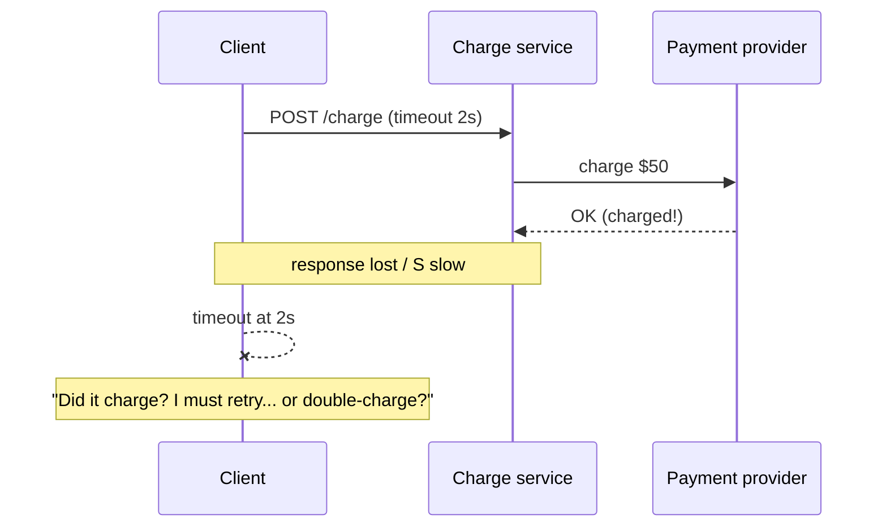
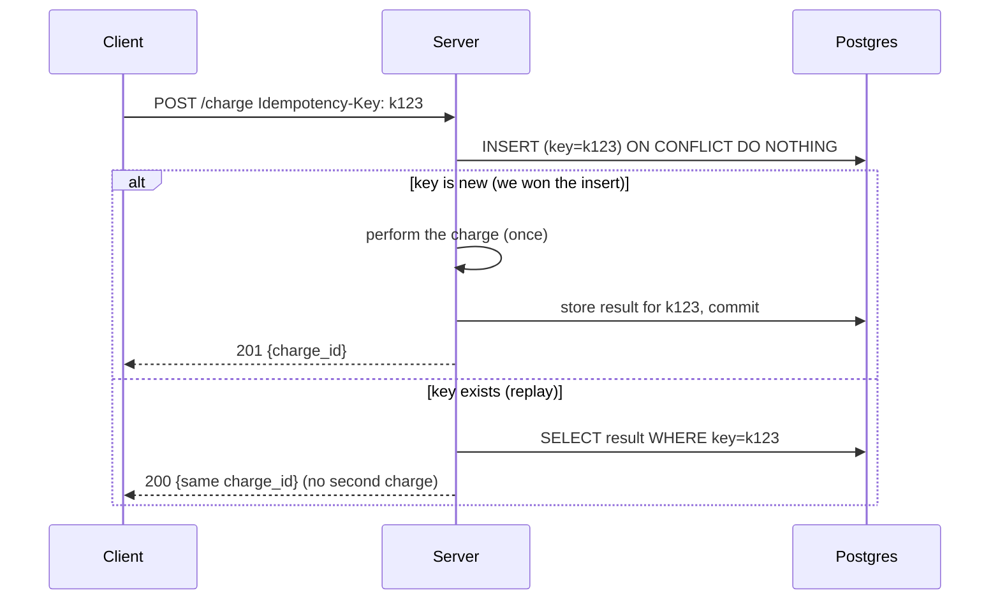

# Day 8 — Timeouts, retries, idempotency, backoff + jitter

*After today you can:* make a write endpoint safe to retry (idempotency keys),
choose a retry policy that recovers from blips without amplifying an outage, and
explain why the *ambiguous timeout* — not the clean failure — is the hard case.

---

## The core problem

In a distributed system, a request that doesn't return is **ambiguous**: you
cannot tell "it never arrived" from "it succeeded but the response was lost."
Both look identical to the caller — a timeout.



The naive fix — "just retry" — is a trap. Retrying a **non-idempotent** write
(charge, create-order, send-money) after an ambiguous timeout **double-executes**
it. And retries have a second, systemic danger: when a dependency is slow,
*everyone* retries at once, multiplying load precisely when the system is already
struggling — a **retry storm** that turns a brownout into an outage.

So the day is about making two things true at once:

1. **Safety:** a retried write must produce the same result as one execution
   (**idempotency**), so retrying is free of correctness risk.
2. **Politeness:** retries must be *bounded, spaced, and jittered* so recovery is
   possible — a client that hammers a struggling server prevents its own recovery.

---

## Key concepts

### Delivery semantics

| Semantic | Guarantee | Cost | Where |
|---|---|---|---|
| **At-most-once** | never duplicated, may be lost | cheapest | fire-and-forget metrics |
| **At-least-once** | never lost, may be duplicated | retries + acks | almost all real systems (SQS, Kafka default) |
| **Exactly-once** | once, no dup, no loss | expensive / often illusory over a network | Kafka txns within Kafka; broker-scoped only |

You cannot get true exactly-once *delivery* across an arbitrary network — the two
generals problem. What you get in practice is **at-least-once delivery +
idempotent processing = effectively-once**. That combination is the entire game.
The network guarantees *at-least*; **you** supply the idempotence.

### Idempotency

An operation is **idempotent** if applying it N≥1 times has the same effect as
applying it once. `GET`, `PUT x=5`, `DELETE id` are naturally idempotent.
`balance += 50`, `INSERT a row`, `POST /charge` are **not** — and those are exactly
the ones you most want to retry.

You make a non-idempotent operation idempotent with an **idempotency key**: the
client generates a unique key per logical operation (a UUID) and sends it (Stripe:
the `Idempotency-Key` header). The server records `(key → result)` and, on any
replay of that key, returns the **stored result** instead of re-executing.



The critical detail: **the idempotency record and the effect must be atomic** —
written in the same transaction, or ordered so the key is claimed *before* the
side effect. Otherwise a crash between "did the charge" and "saved the key" lets a
retry charge again. The unique constraint on the key column is what serializes two
concurrent requests carrying the same key.

### Timeouts

A call with no timeout is a **resource leak waiting for an outage**: one slow
dependency pins your threads/connections forever (the cascade of Day 9). Set:

- **Connection timeout** — short (e.g. 100–500ms); a TCP connect should be fast.
- **Request/overall timeout** — from your latency budget, *below* the caller's
  timeout. If the client waits 2s, the server's downstream call must time out
  well under 2s so there's room to respond.
- **Rule:** timeouts must *decrease* as you go deeper in the call chain (deadline
  propagation), or an inner retry blows the outer budget.

Set them from **observed p99**, not guesses: `timeout ≈ p99 × small_factor`. Too
tight → false failures on normal tail latency; too loose → slow failures that pin
resources.

### Retries — which errors, and how spaced

**Retry only what might succeed on retry:** timeouts, connection refused, 503, 429
(honoring `Retry-After`). **Never retry** deterministic failures: 400, 401, 403,
404, 422 — the input is wrong; retrying just wastes capacity.

Spacing (this is the AWS Builders' Library result):

```
attempt n backoff:
  fixed:            base                       (all clients retry in lockstep -> thundering herd)
  exponential:      base * 2^n                 (spaced, but synchronized -> herd at each step)
  exp + full jitter: random(0, base * 2^n)     (spread across the window -> best)
  decorrelated:     random(base, prev * 3)     (also excellent; grows smoothly)
```

**Full jitter wins.** Exponential backoff alone still synchronizes: all clients
that failed at T retry at T+base, then T+2·base — herds. Adding jitter spreads
retries uniformly across the window, flattening the load the recovering server
sees. Numbers from the AWS experiment: full jitter cut both total work and time-to-
completion dramatically versus plain exponential under contention.

### Retry budgets & amplification

Retries multiply load. If every layer retries 3×, a call through 3 layers can
become **3³ = 27** downstream calls — **retry amplification**. Defenses:

- **Retry budget:** cap retries as a *fraction* of total requests (e.g. ≤10%). When
  the budget is exhausted (many things failing → a real outage), **stop retrying**
  — retries can't fix an outage, only deepen it.
- **Retry at one layer only** (usually the outermost that has context), not every
  hop. Deeper layers fail fast and let the top decide.
- **Pair retries with a circuit breaker** (Day 9): an open breaker stops retries
  against a known-dead dependency.

---

## The decision / tradeoffs

**Idempotency-key storage & retention** — the day's ADR:

| Option | Where key lives | Pros | Cons |
|---|---|---|---|
| **Same DB, same tx** | Postgres row + unique index | atomic with the effect; simplest correctness | key store scales with your DB |
| **Dedicated store (Redis)** | fast KV with TTL | fast, offloads DB | needs care to stay atomic with the effect; TTL eviction can drop a key mid-retry |
| **Provider-side** | pass key to downstream too | end-to-end dedup | only as good as the provider's window |

Retention: keep keys **at least as long as the client might retry** (minutes to
24h typically). Too short → a late retry re-executes; too long → unbounded growth
(TTL / periodic purge). Stripe keeps keys ~24h.

**Retry policy** decision: exponential + **full jitter**, capped attempts (e.g. 3),
a per-client **retry budget**, retry only transient errors, honor `Retry-After`.

Decision heuristic: *any write you'd want to retry needs an idempotency key first.*
Add the retry policy second. Never ship the retry without the key.

---

## When NOT this

- **Do NOT retry a non-idempotent write without an idempotency key.** You will
  double-charge / double-order on the first ambiguous timeout. Add the key, or
  don't retry — those are the only two safe choices.
- **Do NOT retry at multiple layers.** Nested retries amplify multiplicatively.
  Pick one layer to retry; make the rest fail fast.
- **Do NOT retry 4xx (client errors).** The request is deterministically wrong;
  retrying wastes capacity and can trip rate limits. (429 is the exception — it's
  a "retry later," so honor `Retry-After`.)
- **Do NOT retry without jitter and a budget.** Synchronized retries are a
  self-inflicted DDoS; an unbounded budget turns a blip into an outage.
- **Alternative that wins:** when the ambiguous outcome is *reconcilable*, prefer
  **reconciliation over retry** — mark the charge `pending`, and have a job query
  the provider by idempotency key to learn the true outcome. Blind retry guesses;
  reconciliation *knows*.

---

## Real-world

- **Stripe idempotency keys:** clients send `Idempotency-Key`; Stripe stores the
  first response and replays it for ~24h, so a network-glitched retry never
  double-charges. *Lesson:* push idempotency to the *client-chosen key* so the
  whole retry chain (client→you→provider) dedupes on one identifier.
- **AWS Builders' Library — "Timeouts, retries, and backoff with jitter":** the
  canonical writeup; the simulation showing **full jitter** minimizes both
  competing work and completion time versus plain exponential backoff. Also
  introduces the **retry budget** and deadline propagation. *Lesson:* jitter isn't
  a nice-to-have — synchronized retries are the failure mode.
- **SQS / Kafka at-least-once delivery:** both redeliver on consumer failure, so
  every consumer must be idempotent (dedup on message id / a processed-keys table).
  *Lesson:* the broker gives you at-least-once; effectively-once is *your* job at
  the consumer.
- **DynamoDB conditional writes / `ConditionExpression`:** `attribute_not_exists`
  gives you the same "insert-only-if-new" idempotency primitive as Postgres
  `ON CONFLICT DO NOTHING`. *Lesson:* idempotency is a database primitive, not
  application glue.

Log your one-line takeaway in `reference/real-world-case-studies.md` (Day 8).

---

## Common mistakes / gotchas

1. **Storing the key *after* the side effect.** Crash in between → replay
   re-executes. Claim the key in the *same transaction* as (or before) the effect.
2. **Two concurrent requests, same key, race.** Without a unique constraint both
   pass the "does it exist?" check and both execute. The DB unique index (or an
   advisory lock) must be the arbiter, not an app-level `SELECT` then `INSERT`.
3. **Idempotency key = the request body hash.** Two *legitimately different*
   requests that happen to be identical (two real $5 charges) get collapsed into
   one. The key must identify the *operation*, chosen by the client, not the
   payload.
4. **Retrying with the same key but a *changed* body.** Server should reject a key
   reused with a different payload (409), not silently apply either.
5. **Timeouts longer than the caller's timeout.** Your downstream call outlives the
   client's patience → the client retries while your first attempt is still
   running → duplicate in flight.
6. **Retry storms with no budget.** Everyone retries a struggling service → it
   never recovers. Budget + jitter + breaker, together.
7. **TTL-evicting an idempotency key mid-retry.** Redis key expires between the
   original and a slow retry → re-execution. Retention ≥ max retry window.

---

## Practice

### 1. The ambiguous timeout

Your charge service calls a payment provider with a 2s timeout. The call times
out. Walk the three things that could actually have happened, and what your
service should do in each — without knowing which occurred.

<details><summary>Hint</summary>
Timeout means "no answer," not "no charge." Enumerate: (a) provider never got it,
(b) provider charged but reply was lost, (c) provider is just slow and will charge
after you gave up.
</details>
<details><summary>Solution sketch</summary>

You can't distinguish them from the timeout alone. Safe handling: mark the local
charge `pending` and **reconcile** — query the provider by your idempotency key
("did k123 charge?"). If the provider dedupes on that key, a safe *retry with the
same key* is also acceptable (it charges at most once). What you must NOT do: retry
with a *new* key (guarantees a double-charge in case b/c) or mark it failed and let
the user re-submit (same). The idempotency key turns an unknowable outcome into a
safe one. This is exactly why Problem 2 in the interview bank pairs idempotency
with reconciliation.
</details>

### 2. Make it idempotent

Sketch the `/charge` handler and the `charges` table so that firing the same
`Idempotency-Key` 100× concurrently produces exactly one charge. What guarantees
the "exactly one" under concurrency?

<details><summary>Hint 1</summary>
A unique constraint on the key column + `INSERT ... ON CONFLICT DO NOTHING`. The
database, not your code, decides who wins the race.
</details>
<details><summary>Hint 2</summary>
The winner does the charge and stores the result in the *same transaction*.
Losers find the key already present and return the stored result (they may need to
wait briefly for the winner to commit).
</details>
<details><summary>Solution sketch</summary>

`charges(id, idempotency_key TEXT UNIQUE, amount_cents INT, status TEXT,
created_at TIMESTAMPTZ)`. Handler, in one tx: `INSERT ... (idempotency_key,
amount, 'succeeded') ON CONFLICT (idempotency_key) DO NOTHING RETURNING id`. If a
row is returned → we won → (perform/record the charge) → commit → 201. If **no**
row → the key already exists → `SELECT id FROM charges WHERE idempotency_key=$1` →
return 200 with that id (replay). Under 100 concurrent identical keys, the unique
index guarantees exactly one INSERT succeeds; the other 99 take the replay branch.
`COUNT(*)` for that key = 1. This is the Day 8 lab. Remove the unique
constraint/`ON CONFLICT` and you get up to 100 rows — the break-it step.
</details>

### 3. Backoff math + amplification

Three services chained A→B→C. Each retries up to 3 attempts on failure. C is down.
How many total calls hit C for one user request? Now design the fix.

<details><summary>Solution sketch</summary>
Worst case A tries 3×, each triggers B up to 3×, each triggers C up to 3× = **27**
calls to a service that's already down — retry amplification. Fixes: (1) retry at
**only one layer** (A, which has the user context); B and C fail fast. (2) A
**retry budget** (stop retrying once failures exceed ~10% — C being down blows the
budget immediately, so A stops after the budget, not 3×). (3) a **circuit breaker**
on the C-client (Day 9) so once it's open, calls fail instantly with no retry.
Together these turn 27 into ~1–3.
</details>

### 4. Jitter, felt

You have 10,000 clients that all failed at T=0 and retry with exponential backoff
`base=1s`. Without jitter, when do they retry and why is that bad? With full
jitter?

<details><summary>Solution sketch</summary>
Without jitter: all 10,000 retry at T=1s, then (those still failing) at T=3s, then
T=7s — synchronized **herds** that re-overload the recovering server at each step,
so it keeps failing, so they keep herding. With **full jitter** (`random(0,
base·2^n)`): the first retries spread uniformly over [0,1s], the next over [0,2s],
etc. — the server sees a smooth, drainable trickle and can actually recover. Same
number of retries, radically different load *shape*. Shape is everything.
</details>

---

## Go deeper (offline-friendly)

- **AWS Builders' Library — "Timeouts, retries, and backoff with jitter"** (Marc
  Brooker). Read it twice; internalize full jitter + retry budgets + deadline
  propagation. The single best resource for this day.
- **Stripe engineering blog — "Designing robust and predictable APIs with
  idempotency."** The reference implementation of client-keyed idempotency.
- **Michael Nygard, *Release It!* (2nd ed.)** — "Timeouts" and "Retries" stability
  patterns; the fail-fast principle.
- **DDIA Ch. 8 (The Trouble with Distributed Systems)** — unreliable networks,
  unbounded delays, why "it timed out" tells you nothing about success; **Ch. 9**
  for the "exactly-once" discussion and fencing.
- **Marc Brooker's blog** — "What is a simple retry?" and "Timeouts, retries, and
  backoff" posts.
- **Kafka docs — "Idempotent producer" & consumer offset commit semantics** for
  at-least-once vs the broker's exactly-once boundary.

---

## Check yourself

- Why does a timeout tell you nothing about whether the operation succeeded?
- What two ingredients combine to give "effectively-once," and which one is *your*
  responsibility?
- How does a unique constraint + `ON CONFLICT DO NOTHING` guarantee one charge
  under 100 concurrent identical keys?
- Why does full jitter beat plain exponential backoff? Draw the load shape.
- What is retry amplification, and name two independent defenses.
- When would you reconcile instead of retry? When would you NOT retry at all?
