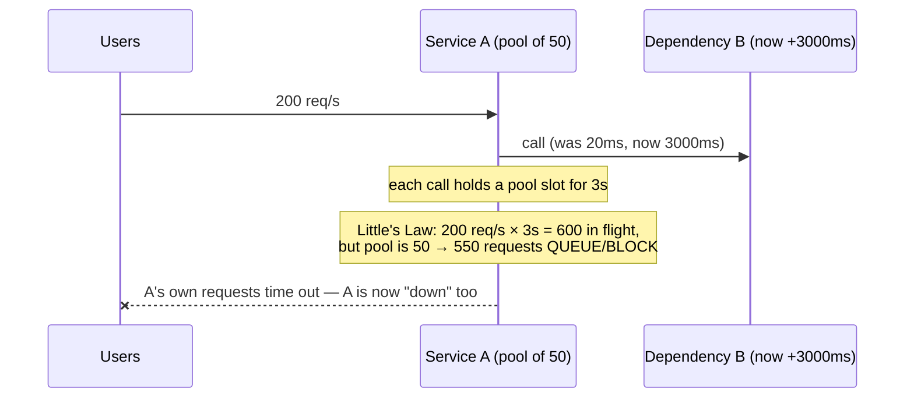
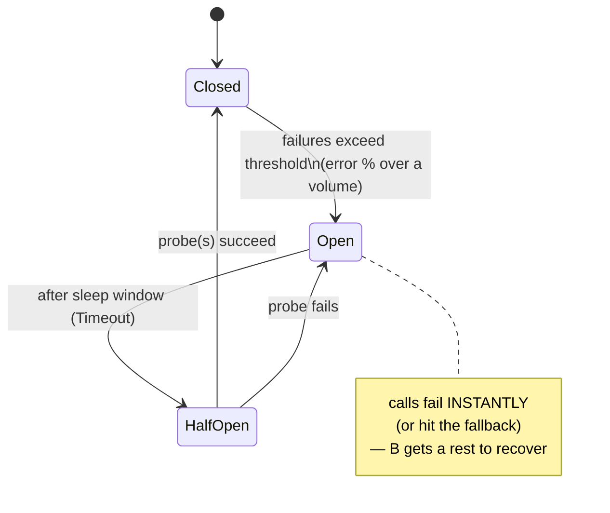
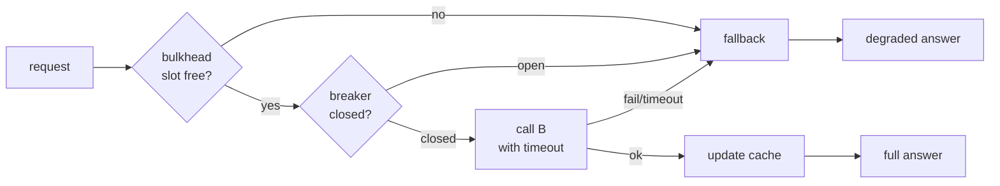

# Day 9 — Circuit breakers, bulkheads, graceful degradation

*After today you can:* explain why a *slow* dependency is more dangerous than a
*down* one, stop a cascade with a circuit breaker + timeout + bulkhead, and reason
about when a breaker helps versus when it just fails you faster.

---

## The core problem

Service A calls dependency B. B gets slow — not down, **slow** (latency goes from
20ms to 3000ms). Watch what happens to A:

By Little's Law (Day 7), the number of in-flight calls A needs is `λ × W` =
200 × 3s = **600**, but A's connection/thread pool is 50. The other 550 requests
**block waiting for a pool slot** — including requests that don't even touch B.
A's latency collapses, A's health checks fail, and A's *callers* now see A as slow
and start blocking too. The failure **cascades** upstream, hop by hop, until the
whole system is down — because one leaf dependency got slow.

This is the central insight: **a slow dependency is more dangerous than a failed
one.** A fast failure returns the resource immediately; slowness holds resources
hostage and propagates. Retries (Day 8) make it worse — they multiply load on the
already-struggling B.

The three tools that contain this:

- **Timeout** — bound `W` so a slow call fails fast and returns its resource.
- **Circuit breaker** — stop calling a known-bad dependency at all; fail instantly.
- **Bulkhead** — isolate the resource pool so B's problem can't consume *all* of
  A's capacity — only B's share.

And the thing that makes them *useful*: **graceful degradation** — a meaningful
fallback so "B is unavailable" becomes "degraded answer," not "error."

---

## Key concepts

### Resource-pool exhaustion — the cascade mechanism

The unit that gets exhausted is a **finite pool**: threads, goroutines with a
semaphore, DB/HTTP connections, file descriptors. When calls to a slow dependency
occupy every slot, *unrelated* work starves. The blast radius of one slow
dependency is your entire service — unless you isolate it.

### Timeouts (recap from Day 8, now load-bearing)

A call with no timeout has `W = ∞` → unbounded in-flight → guaranteed exhaustion.
The timeout is what converts "slow" into "fast failure." Set it from B's p99, and
make it *shorter* than the caller's timeout. **A breaker without a timeout is
almost useless** — the breaker can't observe failures if calls never return.

### Circuit breaker — the state machine

- **Closed** — normal; calls pass through; failures are counted.
- **Open** — the dependency is presumed dead; calls **fail immediately** without
  touching B (returning the fallback). This does two things: A stops wasting
  resources on doomed calls, and B gets breathing room to recover instead of being
  hammered.
- **Half-open** — after a **sleep window**, let a *limited* number of probe calls
  through. Success → close; failure → re-open and wait again.

Trip conditions (must combine): an **error-rate threshold** (e.g. >50%) **over a
minimum request volume** (e.g. ≥20 requests in the window). Volume matters — 1
failure out of 1 request is 100% error rate but not signal. `sony/gobreaker`
exposes exactly these knobs: `ReadyToTrip(counts)`, `MaxRequests` (half-open probe
count), `Interval` (counter reset), `Timeout` (sleep window).

### Bulkhead — isolation by partitioning resources

Named after a ship's watertight compartments: a breach in one doesn't sink the
ship. In software, give each dependency (or each tenant/priority class) its **own
bounded pool** of concurrent slots. If B saturates its bulkhead (say, 20 slots),
calls to B are rejected/queued, but the *other* 30 slots serving other work are
untouched. The cascade is contained to B's compartment.

Implementation: a **semaphore / buffered channel** of size N guarding the calls to
B. `acquire → call → release`; if you can't acquire quickly, shed (fallback) rather
than block. Bulkhead limits *concurrency*; the breaker limits *whether you try at
all*. They compose.

### Load shedding & graceful degradation

- **Load shedding:** under overload, deliberately reject a fraction (lowest
  priority first) so the rest succeeds (Day 7's 429).
- **Graceful degradation / fallback:** serve a *reduced* answer when the full one
  isn't available — a cached last-known value, a default, an empty-but-valid
  response, or a queued "we'll do it later." The fallback is what makes a breaker
  worth having.

---

## The decision / tradeoffs

**Breaker thresholds** — the day's ADR. The knobs and their tensions:

| Knob | Too low / short | Too high / long |
|---|---|---|
| Error % to trip | flaps open on normal blips | opens too late, cascade already started |
| Min volume | trips on noise | ignores real failures at low traffic |
| Sleep window (Timeout) | probes too soon, re-hammers B | slow to recover after B heals |
| Half-open probes (MaxRequests) | 1 unlucky probe re-opens | too many probes re-overload B |

**Fallback options:**

| Fallback | Good for | Risk |
|---|---|---|
| Cached last-known value | reads (profile, config, catalog) | staleness |
| Static default / empty | recommendations, ads, "extras" | reduced UX (acceptable) |
| Queue for later | writes that can be async (Day 7) | needs idempotent processing (Day 8) |
| Fail fast (no fallback) | truly optional calls | none — but see "When NOT" |

Decision heuristic: pick the breaker thresholds from B's *observed* behavior
(error rate + p99), and **only add a breaker where a meaningful fallback exists.**

### The half-open probe stampede (red-team this)

When the breaker moves to half-open, if you let *all* waiting traffic through as
"probes," you re-overload a barely-recovering B and immediately re-open — a
recovery you prevent yourself. Fix: `MaxRequests` caps half-open probes to a
trickle; only after they succeed do you fully close.

---

## When NOT this

- **Do NOT put a breaker on a call that has no safe fallback.** If A *cannot*
  function without B's answer (e.g. the auth check, the actual payment charge),
  an open breaker just makes A fail **faster** — it doesn't make it *work*. There,
  invest in B's availability (redundancy, Day 10 cells), tight timeouts, and
  reconciliation — not a breaker that returns errors more efficiently.
- **Do NOT breaker a strongly-consistent, must-succeed write** and silently serve
  a stale/default value — you'd trade a visible error for a **correctness bug**.
- **Do NOT rely on a breaker without a timeout.** No timeout → calls never return →
  the breaker never sees failures → the pool exhausts anyway. Timeout first.
- **Do NOT set the trip threshold so tight it flaps.** A breaker that opens and
  closes every few seconds adds latency variance and hides the real signal. Tune
  to B's normal error/latency profile.
- **Alternative that wins:** for *balancing away* from a bad instance (not a whole
  dependency), **outlier detection / passive health checking at the LB/mesh**
  (Envoy, Day 17) ejects the one sick host without an app-level breaker. For pure
  overload, **load shedding** (Day 7) is the right tool, not a breaker.

---

## Real-world

- **Netflix Hystrix:** the pattern popularizer — breakers + **bulkheads** (separate
  thread pools per dependency) + fallbacks, with a real-time dashboard. Netflix has
  since moved to adaptive concurrency limits, but the concepts are canonical.
  *Lesson:* isolate every dependency's resources and always define a fallback; a
  breaker without a degraded mode is half a solution.
- **Resilience4j / `sony/gobreaker`:** the modern libraries. gobreaker gives you
  the three states with `ReadyToTrip`, `MaxRequests`, `Interval`, `Timeout` — the
  exact knobs from the tradeoff table. *Lesson:* the state machine is small; the
  *thresholds* are the design.
- **Envoy / service mesh outlier detection (Day 17):** the mesh ejects a host after
  N consecutive 5xx and passively circuit-breaks per-host, no app code. *Lesson:*
  push cross-cutting resilience to the platform where you can — but you still own
  the *fallback* (the mesh can't invent a degraded answer for you).
- **AWS Builders' Library — "Avoiding fallback in distributed systems":** the
  contrarian read — fallbacks add an untested code path that can fail in the same
  outage; sometimes shedding/failing cleanly is safer. *Lesson:* a fallback is a
  second system you must test under the failure it's meant to handle.

Log your one-line takeaway in `reference/real-world-case-studies.md` (Day 9).

---

## Common mistakes / gotchas

1. **Breaker without a timeout.** The #1 mistake — calls hang, the breaker is blind,
   the pool exhausts. Timeout is the prerequisite, not an add-on.
2. **Shared pool across all dependencies.** One slow dependency exhausts the pool
   every dependency shares → no isolation. Bulkhead per dependency.
3. **Fallback that calls another remote service.** Your fallback for "B is down" is
   a call to C — which is down in the same regional outage. Fallbacks should be
   *local* (cache, default), not another network hop.
4. **Untested fallback.** The degraded path only runs during incidents, so it rots.
   If you never exercise it, assume it's broken (chaos-test it — BACKLOG).
5. **Trip threshold ignores volume.** Tripping on "100% errors" when that's 1 of 1
   request → the breaker opens on noise at low traffic.
6. **Half-open lets everyone through.** Recovery stampede re-opens the breaker
   instantly. Cap probes.
7. **Retries *inside* the breaker.** Retrying before the breaker sees the failure
   both amplifies load and delays tripping. Order: timeout → (maybe one retry) →
   breaker counts the outcome.

---

## Practice

### 1. Why slow is worse than down

B returns errors *instantly* (fail-fast) vs B is *slow* (3s then times out). A has
a 50-slot pool at 200 req/s. Which scenario takes A down, and why? What's the fix
for the dangerous one?

Hint

Apply Little's Law to each. A fast failure returns its slot in ~1ms; a slow call
holds it for the timeout.

Solution sketch

**Fast failure:** W ≈ 1ms → in-flight ≈ 200 × 0.001 = 0.2 → the 50-slot pool is
never stressed; A stays up (serving errors/fallbacks). **Slow:** W = 3s → in-flight
needed = 600 ≫ 50 → 550 requests block on the pool, A's latency explodes, A goes
down and cascades. The fix for the slow case: a **timeout** (turn 3s into, say,
200ms → W=0.2s → in-flight=40, fits the pool) **+ a breaker** (once B's error rate
crosses threshold, stop calling it entirely) **+ a bulkhead** (cap B's slots so
even without a timeout, B can't take more than its share). Slow is worse because
slow *holds resources*; fast failure *frees them*.

### 2. Set the breaker knobs

B normally runs 0.5% errors at p99=40ms, 300 req/s. Choose: timeout, error-% to
trip, min volume, sleep window, half-open probe count. Justify each.

Hint

Timeout from p99 (small multiple). Trip threshold well above normal error rate but
below "cascade" levels. Volume high enough to be signal at this RPS. Sleep window ≈
B's realistic recovery time.

Solution sketch

- **Timeout ≈ 150–200ms** (p99 40ms × ~4; leaves room for tail without holding slots
  3s).
- **Trip at error rate > 50% over a rolling window** — far above the 0.5% baseline,
  so blips don't flap it, but low enough to open before the pool exhausts.
- **Min volume ≥ 20 requests** in the window (at 300 req/s that's <0.1s of traffic
  — plenty of signal, avoids tripping on 1-of-1 noise).
- **Sleep window ≈ 5–10s** — enough for a transient B hiccup to clear before
  probing; not so long that recovery is sluggish.
- **Half-open probes = 1–5** (`MaxRequests`) — trickle, not stampede.
These map directly to `gobreaker.Settings`. The lab lets you tune and observe.

### 3. Choose the fallback

For each A→B call, pick a fallback (or "no breaker"): (a) B = product catalog for a
listing page; (b) B = fraud-check for a payment; (c) B = "users who bought this
also bought" recommendations; (d) B = writing an audit log entry.

Solution sketch

- (a) Catalog: **cached last-known catalog** — staleness is fine on a listing page.
- (b) Fraud-check: **no fallback / fail closed** — you cannot serve a "degraded"
  fraud decision; either decline or hold (`pending` + reconcile). A breaker that
  returns "looks fine" is a correctness/security bug. This is a "when NOT" case.
- (c) Recommendations: **static/empty default** — the page works without the
  carousel; classic graceful degradation.
- (d) Audit log: **queue for later** (Day 7) with idempotent write (Day 8) — the
  request needn't block on the audit write; buffer and drain.
The pattern: fallback safety depends entirely on whether a *degraded answer is
still correct*.

### 4. The half-open stampede

Your breaker opened during a B outage. B recovers. At the moment the sleep window
ends, 500 req/s are waiting. What happens with a naive half-open, and how do you
prevent it?

Solution sketch

Naive: all 500 rush in as "probes," instantly re-overloading a B that just came
back with cold caches/connections → probes fail → breaker re-opens → repeat. B
never stabilizes. Prevent with `MaxRequests` (e.g. allow 3 probes; the rest still
hit the fallback until the breaker closes), plus jittered/ramped recovery. This is
the same "synchronized herd" failure as Day 8's no-jitter retries — the fix is the
same shape: limit and spread.

---

## Go deeper (offline-friendly)

- **Michael Nygard, *Release It!* (2nd ed.)** — the source chapters: "Circuit
  Breaker," "Bulkheads," "Steady State," "Fail Fast," "Governor." The canonical
  text for this entire day.
- **`sony/gobreaker` source + README** — small enough to read end to end; map each
  `Settings` field to the tradeoff table.
- **AWS Builders' Library — "Avoiding fallback in distributed systems"** and
  "Using load shedding to avoid overload." Read the fallback one for the
  counter-argument.
- **Netflix Tech Blog — Hystrix** (design principles, "How it works") and the later
  "Performance Under Load" (adaptive concurrency limits) posts.
- **DDIA Ch. 8** (unreliable networks / unbounded delays) for *why* slow is the hard
  case; **Ch. 1** for tail-latency amplification across many dependencies.
- **Envoy docs — "Outlier detection" & "Circuit breaking"** for the mesh-level
  version you'll meet on Day 17.

---

## Check yourself

- Why is a *slow* dependency more dangerous than a *down* one? (Use Little's Law.)
- Name the three circuit-breaker states and the transition trigger for each.
- Why is a breaker nearly useless without a timeout?
- What does a bulkhead isolate, and how is it different from a breaker?
- When would you NOT put a breaker on a call? What do you do instead?
- What is the half-open stampede and how do you prevent it?
