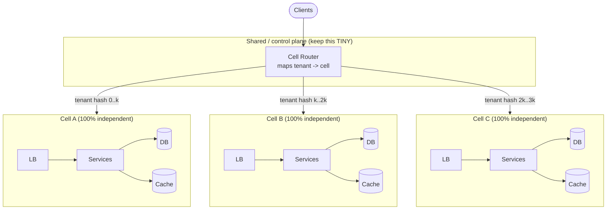

# Day 10 — Cell-based architecture, blast radius & multi-region

*After today you can partition a system into isolated cells, size and route them,
argue single-region-multi-cell vs multi-region, and prove blast-radius containment.*

## The core problem

A single shared stack has a single **blast radius**: one poison request, one bad
deploy, one hot tenant, one exhausted connection pool, one corrupt cache entry can
degrade **100% of users at once**. Redundancy (more replicas of the same shared
thing) does not help here — the failure is *correlated*: every replica runs the
same bad code, hits the same overloaded database, trips over the same poison
message. Adding nodes to a shared fleet just spreads the same failure wider.

Cell-based architecture attacks *correlated* failure. You slice users into `N`
independent stacks ("cells"), each a **complete copy** of the application +
its data, and route each user to exactly one cell. A failure now hurts one cell —
`1/N` of users — and cannot cross into the others, because the others share
nothing with it. You trade a small, thin, well-understood shared component (the
router) plus operational multiplicity for a hard ceiling on how bad any single
failure can get.

The mental model: **availability is not "how rarely does something break" — it is
"when something breaks, how much of my system goes with it."** Cells make the
second number small and predictable.

## Key concepts

### Cell = a full, independent instance of the stack

A cell is not a shard of the database. It is the whole thing: load balancer →
services → cache → database → queues, sized for a bounded slice of tenants, with
**no data path to any other cell**. Cell-A's outage is invisible to cell-B because
cell-B never reads cell-A's database, never calls cell-A's services, never shares
cell-A's Redis.

### The router is the one shared fate — so make it thin

Every cell design has *something* shared that maps a request to its cell. That
component is your remaining single point of failure, so it must be:

- **Thin:** it does mapping and forwarding, nothing else. No business logic, no
  per-request DB lookup on the hot path (cache the mapping or compute it).
- **Stateless / trivially replicated:** DNS, an ALB with host/header rules,
  Lambda@Edge, an Anycast IP, or a small proxy. The less it does, the less it can
  break.
- **Independently deployable from cells,** and ideally deployed *rarely*.

If your router does a database lookup per request to find the cell, you have just
reinvented the shared database you were trying to escape. Prefer a
**deterministic mapping** (hash of tenant → cell) or a mapping cached at the edge.

### Routing key & mapping

Pick a **partition key with a natural blast-radius meaning** — usually
`tenant_id` / `account_id` / `user_id`, so one customer lives entirely in one cell
("customer X is degraded", not "10% of every customer is degraded"). Map it:

- `cell = hash(tenant_id) % N` — simple, even, but re-mapping on `N` change moves
  most tenants (same reshard pain as Day 5). Prefer an explicit **assignment
  table** (tenant → cell) or **consistent hashing** so you can grow cells and
  migrate individual hot tenants without a global reshuffle.
- Keep the assignment **durable and authoritative** (the control plane owns it),
  but serve it to the router from a cache/edge config so the hot path never blocks
  on it.

### Poison-pill isolation

A "poison pill" is a request or record that reliably crashes whatever processes
it (a pathological payload, a tenant whose data triggers a bug). In a shared
stack it can crash every worker in a retry loop → full outage. In cells, only the
one cell that owns that tenant is affected; the blast radius is `1/N` and the on-
call can quarantine or drain that single cell.

### Cell sizing — the central tradeoff

Two knobs pull against each other:

| Make cells… | Blast radius | Ops overhead | Bin-packing / cost | Hot-tenant risk |
|-------------|--------------|--------------|--------------------|-----------------|
| **Smaller / more** | smaller (good) | higher (many stacks) | worse (per-cell overhead × N) | lower |
| **Bigger / fewer** | bigger (bad) | lower | better | higher (one tenant can dominate a cell) |

Rules of practice:

- Size a cell to a **tested maximum load** (a known, load-tested ceiling — e.g.
  "a cell holds ≤ 50k tenants / ≤ 20k RPS"), then **stop filling it** and open a
  new cell. Never let a cell grow past what you've verified it can survive.
- The **largest single tenant must fit comfortably inside one cell** with room to
  spare, or that tenant *is* your blast radius.
- More cells = smaller blast radius but linear growth in fixed per-cell cost
  (each cell needs its own DB, its own minimum capacity). There's a floor.

### Region vs AZ vs cell — three different axes

These are orthogonal; production systems combine them.

| Layer | Isolates against | Typical span | Latency to cross |
|-------|------------------|--------------|------------------|
| **AZ** (Availability Zone) | datacenter/power/network failure | one metro | ~0.5–2 ms |
| **Cell** | *correlated software/data failure, poison tenant, bad deploy* | usually within a region (spans AZs) | in-region |
| **Region** | regional disaster, control-plane outage, compliance/data-residency | continent | 30–150+ ms |

A cell normally spans **multiple AZs** for hardware fault tolerance and is
**within one region**. Multi-region is a *separate* decision layered on top:

- **Single-region, multi-cell:** contains software/data blast radius; does *not*
  survive a whole-region outage. Simpler, cheaper, no cross-region consistency
  problem. This is the right first step for most systems.
- **Multi-region:** survives a region loss and can serve users closer to home,
  but now you inherit Day 4's replication/consistency problem across 30–150 ms
  links (active-passive DR vs active-active), higher cost, and cross-region data
  governance. Only buy it when a region-level outage or data-residency law is a
  real requirement — not by default.

### Shuffle sharding (the AWS refinement)

Instead of assigning a tenant to *one* cell, assign it to a small random
**combination** of cells (e.g. 2 of 8). With 8 cells choosing 2, there are
`C(8,2)=28` combinations; two random tenants share **both** their cells with
probability `1/28 ≈ 3.6%`. A poison tenant degrades only the (few) tenants who
happen to overlap on *both* nodes — so a single bad actor takes out a tiny
fraction of others instead of a whole `1/N` cell. Route 53 and other AWS control
planes use this. It costs routing complexity and per-tenant capacity in multiple
cells; reach for it when a *single tenant* can poison a cell and you need finer
isolation than `1/N`.

## The decision / tradeoffs

Design brief: partition users into isolated cells and contain blast radius. Top-3
NFRs here are almost always **availability, blast-radius/reliability (fault
isolation), operability** — cells trade *cost* and *simplicity* for them.

| Option | Blast radius of one failure | Availability under a bad deploy | Ops overhead | Cost | When it wins |
|--------|-----------------------------|--------------------------------|--------------|------|--------------|
| **Single shared stack** | 100% | 100% down | lowest | lowest | small scale, low stakes, one team |
| **Single-region, multi-cell** | ~`1/N` | one cell (`1/N`) down; canary a cell | medium (N stacks, automation required) | medium | large multi-tenant SaaS; poison-pill / noisy-neighbor risk |
| **Multi-region multi-cell** | `1/N` + survives region loss | region-level survivable | highest | highest | region-loss or data-residency is a real requirement |

The one-sentence decision test: *"When our worst failure fires, what fraction of
customers notice, and can I name the exact set?"* Cells let you answer with a
number and a tenant list.

## When NOT this

- **Below a scale/stakes threshold.** For a small service, the router + N stacks +
  the automation to deploy/observe/migrate cells costs more (money and cognitive
  load) than the availability it buys. **Alternative: one well-run stack across
  multiple AZs with good deploy hygiene (canary + fast rollback).** It wins until
  a single outage hurting 100% of users is genuinely unacceptable *and* you have
  the tenant count to slice.
- **Single-tenant or tightly-coupled data.** If tenants constantly query *each
  other's* data (a social graph, a shared marketplace), cells force expensive
  cross-cell calls and you lose the isolation you paid for. Cells assume tenants
  are **mostly independent**.
- **Multi-region "for availability" when a region already gives you enough
  nines.** Alternative: single-region multi-cell + AZ redundancy. Multi-region
  wins only when region loss or data residency is the actual requirement — its
  cross-region consistency tax is real.

## Real-world

- **AWS cell-based architecture** (Well-Architected / the Builders' Library piece
  *"Reducing the scope of impact with cell-based architecture"*). The doctrine:
  cells are independent, the router is thin, you test a cell to a known max and
  stop, and control-plane operations (like Route 53) use **shuffle sharding** to
  shrink per-tenant blast radius below `1/N`. Lesson: **the shared component is
  the one you must obsess over; everything else is disposable by design.**
- **Shopify Pods.** Shopify runs "pods" — isolated full stacks (app + MySQL +
  Redis) each serving a subset of shops, routed by shop. A pod failure affects
  only its shops; pods are the unit of failure, capacity, and even regional
  placement. Lesson: **the routing key = the business isolation unit** (a shop is
  never spread across pods, so "which shops are down" is answerable).
- **Slack's cellular migration.** Slack moved to cells partly to contain the blast
  radius of *control-plane and network* incidents and to drain traffic away from a
  degraded cell quickly. Lesson: **cells give you a big, safe operational lever —
  "drain cell 3" — that a shared stack can't offer.**
- **DynamoDB / Route 53 shuffle sharding.** Isolation finer than `1/N` for
  control planes where a single poison request could otherwise cascade.

Log your one-line takeaway for each in `reference/real-world-case-studies.md`
(Day 10 section).

## Common mistakes / gotchas

1. **The router quietly becomes the shared fate.** A per-request DB lookup to find
   the cell, business logic in the router, or a router that deploys with the cells
   — any of these re-couples everything. Keep it thin, deterministic, rarely
   deployed.
2. **A cell that isn't actually independent.** A shared database "just for config",
   a shared Redis, a shared auth service — one hidden shared dependency and a cell
   outage crosses the boundary. Audit for shared fate ruthlessly.
3. **Sizing cells by cost instead of by tested failure ceiling.** Packing cells
   full to save money re-creates a large blast radius. Size to survivability.
4. **Forgetting the control plane is itself a blast radius.** The thing that
   provisions/deploys/migrates cells can take them all down. Keep the data plane
   able to run while the control plane is broken ("static stability").
5. **Global deploys defeat the point.** If you push new code to all cells at once,
   a bad deploy is back to 100% blast radius. Deploy cell-by-cell (a cell is a
   natural canary).
6. **A tenant bigger than a cell.** If one customer's load can saturate a whole
   cell, that customer is an un-contained blast radius; you need per-cell limits
   or shuffle sharding.

## Practice

### 1. Size the cells

You have 2,000,000 tenants. Load testing shows a single cell survives up to
**80,000 tenants** or **25,000 RPS** (whichever comes first), average tenant does
0.2 RPS. How many cells, and what's your blast radius per cell? What's the first
knob you'd change to *halve* the blast radius, and what does it cost?

Hint 1

Check both ceilings: tenants-per-cell and RPS-per-cell. The binding constraint is
whichever you hit first.

Hint 2

2M × 0.2 RPS = 400k RPS total. RPS ceiling 25k/cell → 16 cells. Tenant ceiling
80k/cell → 25 cells. Which is larger?

Solution sketch

RPS need 400k / 25k = **16 cells**; tenant need 2M / 80k = **25 cells**. The
tenant ceiling binds → **25 cells** (with headroom, round up / leave spare, say
28–30). Blast radius ≈ **1/25 ≈ 4% of tenants** per cell failure. To halve blast
radius → double cells to ~50, cutting each cell to ~40k tenants. Cost: ~2× the
fixed per-cell overhead (each cell's minimum DB + baseline compute), plus more
deploy/observability surface. You buy 2% blast radius with roughly linear cost —
worth it only if 4% is genuinely unacceptable. (Shuffle sharding could get below
4% *without* doubling total capacity, at the cost of routing complexity.)

### 2. Kill the router's shared fate

Your router does `SELECT cell FROM tenant_cell WHERE tenant_id=$1` on **every
request** against one Postgres. Name the failure mode and redesign the router so
it is no longer a single point of failure — without losing the ability to migrate
a tenant to a new cell.

Hint 1

What happens to 100% of traffic when that one Postgres is slow or down? You
rebuilt the shared blast radius.

Hint 2

Separate the *authoritative* mapping (rarely changes) from the *hot-path* lookup.
Push the mapping to where the router already is (edge config, in-memory cache, or
a deterministic hash), and treat migration as a control-plane event that updates
that config.

Solution sketch

Failure mode: the mapping DB is now a shared dependency on the hot path — its
latency/outage = full outage, exactly what cells were supposed to prevent.
Redesign: keep an authoritative `tenant → cell` table in the control plane, but
the router reads from an **in-memory / edge-cached** copy (refreshed every N
seconds, or pushed on change) — the hot path never touches the DB. For most
tenants use a **deterministic hash** so no lookup is needed at all; keep an
**override table** only for migrated/hot tenants (small, cacheable). Migration
becomes: copy tenant data to the new cell → flip the override entry → invalidate
router cache. The mapping DB being down now degrades only *new migrations*, not
live traffic (static stability).

### 3. Single-region multi-cell vs multi-region

A B2B SaaS at 99.9% today wants 99.99%. An architect proposes going multi-region
active-active. Give the cheaper option that likely gets them there, and name the
one requirement that would actually justify multi-region.

Hint

What is 99.9% → 99.99% usually failing on — whole-region loss, or in-region
correlated failures (bad deploys, poison tenants, overloaded shared DB)?

Solution sketch

Most 99.9% systems lose their nines to **in-region correlated failures** (bad
deploys hitting 100%, poison tenants, a shared DB tipping over), not to AWS losing
an entire region. Cheaper option: **single-region, multi-cell across AZs +
cell-by-cell deploys** — this caps each incident at `1/N` and removes the "one bad
deploy = full outage" class, which is what usually eats the fourth nine, without
paying the cross-region consistency tax. Multi-region active-active is justified
when the requirement is **surviving a full region outage or data-residency law**
(e.g., EU data must stay in EU) — an availability/compliance requirement that
in-region cells simply cannot satisfy. Match the tool to the actual failure you
must survive.

## Go deeper (offline-friendly)

- **AWS Builders' Library — "Reducing the scope of impact with cell-based
  architecture"** (Peter Vosshall) and **"Workload isolation using shuffle
  sharding"** (Colm MacCárthaigh). The canonical treatment.
- **AWS Well-Architected — Reliability pillar**, the "cell-based architecture" and
  "bulkhead"/fault-isolation-boundary sections.
- **Shopify Engineering blog — "A Pods Architecture to Allow Shopify to Scale"**
  and their resiliency/pods writeups.
- **Slack Engineering — "Slack's Migration to a Cellular Architecture."**
- **Marc Brooker's blog** — posts on shuffle sharding, static stability, and
  "why availability is about blast radius."
- **DDIA Ch. 1** (reliability/maintainability framing) and **Ch. 9** (for the
  multi-region consistency you inherit) — Kleppmann.
- **Alex Xu, *System Design Interview* Vol. 2** — multi-datacenter / geo chapters.

## Check yourself

- Can you explain the difference between **redundancy** and **fault isolation**,
  and why adding replicas doesn't shrink blast radius?
- What exactly is a cell, and what is the *one* thing all cells share?
- How do you size a cell, and why size to a tested ceiling rather than to cost?
- When would you use **shuffle sharding** instead of plain `1/N` cells?
- When would you *not* build cells at all — and what do you do instead?
- Why is single-region multi-cell usually the right first move, and what single
  requirement flips you to multi-region?
