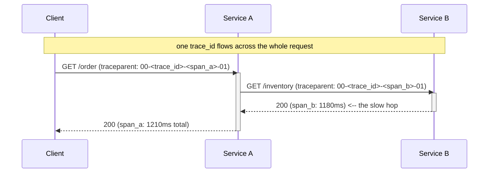

# Day 11 — Observability-as-design (SLI/SLO, tracing, metrics)

*After today you can instrument a multi-service path with traces + RED metrics +
correlation IDs, define measurable SLIs/SLOs with an error budget, and locate an
injected fault from telemetry alone — without reading the code.*

## The core problem

In a distributed system the question is never "is the server up?" It is: *"this
one request took 4 seconds — which of the 6 services it touched was slow, and
why?"* You cannot answer that by SSH-ing into a box. You answer it only if the
system was **designed to emit the evidence** — a trace that stitches the hop
across services, metrics that show the rate/error/latency shape, and a
correlation ID that ties a user complaint to the exact request.

Observability is therefore an **architectural property, decided at design time**,
not an ops task bolted on after launch. If service A calls B calls C and none of
them propagate a trace context, no amount of dashboards will reconstruct where a
request spent its time. The decision "we will propagate context and emit RED
metrics on every service" is as much a design decision as choosing a database.

Distinguish two words people conflate:

- **Monitoring** answers *known* questions: pre-defined dashboards and alerts for
  failure modes you already anticipated ("CPU > 80%", "5xx rate > 1%"). Good for
  known-unknowns.
- **Observability** is the property that lets you ask *new* questions of the
  system's output without shipping new code — slice latency by tenant, by
  version, by endpoint, after the incident started. It requires **high-cardinality,
  high-dimensionality** telemetry (traces + wide events), because the questions you
  need during an incident are the ones you didn't predict (unknown-unknowns).

## Key concepts

### The three pillars — and how they relate

| Pillar | Answers | Shape | Cost driver |
|--------|---------|-------|-------------|
| **Metrics** | "how much / how often / how bad, over time" | numbers aggregated into time series | **cardinality** (label combinations) |
| **Traces** | "where did this one request spend its time" | a tree of spans across services | volume × sampling rate |
| **Logs** | "what exactly happened at this point" | timestamped events, often structured | volume × retention |

They are complementary, not redundant: a **metric** tells you the p99 latency
crossed the SLO (the *what*); a **trace** for a slow request shows *which hop* ate
the time (the *where*); a **log line** on that span tells you *why* (the exception,
the query, the parameter). The glue is a shared **trace/correlation ID** stamped
into all three so you can pivot between them.

Read as a waterfall: span_a is the whole request (1210ms), span_b is nested inside
it (1180ms) — so ~97% of the time is in B. You found the culprit without reading a
line of A's or B's code. That is the payoff of trace-context propagation.

### Context propagation & correlation IDs

A trace works only if each service **extracts** the incoming trace context, does
its work as a **child span**, and **injects** the context into every outbound
call. The standard wire format is **W3C `traceparent`** (an HTTP header:
`version-traceid-spanid-flags`). OpenTelemetry's propagators do this for you. A
**correlation ID** is the same idea for logs: log the `trace_id` on every line so
"customer says order 123 was slow" → find the request → jump to its trace.

The failure mode to design against: a service in the middle that **drops the
context** (a queue hop, a thread boundary, a client that doesn't inject headers)
breaks the trace into disconnected fragments. Propagation is a whole-path
property — one un-instrumented hop blinds you.

### RED and USE — the two golden-signal methods

- **RED** (for **request-driven services**): **R**ate (requests/sec), **E**rrors
  (failed requests/sec or %), **D**uration (latency distribution — p50/p95/p99).
  These three, per endpoint, tell you almost everything about a service's health
  from the *caller's* perspective.
- **USE** (for **resources**: CPUs, disks, pools, queues): **U**tilization,
  **S**aturation (queue depth / wait), **E**rrors. Tells you *why* a service is
  slow from the *resource's* perspective (e.g., the connection pool is saturated).

RED tells you the service is unhealthy; USE tells you which resource is the cause.
You want both. On Day 9 you watched a connection pool saturate (USE) and A's p99
explode (RED) — same event, two lenses.

### Percentiles, not averages

A mean hides the tail. If 99% of requests are 10ms and 1% are 5s, the mean is
~60ms — invisible — but 1 in 100 users waits 5 seconds. Always track **p95/p99/
p999**; the tail is what users feel and what SLOs are written against.
Percentiles also **do not average across instances** — you cannot average two
hosts' p99s to get the fleet p99; aggregate from histograms (e.g. Prometheus
`histogram_quantile` over bucketed data).

### SLI → SLO → error budget

- **SLI** (Service Level *Indicator*): a measured ratio of good events to total,
  e.g. *"proportion of redirect requests served < 100ms"* or *"proportion of
  requests that returned non-5xx."* An SLI must be **measurable with the
  instrumentation you actually have** — an SLI you can't compute is a wish.
- **SLO** (Service Level *Objective*): the target for that SLI over a window,
  e.g. *"99.9% of redirects < 100ms over 28 days."*
- **Error budget:** `1 − SLO`. At 99.9% you may "spend" 0.1% — ~43 min/month — of
  failures/slowness. The budget converts reliability from "as much as possible"
  (impossible to prioritize) into a **currency**: if you're under budget, ship
  features faster; if you've burned it, freeze risky changes and fix reliability.
  **Burn-rate alerting** pages when you're spending the budget fast (e.g. 2% of a
  30-day budget in 1 hour) rather than on every blip.

Numbers to internalize (see also `reference/nfr-checklist.md` nines table): 99.9%
= 43.8 min/month down; 99.99% = 4.4 min/month. Each nine ~10× the cost — pick the
SLO the business actually needs.

### Cardinality — the trap that bankrupts metrics

A metric's cost is the number of unique **time series** = product of its label
values. `http_requests_total{method, status, endpoint}` with 4 methods × 6
statuses × 20 endpoints = 480 series — fine. Add `user_id` with 1,000,000 users
→ **480 million series** → your metrics backend falls over or bills you a fortune.
Rule: **metrics labels must be low-cardinality** (bounded sets: method, status,
route *template* not raw path). Put the high-cardinality stuff (user_id, order_id,
raw URL) in **traces and wide log events**, which are built for it. Mixing them up
is the #1 observability cost incident.

### Sampling

At high RPS you cannot store every trace. Two strategies:

- **Head sampling:** decide at the start of the trace (e.g. keep 1%). Cheap,
  simple, but you might drop the rare slow/error trace you actually needed.
- **Tail sampling:** buffer, then decide after seeing the whole trace — keep all
  errors and all slow traces, sample the boring fast ones. More useful, more
  infrastructure (a collector that buffers).

Metrics are **not** sampled (they're aggregates — you count every request); only
traces/logs are. This is why RED metrics + sampled traces is the standard combo:
metrics catch *that* something is wrong on 100% of traffic, traces (biased toward
errors/slow) explain *why*.

### OpenTelemetry (OTel)

The vendor-neutral standard for instrumentation: one set of SDKs/APIs to produce
traces + metrics + logs, exported over **OTLP** to any backend (Jaeger, Tempo,
Prometheus, Datadog, …). The architectural win: **instrument once, swap backends
without touching app code.** You'll wire Go's OTel SDK to export spans to Jaeger
and RED metrics to Prometheus in today's lab.

## The decision / tradeoffs

Design brief: make the multi-service lab stack observable *by design*. The
dominating NFRs are **observability, operability**, traded against **cost**
(cardinality/storage) and a little **latency** (instrumentation overhead).

| Decision | Option A | Option B | Choose A when… |
|----------|----------|----------|----------------|
| Trace sampling | head (1%) | tail (keep errors/slow) | cost-bound, low error rate; B when incidents are rare-but-critical |
| High-cardinality IDs | as metric labels | as trace/log attributes | never put them in metrics — B always |
| Latency SLI | average | p99 threshold ratio | never average — B always |
| Metrics transport | push (statsd/OTLP) | pull (Prometheus scrape) | B for pull-friendly infra; A for short-lived jobs |
| Alerting | on raw thresholds | on SLO burn rate | B — page on budget burn, not on every blip |

The one-sentence rule: **every service emits RED metrics (100% of traffic) and a
propagated trace (sampled); high-cardinality context lives in traces/logs, never
in metric labels; you alert on SLO burn.**

## When NOT this

- **100% trace sampling on a high-RPS production path.** The storage/egress cost
  and per-request overhead are real (serialization, exporter I/O). **Alternative:
  head-sample low + tail-sample to keep all errors/slow traces.** 100% is fine in
  dev, on low-RPS critical paths, or briefly during an incident — not as the prod
  default on a 50k-RPS service.
- **Vanity metrics with no SLO.** A dashboard of 200 graphs nobody has tied to a
  user-facing objective is noise that hides signal. **Alternative: a handful of
  SLIs mapped to SLOs + burn-rate alerts.** If a metric wouldn't change a
  decision, don't page on it.
- **High-cardinality labels on metrics.** Covered above — the alternative is
  traces/wide events. Putting `user_id` on a counter is the classic "why is our
  observability bill 10× our compute bill" story.

## Real-world

- **Google SRE book — SLOs & error budgets.** The founding idea: reliability is a
  *product decision*, not "maximize uptime." The error budget aligns dev
  (ship features) and SRE (protect reliability) with a shared number. Lesson:
  **pick the SLO the business needs and spend the budget deliberately** — 100%
  is the wrong target (it's infinitely expensive and kills velocity).
- **OpenTelemetry.** The industry converging on one instrumentation standard so
  telemetry is portable across backends. Lesson: **instrument to a neutral API;
  keep the backend a swappable detail.**
- **Honeycomb / high-cardinality wide events.** The argument that observability
  needs arbitrarily-sliceable, high-cardinality event data to debug
  unknown-unknowns — you can't pre-aggregate your way to answers you didn't
  anticipate. Lesson: **traces/wide events for cardinality, metrics for
  aggregates; don't force one to do the other's job.**
- **The RED method (Tom Wilkie) / USE method (Brendan Gregg).** Two small,
  memorable checklists that cover most of what you need to instrument. Lesson:
  **RED for services, USE for resources — start there, not with 300 metrics.**

Log takeaways in `reference/real-world-case-studies.md` (Day 11).

## Common mistakes / gotchas

1. **A broken trace-context chain.** One hop (a queue, a thread pool, a client
   that doesn't inject headers) drops the context and the trace fragments.
   Propagation must be end-to-end.
2. **Averaging latency** (hides the tail) or **averaging percentiles across
   hosts** (mathematically meaningless). Aggregate from histograms.
3. **Cardinality explosions** from high-cardinality metric labels — the fastest
   way to a five-figure telemetry bill or a dead metrics backend.
4. **SLIs you can't measure.** "99.9% of orders are correct" with no correctness
   signal instrumented is a wish, not an SLO. Red-team every SLO: *can I compute
   it from what I emit today?*
5. **Alerting on causes, not symptoms** (paging on CPU instead of on user-facing
   SLO burn) → alert fatigue and missed real incidents.
6. **Logging without a trace/correlation ID**, so you can never connect a log line
   to the request (or trace) it belongs to.
7. **Instrumenting only the happy path** — no span/attribute on the error branch,
   so the traces you most need (the failures) carry the least information.

## Practice

### 1. Set the SLO and read the budget

Redirects must be fast. You choose SLI = *"proportion of redirect requests served
in < 100ms"* and SLO = **99.5% over 28 days**. (a) What's the error budget in
minutes over 28 days? (b) Halfway through the window you've already served 0.9%
slow — what does the error-budget policy say to do? (c) Why p99-style ratio and
not "average latency < 100ms"?

Hint

Budget = (1 − SLO) × window. 0.5% of 28 days. Compare consumed (0.9%) to the
total budget (0.5%).

Solution sketch

(a) 28 days = 40,320 min; budget = 0.5% × 40,320 = **~201.6 min** over the window
(or think of it as: at most 0.5% of requests may exceed 100ms). (b) 0.9% slow >
0.5% budget → **budget already exhausted** (over-spent) with half the window left
→ policy: **freeze risky changes / feature work, prioritize latency fixes** until
you're back under. (c) An *average* < 100ms can still hide 5% of requests at 2s
(the tail users feel); a **ratio of good events** ("fraction < 100ms") directly
measures the user experience and is what the budget is denominated in. Averages
are not SLIs.

### 2. Find the fault from the trace (the lab in your head)

A user reports `/order` is slow. The trace for their request shows: span
`A /order` = 1210ms, child span `B /inventory` = 1180ms, and within B a child
span `db.query` = 40ms. Where is the time, and what's your next diagnostic step —
*without* reading code?

Hint

Subtract children from parents. B is 1180 of A's 1210. But B's own DB span is only
40ms. So where did B's other ~1140ms go?

Solution sketch

Time is in **B**, but **not in B's database** (40ms). ~1140ms of B is unaccounted
"self time" — B is slow *before/around* its DB call. Next step without code:
overlay **USE metrics for B** (is its connection pool or CPU saturated? is it
waiting on a lock or a downstream not-yet-instrumented call?) and check B's RED
duration histogram to see if it's *all* requests or just some. The trace localized
the problem to B; metrics/an added span localize it *within* B. (In the lab, the
"missing" time is the Toxiproxy latency injected on B's inbound path — visible as
B's inflated span with a fast DB child.)

### 3. Fix the cardinality bomb

A teammate adds `http_requests_total{path, user_id, region}` to a 30k-RPS service
with ~2M users, 4 regions, ~50 route templates. Estimate the series count, say
what breaks, and redesign the instrumentation to answer "which users hit errors on
which route" *without* the explosion.

Hint

Series = product of label cardinalities. Which label is unbounded? Where should
unbounded dimensions live instead?

Solution sketch

Series ≈ 50 routes × 2,000,000 users × 4 regions = **400,000,000** series (×
status/method makes it worse) — the metrics backend OOMs / bills catastrophically.
`user_id` (and raw `path`) are unbounded/high-cardinality. Redesign: keep the
**metric low-cardinality** — `http_requests_total{route_template, status, region}`
(50 × ~6 × 4 ≈ 1,200 series). Put `user_id` and the raw path as **span attributes
/ wide-event fields on traces** (sampled, but keep all errors via tail sampling).
"Which users hit errors on which route" is then a **trace query** ("errors on
route X, group by user_id"), which is exactly what traces/wide events are built
for — not a metric.

## Go deeper (offline-friendly)

- **Google SRE book** (Beyer et al.) — Ch. 4 *Service Level Objectives* and Ch. 6
  *Monitoring Distributed Systems*; and the **SRE Workbook** — *Implementing SLOs*
  and *Alerting on SLOs* (the multi-window burn-rate recipe).
- **OpenTelemetry docs** — the tracing + metrics data model and the Go SDK guide.
- **"The RED Method" (Tom Wilkie, Grafana)** and **Brendan Gregg — "The USE
  Method"** (his site + *Systems Performance*).
- **Charity Majors et al., *Observability Engineering*** — high-cardinality wide
  events; observability vs monitoring.
- **DDIA Ch. 1** (reliability & the operability discussion) — Kleppmann.
- **Cindy Sridharan, *Distributed Systems Observability*** (free O'Reilly report).
- **AWS Builders' Library — "Instrumenting distributed systems for operational
  visibility."**

## Check yourself

- Can you explain the difference between **monitoring** and **observability**, and
  why one un-instrumented hop blinds a trace?
- What are RED and USE, and which applies to a service vs a resource?
- Define **SLI/SLO/error budget** and explain what an error budget lets a team
  *do* differently.
- Why must metric labels be low-cardinality, and where does high-cardinality data
  belong instead?
- When would you *not* sample traces at 100%, and what do you do instead?
- Given a slow request, how do you use trace → metrics → logs to localize the
  fault without reading code?
