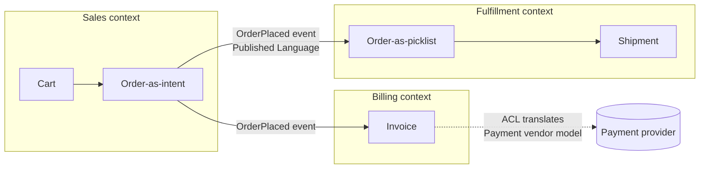

# Day 12 — Boundaries: microservices vs modular monolith & DDD strategic design

*After today you can context-map a domain into bounded contexts, decide modular
monolith vs microservices for a given team/scale, and enforce a boundary in code
with an interface + DTOs so a change stays contained.*

## The core problem

Every non-trivial system is carved into parts. The architect's hardest question
isn't *how many* parts — it's **where the lines go**. Draw them well and a
business change touches one module; draw them badly and every feature drags three
teams and five services into a coordinated release. The classic failure is to
draw the lines by **technical layer** (a "controllers" service, a "database"
service) or by guesswork, then **cement those wrong lines into network calls** —
producing a **distributed monolith**: the operational cost of microservices with
the coupling of a monolith, and none of the benefits of either.

Domain-Driven Design (DDD) gives boundaries a principled basis: draw them around
**how the business actually thinks and changes**, not around your code's current
shape. The unit is the **bounded context** — a region of the model with its own
consistent language and rules. Boundaries that match the domain minimize
**coupling** (how much one part must know about another) and maximize **cohesion**
(how much the things inside a part belong together). Get that right and *whether*
the boundary is a package call or a network call becomes a later, reversible
decision — get it wrong and no amount of gRPC saves you.

The senior instinct: **boundaries first, distribution later.** A modular monolith
with clean internal boundaries can be split into services when a seam proves it
needs independent scaling/deploy/ownership. A premature microservice with a wrong
boundary is enormously expensive to move — you're now migrating data and rewiring
network contracts, not just moving a function.

## Key concepts

### Coupling and cohesion — the two forces under everything

- **Cohesion:** things that change together live together. High cohesion = a
  module has one clear reason to change.
- **Coupling:** how much a change in A forces a change in B. Low coupling = you can
  change A's internals without touching B.

**A good boundary maximizes cohesion inside and minimizes coupling across.** The
tell of a bad boundary: features routinely require coordinated changes on both
sides (high coupling), or a "module" contains unrelated concerns that change for
different reasons (low cohesion).

### Bounded context

A **bounded context** is the scope within which a model and its **ubiquitous
language** are consistent. The word "Order" means different things in different
contexts — in *Sales* it's a shopping intent with pricing; in *Fulfillment* it's a
pick-list with a shipping address; in *Billing* it's an invoice line. Forcing one
"Order" object to serve all three is the god-model that couples everything.
Instead, each context has its **own** Order, and they translate at the border.

> Rule of thumb: if two teams argue about what a term "really means," you've found
> a context boundary — give each side its own model.

### Aggregates & aggregate roots

Within a context, an **aggregate** is a cluster of objects treated as one
**consistency/transaction unit**, accessed only through its **aggregate root**.
The root enforces invariants ("an Order's line items must sum to its total";
"you can't add items to a shipped Order"). Rules:

- **One transaction = one aggregate.** If a single operation must atomically
  change two aggregates, that's a signal they might be one aggregate — or that you
  need eventual consistency (an event) between them, not a distributed
  transaction.
- Reference other aggregates **by ID**, not by embedding — this keeps the
  transactional boundary small and is exactly what lets you later put a network
  between them.

Aggregates are where DDD *strategic* design (boundaries) meets *tactical* design
(how to keep data consistent) — and they predetermine your service boundaries:
**a service boundary that splits an aggregate is almost always wrong**, because
you've split a consistency unit across the network.

### Context mapping — the relationships between contexts

Contexts aren't islands; they integrate. The **context map** names each
relationship, which tells you where to invest in translation:

| Pattern | Meaning | When |
|---------|---------|------|
| **Partnership** | two contexts succeed/fail together, coordinate closely | two teams, deeply intertwined goals |
| **Customer/Supplier** | downstream's needs get prioritized in upstream's plan | clear direction of dependency, cooperative teams |
| **Conformist** | downstream just accepts upstream's model as-is | upstream won't/can't change (e.g. a vendor) |
| **Anti-Corruption Layer (ACL)** | downstream translates upstream's model into its own | you must integrate but refuse to let their model leak in |
| **Shared Kernel** | two contexts share a small common model | rare, high-discipline; shared code is shared coupling |
| **Open-Host Service / Published Language** | upstream offers a stable public contract (e.g. a versioned API/event schema) | many downstreams; you formalize the interface |

The **Anti-Corruption Layer** is the one to internalize: it's the translation seam
that stops another context's (or a legacy system's, or a vendor's) model from
infecting yours. In code it's an adapter + your own DTOs — exactly today's lab.

### Conway's Law

*"Organizations design systems that mirror their communication structure."* Your
service boundaries will drift to match your **team boundaries** whether you plan
it or not. So either draw boundaries to match how teams are (and want to be)
organized, or reorganize teams to match the boundaries you want (the **Inverse
Conway Maneuver**). A boundary that cuts across a single team's daily work will be
eroded; a boundary that matches "one team owns this end-to-end" survives. This is
why Amazon's "two-pizza teams" own services end-to-end.

### Modular monolith vs microservices — the real spectrum

These aren't the only two points, but they anchor the tradeoff:

| Dimension | Modular monolith | Microservices |
|-----------|------------------|---------------|
| **Boundary enforcement** | discipline + compiler (packages, interfaces, `internal/`) | the network (physically separate) |
| **Deploy independence** | one deploy unit | per-service deploys |
| **Scaling granularity** | scale the whole app | scale hot services independently |
| **Fault isolation** | in-process = shared fate (mostly) | a service can fail alone (with breakers) |
| **Transactions** | easy — one DB, real ACID | hard — sagas, eventual consistency (Day 16) |
| **Latency of a call** | function call (~ns) | network hop (~0.5ms in-DC + failure modes) |
| **Operational cost** | one thing to run/observe | N things: deploy, mesh, tracing, on-call |
| **Team autonomy** | lower (shared codebase/release) | higher (independent ownership) |
| **Cost of moving a boundary** | low (refactor) | high (data migration + contract change) |

The decisive asymmetry: **moving a boundary is cheap in a monolith and expensive
across a network.** So the low-regret path is *modular monolith with real internal
boundaries*, extracting a service only when a seam proves a concrete need
(independent scaling, independent deploy cadence, separate team ownership, or
fault isolation) — the "when a seam proves real" rule.

### The distributed-monolith anti-pattern

Microservices that must be deployed together, share a database, or make chatty
synchronous calls across boundaries on every request. You pay the network's
latency and failure modes **and** stay tightly coupled. Symptoms: "we can't
deploy service X without also deploying Y and Z", a shared DB behind several
services, an N+1 call pattern across a service boundary. This is worse than the
monolith you left. It's caused by decomposing before you understand the domain —
you turned bad in-process coupling into bad network coupling.

## The decision / tradeoffs

Design brief: decide service boundaries for a mid-size e-commerce domain (Catalog,
Cart, Orders, Payments, Inventory, Shipping). Top-3 NFRs for *this* decision are
usually **evolvability, operability, and team autonomy** (with cost as the
constant tension). Method:

1. Context-map the domain; mark each relationship (partnership/ACL/…).
2. Mark each edge **synchronous** (needs an immediate answer — Cart → Catalog for
   price) vs **asynchronous** (can be an event — Orders → Inventory, Orders →
   Billing). Async edges are natural service seams; chatty sync edges are warnings.
3. Choose modular monolith vs extract-some-services, per the table.

The one-sentence decision test: *"Which boundaries will generate the most
cross-boundary chatter, and am I about to put a network there?"* If yes, keep it
in-process until proven otherwise.

## When NOT this

- **Don't go microservices before you understand the domain.** You cement wrong
  boundaries into network calls and get a distributed monolith. **Alternative:
  modular monolith first**, with boundaries enforced by packages/interfaces;
  extract a service when a seam proves a real need. Microservices win once you
  have multiple teams needing independent deploy cadence, services with
  genuinely different scaling profiles, or a fault-isolation requirement a
  process can't give you.
- **Don't add an Anti-Corruption Layer where a shared kernel is genuinely fine.**
  ACLs cost translation code; if two contexts are one team with one aligned model
  and change together, the translation is ceremony. (But be honest — "we'll share
  the model" is how god-models start.)
- **Don't split an aggregate across a boundary.** If two things must change in one
  transaction, keeping them in one service (one DB, real ACID) beats a saga.
  Reach for the saga (Day 16) only when the boundary is real and eventual
  consistency is acceptable.

## Real-world

- **Segment: monolith → microservices → monolith.** They decomposed early, hit a
  swarm of services with duplicated logic and painful cross-cutting changes (a
  distributed monolith), and **merged back** to a monolith for velocity. Lesson:
  **premature decomposition is a real, expensive mistake — boundaries first,
  network later.**
- **Amazon Prime Video: audio/video monitoring re-monolith.** Moved a serverless/
  microservice pipeline back to a monolith and cut cost ~90%, because the
  components were chatty and shuffling data over the network dominated cost.
  Lesson: **micro isn't automatically cheaper or faster — for tightly-coupled,
  chatty work, in-process wins.**
- **Amazon "two-pizza teams" / Conway's Law.** Service ownership mapped to small
  autonomous teams. Lesson: **boundaries and team topology must agree**, or the
  org structure will bend the architecture.
- **Shopify's modular monolith.** A very large Rails monolith kept maintainable by
  strict internal component boundaries (enforced tooling) rather than premature
  service splits. Lesson: **"monolith" is not "big ball of mud" — a *modular*
  monolith is a legitimate, often superior, target.**

Log takeaways in `reference/real-world-case-studies.md` (Day 12).

## Common mistakes / gotchas

1. **Boundaries by technical layer**, not by domain ("frontend service", "DB
   service") → every feature spans all layers → maximal coupling.
2. **The god-model / shared "core" library** that every context imports → a change
   to it ripples everywhere; the shared kernel becomes shared fate.
3. **Splitting an aggregate** across a service boundary → you need a distributed
   transaction where a local one would have done.
4. **Chatty synchronous calls across a boundary** (N+1 over the network) → latency
   and cascading-failure exposure; a sign the boundary is wrong or should be async.
5. **A shared database behind multiple services** → they're coupled at the schema;
   you have a distributed monolith with extra steps.
6. **Ignoring Conway's Law** → drawing boundaries no single team owns; they erode.
7. **Leaking another context's model** into yours (no ACL) → their breaking change
   is now your breaking change.

## Practice

### 1. Context-map the domain & find the chatty boundary

For Catalog, Cart, Orders, Payments, Inventory, Shipping: name the aggregate root
of each, mark Cart→Catalog and Orders→Inventory as sync or async, and identify the
one boundary most likely to generate cross-service chatter. What would you do
about it?

Hint 1

Which interactions need an *immediate* answer (a user is waiting, correctness
depends on it) vs which can be a fire-and-forget event?

Hint 2

"Show me my cart with current prices/stock" happens on every page view; "an order
was placed, decrement stock" happens once per checkout.

Solution sketch

Aggregate roots: Catalog→Product; Cart→Cart; Orders→Order; Payments→Payment;
Inventory→StockItem; Shipping→Shipment. **Cart→Catalog is synchronous** (user is
looking at the cart now, needs current price/availability) and **high-frequency**
→ the chatty boundary: rendering a cart of 20 items could be 20 cross-service
calls (N+1 over the network). **Orders→Inventory is asynchronous** (an
`OrderPlaced` event decrements stock; eventual consistency is fine). Fixes for the
chatty Cart→Catalog boundary: keep Cart and Catalog **in the same service/process
until proven otherwise**; if split, **batch** the lookup (one call for 20 items),
**cache** product data in Cart (accepting mild staleness), or push a
denormalized read-model of prices to Cart via events. The point: don't put a
network on the highest-frequency synchronous edge.

### 2. Modular monolith or microservices?

A 6-engineer startup, pre-product-market-fit, is building this e-commerce system
and wants "microservices so we can scale." Give your recommendation and the
single condition that would change it.

Hint

Count the teams. What's the cost of moving a boundary you drew wrong at this
stage? What are they actually optimizing for right now?

Solution sketch

Recommend a **modular monolith**: one deploy unit, clean internal package
boundaries (Catalog/Cart/Orders/… as modules communicating via interfaces + DTOs),
one Postgres with per-module schemas. Reasons: 6 engineers ≈ 1–2 teams (Conway —
you don't have enough teams to own many services); pre-PMF the domain (and thus
the *right* boundaries) is still changing, and **moving a boundary in-process is a
refactor, across the network it's a migration**; they're optimizing for **velocity
and learning**, which the monolith serves. The condition that flips it: a specific
component develops a **genuinely different scaling profile or deploy cadence, or a
second team forms to own it end-to-end** — then extract *that one* service along
the seam you already have. "We want to scale" is not that condition until a real
bottleneck exists.

### 3. Why does the boundary hold in-process?

Your `orders` package imports `inventory`'s internal structs directly. Nothing in
Go stops this. Explain what enforces the boundary today, how you'd make the
compiler help, and how a network boundary (Day 13) would change the guarantee.

Hint

Go lets any package import any *exported* symbol. What Go mechanism restricts
imports? And what does "the other side is a separate process" force?

Solution sketch

Today only **discipline** enforces it — exported identifiers are importable by
anyone, so `orders` *can* reach into `inventory`'s guts and the compiler is fine
with it. Make the compiler help by: (a) putting `inventory`'s internals under an
`internal/` directory (Go **forbids** imports of `.../internal/...` from outside
the parent tree → compile error), and (b) having `orders` depend only on an
**interface it declares itself** plus **DTOs**, never on `inventory`'s concrete
types (dependency inversion). A **network boundary** changes the guarantee from
"enforced by convention/compiler within one binary" to "**enforced physically**":
the only way to reach the other side is its wire contract (gRPC/REST/events), so
you *cannot* accidentally couple to its internals — at the cost of latency,
partial failure, and serialization. That's the tradeoff: the network gives you a
hard boundary but makes you pay Day 8–11's resilience tax for it.

## Go deeper (offline-friendly)

- **Eric Evans, *Domain-Driven Design*** — bounded contexts, aggregates,
  ubiquitous language (the strategic-design chapters and the context-map patterns).
- **Vaughn Vernon, *Implementing Domain-Driven Design*** — the practical version;
  especially "aggregate design rules" and context mapping.
- **Sam Newman, *Building Microservices* (2nd ed.)** — Ch. 1–3 (boundaries,
  coupling/cohesion) and the "monolith first / when to split" argument; also his
  *Monolith to Microservices*.
- **Martin Fowler — "MonolithFirst" and "MicroservicePremium"** essays; and
  **"BoundedContext"** on martinfowler.com.
- **Segment — "Goodbye Microservices: From 100s of problem children to 1 superstar"**
  (their re-monolith writeup). **Amazon Prime Video tech blog — the monitoring
  re-monolith post.**
- **DDIA Ch. 4** (evolvability, schema compatibility — sets up Day 13) —
  Kleppmann. **Alex Xu Vol. 2** — the microservices/API-gateway chapters.

## Check yourself

- Can you explain **coupling vs cohesion** and what a "good boundary" optimizes?
- What is a **bounded context**, and why can "Order" be three different models?
- What is an **aggregate root**, and why should a service boundary never split an
  aggregate?
- Name three **context-map relationships** and when you'd use an **Anti-Corruption
  Layer**.
- State the **modular-monolith-first** argument and the exact condition under which
  you'd extract a service.
- What is a **distributed monolith**, what causes it, and how do you smell it early?
- In Go, what actually enforces an in-process boundary, and how does `internal/` +
  consumer-defined interfaces + DTOs strengthen it?
