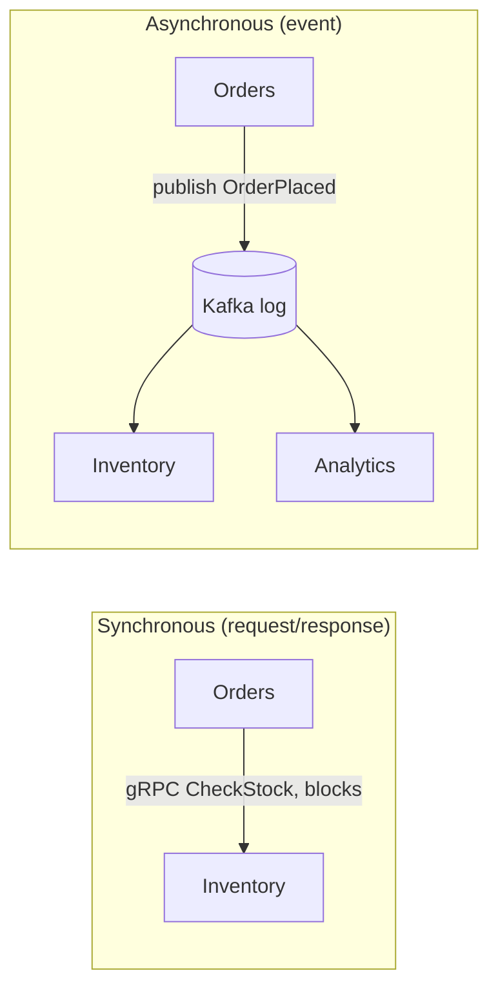

# Day 13 — Service communication: sync vs async, gRPC, API design & versioning

*After today you can: choose sync vs async and a concrete protocol for each service
edge, and evolve a schema without breaking live clients — because you know exactly
what is and isn't on the wire.*

## The core problem

Once you carve a system into services (Day 12), every method call that used to be
a function call becomes a **network call across an ownership boundary**. Two new
problems appear that never existed inside a monolith:

1. **Coupling in time.** A synchronous call means the caller's availability is now
   a *product* of the callee's availability. Three sync hops at 99.9% each →
   99.7% best case, and latency adds, not averages.
2. **Coupling in schema.** The two sides deploy independently, on different days,
   by different teams. The message format is now a *contract* between versions that
   coexist in production. Change it carelessly and you break a caller you can't see.

Today is about making both couplings explicit decisions: **when to pay for a sync
answer vs decouple with async**, and **how to change a contract additively so old
and new peers interoperate during the days/weeks they overlap.**

Mental model: **the wire is the API, not your code.** Your Go struct is a local
convenience. What crosses the boundary is bytes defined by a schema. Compatibility
is a property of the *bytes*, so you reason about the bytes.

## Key concepts

### Sync vs async per edge



- **Synchronous** is right when the caller *cannot proceed without the answer*:
  "is this SKU in stock right now?", "authorize this card". You accept the
  availability coupling because correctness demands the answer inline.
- **Asynchronous** is right when the caller only needs to *announce a fact* and
  others react in their own time: "an order was placed". The producer's
  availability no longer depends on any consumer. (That's Day 14.)

The trap: making a call sync *because it's easier to code*, when the business
doesn't need the answer inline. You've coupled availability for nothing.

### gRPC vs REST vs GraphQL

| Dimension | gRPC | REST / JSON | GraphQL |
|-----------|------|-------------|---------|
| Payload | Protobuf binary (compact) | JSON text (verbose) | JSON, client-shaped |
| Transport | HTTP/2, multiplexed, streaming | HTTP/1.1 or 2 | usually HTTP POST |
| Contract | `.proto`, strict, codegen'd | OpenAPI (optional), loose | SDL schema, strict |
| Browser | needs grpc-web + proxy | native | native |
| Latency | low; ~2–10× smaller payloads than JSON | higher parse + size | one round trip, server does joins |
| Best for | internal service-to-service, high RPS | public APIs, browser edge, cacheable GETs | aggregation / BFF for many clients |
| Weak at | human debuggability, browser, caching | payload size, streaming, N+1 chatter | server complexity, caching, query-cost control |

Rule of thumb: **gRPC between your services, REST/JSON at the public/browser edge,
GraphQL when many heterogeneous clients each want a different slice.** These are
not mutually exclusive — a typical system is gRPC internally with a REST or GraphQL
gateway at the edge.

### The protobuf wire format (why field *numbers* are sacred)

A protobuf message is a flat sequence of `(tag, value)` pairs. The **tag** encodes
the field number and the wire type:

```
tag = (field_number << 3) | wire_type
wire types:  0 = varint (int32/64, bool, enum)   2 = length-delimited (string, bytes, message)
             1 = 64-bit (fixed64,double)          5 = 32-bit (fixed32,float)
```

`CheckStockRequest{ order_id:"o1", sku:"SKU1", quantity:5 }` with fields numbered
1,2,3 serializes to exactly these bytes:

```
0A 02 6F 31        field 1 (1<<3|2=0x0A), len 2, "o1"
12 04 53 4B 55 31  field 2 (2<<3|2=0x12), len 4, "SKU1"
18 05              field 3 (3<<3|0=0x18), varint 5
```

Three consequences that define the whole compatibility model:

- **The field *name* is not on the wire.** Renaming `quantity`→`qty` is a
  source-only change; the wire is identical. (Exception: proto-JSON and reflection
  use names.)
- **The field *number* IS the wire identity.** Change `quantity` from 3 to 7 and
  the same value now serializes as `38 05`. An old peer expecting field 3 sees an
  *unknown field* and reads `quantity = 0`. Silent data loss — no error.
- **Unknown fields are ignored (and, since proto3.5, preserved on round-trip).**
  This is *why* additive changes are safe: an old reader skips fields it doesn't
  know instead of failing.

### Backward / forward compatibility rules

- **Backward compatible** = a *new* reader can read *old* data.
- **Forward compatible** = an *old* reader can read *new* data.
- Protobuf gives you *both* if you follow the rules — critical because during a
  rollout, old and new run simultaneously in *both* roles.

The additive-only ruleset:

1. **Never reuse or renumber a field number.** Removing a field? `reserved 3;`
   (and `reserved "quantity";`) so no one ever re-adds it at that number.
2. **Only add new fields with new numbers.** New fields get proto3 defaults on old
   peers (0, "", empty) — design so the default means "absent".
3. **Never change a field's type** in a wire-incompatible way (e.g. `int32`→`string`
   is wire-type 0→2: garbles). Some are compatible (int32/int64/bool/enum all
   varint), but treat type as frozen.
4. **Enums:** always keep a `0` "UNSPECIFIED" value; never renumber.

### Versioning strategy for the *service*, not just the message

Additive evolution handles most changes in place. When a change is genuinely
breaking (semantics change, a field must be removed), you version:

- **URL/path versioning** (`/v1/orders`, `/v2/orders`) or proto package
  (`order.v1`, `order.v2`) — coarse, simple, you run both.
- **Stripe's date-based versions** — clients pin a date (`2023-10-16`); the server
  keeps *transformation functions* that upgrade an old request to current and
  downgrade the current response back. Old clients never change; complexity lives
  server-side. Powerful and expensive — reserve for large public APIs.

## The decision / tradeoffs

Per edge, decide two things: **sync vs async**, and **which protocol**.

| Edge (this domain) | Needs inline answer? | Choice | Why |
|--------------------|----------------------|--------|-----|
| Orders → Inventory (check stock) | yes — can't confirm order without it | **sync gRPC** | low-latency internal call, strict contract |
| Orders → Payments (authorize) | yes — correctness | **sync gRPC** (or REST if provider is external) | must have the auth result |
| Orders → (the world): "OrderPlaced" | no — just announcing | **async event** (Day 14) | decouple availability of consumers |
| Browser → Orders API | yes | **REST/JSON** | browser-native, cacheable, debuggable |

Criteria an architect weighs: does the caller need the answer *now* (sync) or
just to *notify* (async)? Is the consumer a browser (REST) or a service (gRPC)?
How many independent clients want different shapes (GraphQL)? What is the payload
size × RPS (binary vs JSON matters at scale, not at 5 RPS)?

## When NOT this

- **NOT gRPC at a public/browser edge.** Browsers can't speak raw gRPC; you need
  grpc-web + a proxy (Envoy). At a public edge, REST/JSON's tooling, caching
  (HTTP `Cache-Control`, CDNs), and debuggability usually win. gRPC's payoff is
  *internal* fan-out at high RPS.
- **NOT sync on a critical path that should be async.** If you make "send the
  receipt email" a synchronous call inside checkout, an email-service outage now
  fails checkouts. Announce the fact; let email react. Sync couples availability.
- **NOT date-based versioning for an internal API with 3 callers.** The
  transformation-function machinery is justified by Stripe's thousands of
  externally-pinned integrations, not by your two internal services — just ship
  `v2` and migrate the callers.
- **NOT GraphQL for a single client with stable needs** — you take on query-cost
  control, caching, and N+1 resolver problems to solve an aggregation problem you
  don't have.

## Real-world

- **gRPC at scale (Google/CNCF).** Internally, Google's services are contract-first
  with Protobuf and evolve schemas additively across thousands of independently
  deployed binaries. *Lesson:* the discipline that makes this work is not gRPC the
  transport — it's the **field-numbering rules**. The wire contract, not the code,
  is the API.
- **Stripe API versioning.** Every account is pinned to the API version active when
  they integrated; Stripe maintains per-version request/response transformers so a
  2015 integration still works untouched in 2024. *Lesson:* backward compatibility
  is a *product feature* with a real engineering cost — they chose to pay it
  server-side so customers never have to migrate. Most systems can't afford this and
  shouldn't try; know it exists so you recognize when the scale justifies it.

## Common mistakes / gotchas

1. **Renumbering or reusing a field number.** The #1 wire-break. Old peers read the
   default silently — no exception, just wrong data. Always `reserved` removed numbers.
2. **Treating proto3 defaults as "missing".** A `bool paid = 5;` unset reads `false`
   — indistinguishable from an explicit `false`. If absence matters, use `optional`
   (proto3 field presence) or a wrapper.
3. **Assuming a renamed field breaks the wire.** It doesn't (numbers are the
   identity) — but it *does* break proto-JSON, gRPC reflection, and generated client
   code. Know which surface you're changing.
4. **No deadline on a gRPC call.** gRPC calls with no `context` deadline hang
   forever on a stuck peer, exhausting the caller's connections — the Day 9 cascade.
   Always set a per-call deadline.
5. **Chatty sync calls (N+1 over the network).** A loop that makes one gRPC call per
   item turns a 1ms in-process loop into 100 × network RTT. Batch, or go async.
6. **Versioning the URL but not the schema discipline.** `/v2` doesn't save you if
   *within* v2 you renumber a field. Additive rules apply inside every version.

## Practice

### 1. Which edge is sync, which is async?

A ride-hailing app has: (a) rider requests a ride → needs a driver match; (b) trip
completes → receipt, ratings prompt, and fraud-scoring all must happen; (c) app
shows the driver's live location. Classify each edge sync vs async and pick a protocol.

<details><summary>Hint 1</summary>Ask per edge: does the initiator need the answer before it can proceed, or is it announcing a fact others react to?</details>
<details><summary>Hint 2</summary>Live location is a stream, not a request/response. Which protocol streams natively?</details>
<details><summary>Solution sketch</summary>(a) Rider→matching is <b>sync</b> — the rider is blocked waiting for a match (gRPC internally, REST at the app edge). (b) Trip-complete is <b>async</b>: emit a <code>TripCompleted</code> event; receipt, ratings, and fraud each consume independently — none should be able to fail the trip. (c) Live location is a <b>server stream</b> (gRPC streaming or WebSocket at the edge), not repeated polling.</details>

### 2. Make this change safely

You must add a `discount_code` to `CheckStockRequest` and remove the now-unused
`legacy_region` field (number 4). Write the proto edits that keep every deployed
peer working during the rollout.

<details><summary>Hint 1</summary>New data → new field number. Never reuse a retired one.</details>
<details><summary>Hint 2</summary>What stops a future engineer from re-adding a field at number 4?</details>
<details><summary>Solution sketch</summary>Add <code>string discount_code = 8;</code> (next unused number). To remove field 4: delete the line and add <code>reserved 4; reserved "legacy_region";</code>. Old peers that still send field 4 are harmless (new reader ignores the unknown field); new peers that omit it are fine because old readers default it. No version bump needed — this is a pure additive/reserve change.</details>

### 3. Diagnose the silent break

After a deploy, `quantity` is arriving as `0` at Inventory for all requests from
the old Orders build, but new-build requests are fine. No errors in any log. What
happened and how do you confirm it from the bytes?

<details><summary>Hint 1</summary>"No errors, wrong value" is the signature of what kind of change?</details>
<details><summary>Hint 2</summary>Marshal the same message with both proto versions and diff the tag bytes.</details>
<details><summary>Solution sketch</summary>Someone <b>renumbered</b> <code>quantity</code> (e.g. 3→7). The old client still emits tag <code>0x18</code> (field 3); the new server looks for tag <code>0x38</code> (field 7), treats field 3 as unknown, and defaults quantity to 0 — no error because unknown fields are legal. Confirm by <code>protoc --decode_raw</code> on a captured old request: you'll see field <code>3: 5</code> that the new schema no longer maps. Fix: restore the number to 3; add <code>reserved</code> for any number you actually meant to retire. The lab reproduces exactly this.</details>

### 4. gRPC or REST for a new integration?

A partner (external company, their own release cadence) needs to call your Orders
service. Your internal services all use gRPC. What do you expose to the partner, and why?

<details><summary>Hint 1</summary>Who controls the client's toolchain and upgrade schedule?</details>
<details><summary>Solution sketch</summary>Expose <b>REST/JSON</b> (or gRPC only if they explicitly want it and can generate stubs). External partners value ubiquitous tooling, easy debugging (curl), and not being forced to adopt your proto build. Keep gRPC internal; put a thin REST gateway at the partner edge. This is the "gRPC inside, REST at the edge" pattern.</details>

## Go deeper (offline-friendly)

- **DDIA Ch. 4 — Encoding and Evolution** (Kleppmann): the definitive treatment of
  schema evolution, backward/forward compatibility, and why field numbers matter.
  Read this before the lab.
- **gRPC docs — "Core concepts" + "Protocol Buffers: Proto3 Language Guide"**: the
  `reserved`, `optional`, and default-value semantics, verbatim.
- **Google API Improvement Proposals (AIP)**, aip.dev — AIP-180 (backwards
  compatibility) and AIP-{2xx versioning}: Google's own rulebook for evolving APIs.
- **Stripe blog — "APIs as infrastructure: future-proofing at scale with versioning."**
- **Alex Xu, *System Design Interview* — the API design / communication-style chapters.**
- **buf docs — "Breaking change detection"**: `buf breaking` catches renumbering in CI.

## Check yourself

- Can you explain why renaming a proto field is wire-safe but renumbering is not?
- What are the two independent decisions to make for every service edge?
- When would you NOT use gRPC? When would you NOT use a synchronous call at all?
- What does `reserved` protect you from, and what breaks if you skip it?
- Backward vs forward compatibility — why does a rolling deploy need both?
