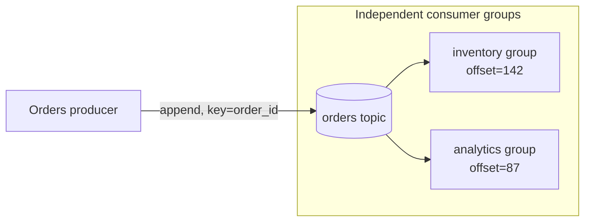

# Day 14 — Event-driven architecture & the log as source of truth

*After today you can: design a topic that fans one fact out to many independent
consumers, replay history to rebuild a consumer from scratch, and keep one bad
message from wedging a partition.*

## The core problem

Day 13's synchronous calls couple availability: if Orders must call Inventory,
Analytics, Fraud, and Email inline, then every one of those being up is a
precondition for accepting an order, and adding a fifth consumer means changing
Orders. That's O(N) coupling and it grows every time the business wants to react
to an order in one more way.

The event-driven inversion: **Orders states a fact once — "OrderPlaced" — to a
durable log, and stops caring who reads it.** Consumers subscribe independently,
at their own pace, and new ones are added without touching Orders. The producer's
availability no longer depends on any consumer's.

The deeper idea (Kleppmann's "turning the database inside out"): **the log of
events is the source of truth, and every other store — a search index, a cache, a
SQL read model, an analytics warehouse — is a derived view you can rebuild by
replaying the log.** State becomes a *materialization* of history, not the primary
artifact. This is the foundation for CQRS (Day 15) and the outbox (Day 16).

Mental model: **a database stores the current value of a cell; a log stores the
sequence of facts that produced it.** Given the facts you can always recompute the
value; given only the value you've thrown the history away.

## Key concepts

### The log abstraction

A log is an **append-only, totally-ordered, durable, replayable** sequence of
records. That's it. Kafka is a distributed implementation of this abstraction.

- **Topic** = a named log. **Partition** = one shard of that log; ordering is
  guaranteed *only within a partition*, never across a topic.
- **Offset** = a monotonically increasing position within a partition. A consumer's
  progress *is* its committed offset. "Replay" = move the offset backward.
- The broker doesn't track "was this delivered?" per consumer — each consumer
  group owns its offsets. This is what lets N groups read the same log independently.

### Partitions, keys, and ordering

The partition is the **unit of parallelism and the unit of ordering**.

- A record's **key** is hashed to choose a partition: `partition = hash(key) % N`.
  Same key → same partition → **ordered relative to each other**. Key by
  `order_id` and all events for one order are processed in order.
- Within a group, **at most one consumer reads a given partition** at a time. So
  max consumer parallelism in a group = partition count. 6 partitions → up to 6
  active consumers; a 7th sits idle.
- No key (null) → round-robin/sticky spread, maximum throughput, **no ordering
  guarantee**. Choose: order per entity (key) *or* max spread (no key). You can't
  have global ordering and horizontal scale at once.

Sizing: pick partition count for peak-throughput ÷ per-consumer-throughput, with
headroom — you can add partitions later but it *changes the key→partition mapping*
for future records (existing ordering per key is disrupted), so over-provision
modestly rather than reshard hot.

### Consumer groups

- A **group** is a set of consumers that *share* the partitions of a topic —
  each partition to exactly one member. Scale a workload by adding members up to
  the partition count.
- **Different groups each get every record**, independently, at their own offset.
  `inventory` and `analytics` are separate groups → both see 100% of events. This
  is the fan-out that replaces N synchronous calls.
- Rebalancing: when a member joins/leaves, partitions are reassigned. Poorly-tuned
  rebalances (or a crash-looping consumer) cause "stop-the-world" pauses — a real
  operational gotcha.

### Retention vs compaction

- **Time/size retention** (`retention.ms`, `retention.bytes`): keep the log for 7
  days / 100 GB, then delete oldest segments. Good for event streams you replay
  within a window.
- **Log compaction** (`cleanup.policy=compact`): keep the *latest* value per key
  forever, garbage-collecting superseded values. Turns the log into a durable
  key-value snapshot — the mechanism behind Kafka as a source of truth for *state*
  (e.g. a changelog topic).
- If you want "rebuild any consumer from the beginning of time," you need retention
  long enough (or compaction) to hold the history. Retention policy *is* an
  architectural decision about replayability.

### Event notification vs event-carried state transfer (ECST)

The single most consequential schema decision in EDA:

| Style | Payload | Consumer then... | Cost | Coupling |
|-------|---------|------------------|------|----------|
| **Notification** | just the fact + ID: `{orderId: 42}` | calls back to Orders for details | extra sync call per event (re-couples!) | low payload, high runtime coupling |
| **Event-carried state transfer** | the full relevant state: `{orderId, items, total, customer}` | works from the event alone | fatter events, data duplicated | high payload, low runtime coupling |

- **Notification** keeps events tiny but forces consumers to call back — you've
  re-introduced the synchronous coupling you were escaping.
- **ECST** makes consumers fully autonomous (they never call back) at the cost of
  larger events and denormalized data that can go stale. This is usually the right
  default for domain events precisely because it preserves the decoupling.
- Middle ground: carry the state a consumer *typically* needs; let rare cases call back.

## The decision / tradeoffs

Designing the `orders` topic, the architect decides:

| Decision | Options | Chosen for this domain | Why |
|----------|---------|------------------------|-----|
| Payload style | notification vs ECST | **ECST** for `OrderPlaced` | consumers (inventory, analytics, fraud) stay autonomous |
| Key | order_id vs customer_id vs none | **order_id** | per-order ordering (Placed→Paid→Shipped); spreads load |
| Partitions | 1 vs 6 vs 50 | **enough for peak throughput + headroom** | unit of parallelism; hard to reduce later |
| Retention | 7d vs compacted vs infinite | **long enough to bootstrap a new consumer** | replayability is the whole point |
| Poison handling | skip / retry / dead-letter | **dead-letter after N retries** | one bad message must not wedge a partition |

## When NOT this

- **NOT events for a request that needs an immediate synchronous answer.** "Is
  this card valid?" can't be a fire-and-forget event — the user is waiting for a
  yes/no. Announce facts async; ask questions sync (Day 13).
- **NOT event-driven where you actually need a transaction across consumers.** If
  "place order" must atomically reserve stock *and* charge the card or do neither,
  a fan-out of independent events gives you eventual consistency, not atomicity —
  you need a saga (Day 16), and you must design the compensations. EDA doesn't give
  you distributed ACID.
- **NOT a fat ECST payload when the event is high-volume and consumers only need
  the ID** — you'll pay bandwidth and duplicate stale data for nothing; use
  notification + lookup there.
- **NOT one giant partition for ordering** — global ordering across a topic means a
  single partition means no horizontal scale. Order per *entity* (key), not globally.

## Real-world

- **Kleppmann — "Turning the Database Inside Out" + the *Making Sense of Stream
  Processing* report.** The log is primary; databases, indexes, and caches are
  derived views maintained by consuming the log. *Lesson:* if you keep the event
  history, every derived store is disposable and rebuildable — you stop fearing
  schema changes to read models because you can just replay.
- **LinkedIn's log (Jay Kreps, "The Log: What every software engineer should know
  about real-time data's unifying abstraction").** LinkedIn unified dozens of
  point-to-point data integrations behind one central log (which became Kafka).
  *Lesson:* N producers × M consumers as direct integrations is O(N×M) glue; a
  shared log makes it O(N+M). The log is an integration architecture, not just a
  queue.

## Common mistakes / gotchas

1. **Keying for throughput when you needed ordering (or vice-versa).** No key →
   `Placed` and `Paid` for the same order can land on different partitions and be
   processed out of order. Key by the entity whose events must stay ordered.
2. **A poison message wedges the partition.** A naive consumer that crashes/retries
   forever on one un-parseable record blocks *every* record behind it in that
   partition. You need a retry limit → dead-letter topic → continue.
3. **Treating a consumer group like a queue.** Adding consumers beyond the partition
   count doesn't add parallelism — the extras sit idle. Parallelism is capped by
   partitions.
4. **Committing offsets before processing succeeds.** Auto-commit + a crash mid-work
   = the record is skipped (at-most-once, silent data loss). Commit *after* the
   work, and make the work idempotent (you'll re-see records after a rebalance).
5. **Assuming events are exactly-once by default.** Kafka is at-least-once out of
   the box; consumers must be idempotent (Day 8). Exactly-once needs transactions +
   care and is narrower than people think.
6. **Short retention on a source-of-truth topic.** If retention < the time to
   bootstrap a new consumer, you *can't* replay from the beginning — you've quietly
   given up the log's superpower.

## Practice

### 1. Choose the key

Events: `OrderPlaced`, `OrderPaid`, `OrderShipped`. Requirement: a consumer must
never see `OrderShipped` before `OrderPaid` for the same order, but you also want
to spread load across 12 partitions. What key do you use, and what does it *not*
guarantee?

Hint 1
Ordering is guaranteed only within a partition. What must share a partition?

Hint 2
What ordering are you explicitly giving up by not using a global key?

Solution sketch
Key by <code>order_id</code>: all events for one order hash to the same partition, so per-order order is preserved, and different orders spread across all 12 partitions for throughput. It does <b>not</b> guarantee ordering <i>across</i> orders (order 7's events may interleave with order 9's) — which is fine, no consumer needs cross-order ordering.

### 2. Notification or ECST?

`OrderPlaced` is consumed by (a) Analytics (needs total + timestamp), (b) Inventory
(needs the line items), (c) an Audit service (needs everything, forever). Traffic
is ~2k events/sec. Pick a payload style and justify.

Hint 1
What happens to Orders' availability if every consumer must call back for details?

Solution sketch
Use <b>ECST</b>: put items, total, timestamp, customer in the event. All three consumers work from the event alone — no callbacks, so Orders isn't a runtime dependency of any of them, and Audit gets a complete immutable record for free. 2k/sec of a few-KB event is trivial. Notification would force ~2k callbacks/sec into Orders, re-coupling exactly what you decoupled.

### 3. Bootstrap a brand-new consumer

The business wants a new `Fraud` consumer that must score *all historical* orders,
not just new ones. What must be true of the topic, and how does the consumer start?

Hint 1
Where does history live, and for how long?

Hint 2
What offset does a new group start from?

Solution sketch
The topic's retention (or compaction) must still hold the history you care about. The new group subscribes with <code>auto.offset.reset=earliest</code> (or explicitly resets to earliest) and consumes from offset 0, rebuilding its state from the log alone. This is the log-as-source-of-truth payoff — and the reason retention is an architectural decision. If retention already expired the old events, you cannot bootstrap it and must backfill from elsewhere.

### 4. The poison message

A consumer hits a record whose JSON is malformed. Naively it throws, the framework
retries, it throws again — forever. What's the blast radius, and what's the fix?

Hint 1
What else is behind that record in the same partition?

Solution sketch
Blast radius = the <b>entire partition</b> stalls: no record after the poison one is processed, so a chunk of orders silently stops being handled (the group looks "alive" but is stuck). Fix: bound retries (e.g. 3×), then route the bad record to a <b>dead-letter topic</b> (with headers: original topic/partition/offset + error), commit the offset, and continue. Alert on DLQ depth; triage out of band. The lab reproduces the stall and adds the DLQ path.

## Go deeper (offline-friendly)

- **DDIA Ch. 11 — Stream Processing** (Kleppmann): logs, consumers, event sourcing
  vs change data capture, exactly-once. The canonical chapter for today.
- **Jay Kreps — "The Log: What every software engineer should know…"** (LinkedIn
  engineering blog / the *I Heart Logs* book): the log-as-integration-substrate argument.
- **Kafka: The Definitive Guide (2nd ed.), ch. on consumers & delivery semantics** —
  offsets, rebalancing, at-least-once vs exactly-once, in operational detail.
- **Confluent — "Kafka Streams and the Dual Nature of Tables and Streams"** (stream–table duality),
  and their **"Error Handling Patterns / Dead Letter Queues"** article.
- **Martin Fowler — "What do you mean by 'Event-Driven'?"**: the four styles
  (notification, ECST, event sourcing, CQRS) crisply distinguished.

## Check yourself

- Can you explain why two consumer groups both receive 100% of a topic's records?
- What is the *unit* of both ordering and parallelism, and what caps consumer count?
- When would you NOT use events at all? When would you NOT use a fat ECST payload?
- What must be true of retention for a new consumer to rebuild from scratch?
- Walk through how one malformed record can stall a partition, and the DLQ fix.
