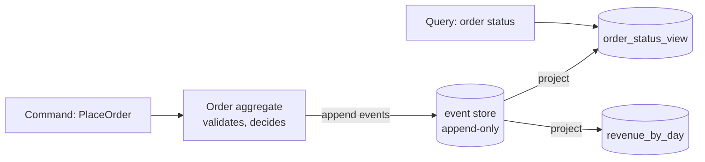

# Day 15 — CQRS / event sourcing

*After today you can: model an aggregate as an append-only stream of events, fold
it back to current state, project read models for queries, and fix a projection bug
by replaying — the superpower CRUD can't give you.*

## The core problem

A CRUD row stores **where you are**; it silently destroys **how you got there**.
`UPDATE orders SET status='shipped'` overwrites the previous status forever. For
most domains that's fine. But when the *history itself* is the valuable asset —
ledgers, audit trails, "why is this order in this state?", regulatory
reconstruction, temporal queries ("what did we think the balance was on March 3?")
— CRUD has thrown away exactly the data you needed.

**Event sourcing** inverts it: the source of truth is an append-only log of
**events** (immutable facts: `OrderPlaced`, `OrderPaid`, `OrderShipped`). Current
state is not stored; it's **computed** by folding the events. Yesterday (Day 14)
the log was the integration substrate between services; today the log *is the
database* for one aggregate.

**CQRS** (Command Query Responsibility Segregation) is the frequent companion: the
write side (commands → events) and the read side (queries → read models) use
*different models and often different stores*. Because a folded event stream is an
awkward thing to query ("show all shipped orders over $100"), you **project** the
events into purpose-built read models optimized for each query.

Mental model: **the events are the truth; every table you query is a cache you can
throw away and rebuild.** That single property is where all the power — and all the
cost — comes from.

## Key concepts

### Command vs query (the CQRS split)



- A **command** is an intent that may be rejected ("PlaceOrder"). The aggregate
  validates it against current state and, if valid, **emits events**.
- A **query** never touches the write model; it reads a **projection** shaped for
  that exact question. Reads and writes scale, and are modeled, independently.

### The event store & optimistic concurrency

An append-only table, ordered two ways:

- **Per-aggregate order** — events for one order in the sequence they happened
  (`seq` 1,2,3…). A `UNIQUE(aggregate_id, seq)` constraint gives you **optimistic
  concurrency**: two commands that both read version 3 and try to append version 4
  → one wins, the other gets a conflict and retries. No locks.
- **Global order** — a monotonic `global_seq` across all aggregates, so projectors
  can consume "everything since position X" deterministically.

Append-only is enforced, not just intended: no `UPDATE`/`DELETE` on the events
table. An event is a historical fact; you don't rewrite history, you append a
correcting event.

### Folding / rehydration

Current state is a **left fold** over the event stream:

```
state = events.reduce(seed, apply)
apply(OrderPlaced)  => {status: PLACED, total: e.total}
apply(OrderPaid)    => {status: PAID}
apply(OrderShipped) => {status: SHIPPED}
apply(OrderCancelled)=> {status: CANCELLED}
```

To handle a command you **rehydrate**: load the aggregate's events, fold to current
state, validate the command against it, append new events. `apply` is a pure
function — deterministic, no I/O — which is *why* replay reproduces state exactly.

### Projections & read models

A **projector** consumes events in `global_seq` order and maintains a read model
(a plain table). Read models are:

- **Denormalized for one query** — `order_status_view(order_id, status, total)` for
  the status page; `revenue_by_day(day, cents)` for a dashboard. Different queries →
  different projections off the *same* events.
- **Disposable and rebuildable** — this is the headline. Drop the table, replay all
  events from `global_seq` 0, and it's reconstructed. A projection bug isn't a
  data-corruption incident; it's "fix the code, truncate, replay."
- **Eventually consistent** — the projector lags the write by however long it takes
  to process. A command's effect is visible in the event store immediately but in
  the read model only after projection. This lag is the central tradeoff (below).

### Snapshots

Folding thousands of events per command gets slow. A **snapshot** stores the folded
state at version N; rehydration loads the snapshot + only events after N. It's a
*performance optimization*, not a source of truth — you can always delete every
snapshot and rebuild from events. Policy: snapshot every K events (e.g. 100), or
never, until folding actually hurts.

### Event versioning

Events are immutable and live *forever*, so their schema will outlive today's code.
When `OrderPlaced` needs a new field, you can't migrate old events in place. Options:
**upcasting** (transform old event shape → new on read), **weak schema** (tolerant
readers, additive fields — the Day 13 discipline), or a versioned event type
(`OrderPlacedV2`). You *will* deal with this; design events to be additively
evolvable from day one.

## The decision / tradeoffs

| Approach | Write model | Read model | History | Complexity | Use when |
|----------|-------------|------------|---------|------------|----------|
| **CRUD** | table rows | same rows | lost | low | most domains; state is all you need |
| **CQRS (no ES)** | table rows | separate read stores | lost | medium | read/write scale or model diverge |
| **Event sourcing (+CQRS)** | event stream | projections | **complete, replayable** | high | history/audit/temporal is the requirement |

The eventual-consistency tradeoff is the one to internalize: a user places an order
(command succeeds, events appended) and immediately loads the status page (query →
projection) — if the projector hasn't caught up, they see stale or missing data.
Mitigations: read-your-writes from the write model for that user's own recent
action, or a synchronous projection for the few reads that can't tolerate lag.

## When NOT this

- **NOT event-sourcing a simple CRUD domain.** A user-profile or a product-catalog
  table gains nothing from event sourcing and pays enormously: event versioning,
  projection rebuilds, eventual-consistency bugs, and a mental model every new team
  member must learn. If nobody will ever ask "how did this get here?", store the
  state. This is the default answer for most tables.
- **NOT full CQRS when reads and writes share a model and scale.** Splitting into
  separate stores adds a projection pipeline and lag for no benefit if a single
  well-indexed table serves both. Add CQRS when the read and write models genuinely
  diverge or scale independently.
- **NOT event sourcing if you can't tolerate eventual consistency anywhere** and
  won't build the read-your-writes escape hatches — you'll fight staleness bugs
  forever.
- **NOT for data you must delete on request (GDPR "right to erasure") without a
  strategy** — an immutable log fights hard deletes. You need crypto-shredding
  (delete the key) or a designed redaction path *before* you commit to ES for PII.

## Real-world

- **Event sourcing in ledger / accounting systems** (and the pattern's canonical
  home, double-entry bookkeeping). An accounting ledger is *already* event-sourced:
  you never edit a posted entry, you post a compensating entry. *Lesson:* ES fits
  domains where the audit trail is legally or operationally the product — and its
  400-year track record in accounting is why "append a correction, never edit" is
  the right instinct.
- **The explicit "when NOT" literature** (e.g. Greg Young's talks, and many teams'
  public post-mortems of over-applied ES). *Lesson:* the most repeated
  event-sourcing lesson from practitioners is *don't event-source the whole system*
  — apply it to the one or two aggregates whose history matters, keep the rest CRUD.
  The complexity tax is real and compounding; scope it deliberately.

## Common mistakes / gotchas

1. **Putting behavior/derived data in events.** Events record *what happened*
   (`OrderPaid{amount}`), not *what to do* or a computed total that today's code
   derives. If the derivation changes, you want to recompute from facts, not be
   stuck with a baked-in wrong number.
2. **Non-deterministic `apply`.** If folding calls `time.Now()`, reads a config, or
   hits the network, replay won't reproduce the original state. `apply` must be pure;
   capture any external value *as data in the event* at write time.
3. **Forgetting projections are eventually consistent.** UI reads the projection
   right after a write and shows stale data; the fix is a deliberate read-your-writes
   path, not "make projections synchronous everywhere" (that throws away the scaling).
4. **Mutable events.** Editing or deleting an event to "fix" data destroys the one
   guarantee ES gives you. Append a correcting event; fix *projections* by replay.
5. **No global ordering / no resumable position.** A projector needs a monotonic
   position (`global_seq`) it can checkpoint, or it can't resume after a crash
   without double-applying or skipping.
6. **Unbounded fold with no snapshot on a hot aggregate.** A long-lived aggregate
   with 100k events makes every command slow. Snapshot before it hurts.

## Practice

### 1. Model the events and the fold

Design the events for an Order that can be Placed, Paid, Shipped, or Cancelled, and
write the `apply` (fold) function's cases. What's the seed state, and which fields
does each event change?

<details><summary>Hint 1</summary>Events are past-tense facts. The fold is a pure function state×event→state.</details>
<details><summary>Hint 2</summary>Which events change status only, and which also carry a value (total)?</details>
<details><summary>Solution sketch</summary>Events: <code>OrderPlaced{items,total}</code>, <code>OrderPaid{amount}</code>, <code>OrderShipped{carrier}</code>, <code>OrderCancelled{reason}</code>. Seed: <code>{status: NONE, total: 0}</code>. Fold: Placed→{status:PLACED, total:e.total}; Paid→{status:PAID}; Shipped→{status:SHIPPED}; Cancelled→{status:CANCELLED}. Pure, deterministic — no clocks, no I/O. This is exactly the lab's fold.</details>

### 2. The stale read model

A user pays for an order; the command succeeds. They refresh the status page and it
still says "PLACED", not "PAID". Nothing is broken. Explain, and give two fixes with
their tradeoffs.

<details><summary>Hint 1</summary>The command wrote events. The page reads a projection. What's between them?</details>
<details><summary>Solution sketch</summary>The projector hasn't processed the <code>OrderPaid</code> event yet — the read model is <b>eventually consistent</b> and lagging. Fix A: read-your-writes — for the user's own just-changed order, fold the write-side event stream directly (fresh, but bypasses the fast read model). Fix B: make that one projection synchronous / update it in the same flow as the command (fresh, but couples write latency to projection and sacrifices independent scaling). Choose per-read based on how much staleness the UX tolerates.</details>

### 3. Fix a bug in a read model

Your `order_status_view` shows some orders as "PAID" that were actually cancelled —
the projector never handled `OrderCancelled`. In CRUD you'd write a data-migration
script guessing which rows are wrong. What do you do here, and why is it safer?

<details><summary>Hint 1</summary>The events still hold the truth. The view is derived.</details>
<details><summary>Solution sketch</summary>Add the missing <code>OrderCancelled</code> case to the projector, then <b>truncate the read model and replay</b> all events from <code>global_seq</code> 0. Every order is recomputed from its true history — no guessing which rows are wrong, no risk of a migration script missing cases, and it's idempotent (replay again → same result). This is the event-sourcing superpower: read-model bugs are fixed by code + replay, not by mutating data. The lab reproduces this exact bug and fix.</details>

### 4. Should this domain be event-sourced?

You're building (a) a bank's transaction ledger, (b) a user's notification-settings
page. For each, event-source or CRUD? Justify with the "when NOT" test.

<details><summary>Hint 1</summary>Will anyone ever need the full history / audit trail of how state got here?</details>
<details><summary>Solution sketch</summary>(a) Ledger → <b>event source</b>: the audit trail and temporal reconstruction are the product and are legally required; corrections must be appended, never overwritten — ES is the natural fit. (b) Notification settings → <b>CRUD</b>: nobody needs the history of toggles; a single row is simpler, and event sourcing would add versioning/projection/consistency cost for zero benefit. Scope ES to the aggregate whose history matters.</details>

## Go deeper (offline-friendly)

- **DDIA Ch. 11 — Stream Processing, "Event Sourcing" and "State, Streams, and
  Immutability" sections** (Kleppmann): the rigorous version of today, and the
  relationship between event sourcing and the log from Day 14.
- **Martin Fowler — "Event Sourcing" and "CQRS"** (martinfowler.com): the reference
  definitions, plus his cautions on when the complexity isn't worth it.
- **Greg Young — "CQRS and Event Sourcing" talk / "A Decade of DDD, CQRS, Event
  Sourcing"**: from the person who named CQRS; heavy on the "when NOT" and the
  operational reality of projections and versioning.
- **Microsoft — Cloud Design Patterns: "Event Sourcing pattern" and "CQRS pattern"**:
  crisp diagrams, consequences, and "when to use / when not to."
- **Vaughn Vernon — *Implementing Domain-Driven Design*, aggregate + event chapters**:
  how aggregates, commands, and events fit DDD (ties back to Day 12).

## Check yourself

- Can you explain why `apply` (the fold) must be a pure function?
- Why is a projection bug *not* a data-corruption incident under event sourcing?
- When would you NOT event-source a domain? When would you NOT even use CQRS?
- What does optimistic concurrency via `UNIQUE(aggregate_id, seq)` protect against?
- Where does eventual consistency enter, and what are your two escape hatches?
