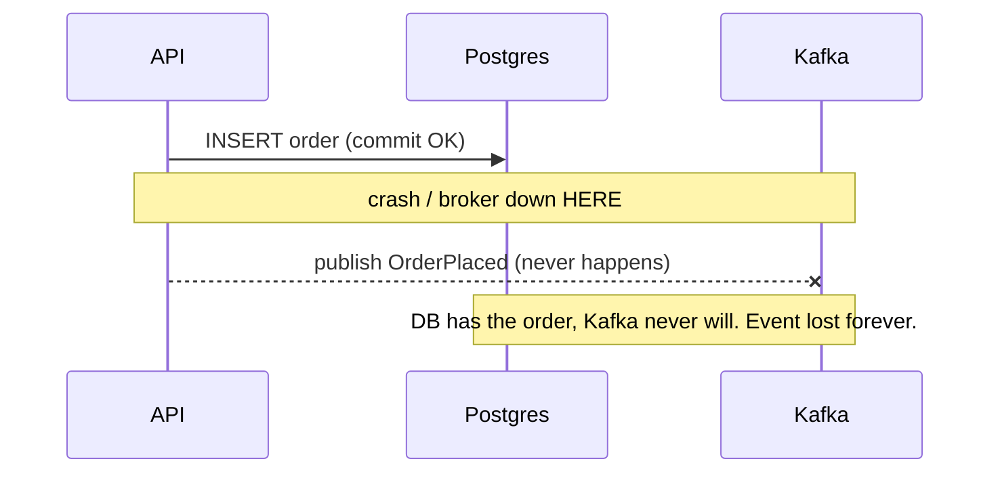
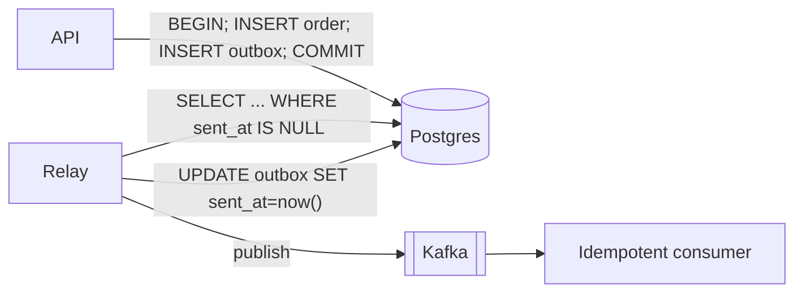
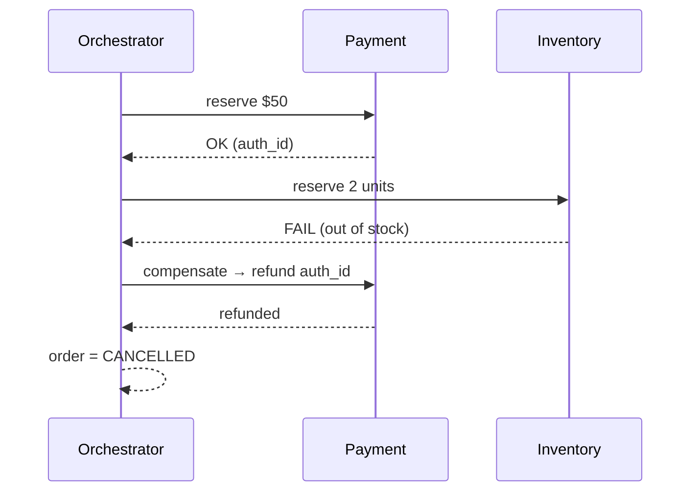

# Day 16 — Sagas, distributed transactions, the transactional outbox

*After today you can: reliably turn one business action into events across services without lost or duplicated effects, and choose between a saga and a real ACID transaction on purpose.*

## The core problem

You committed the order to Postgres. Then you tried to publish `OrderPlaced` to
Kafka — and the process died, or the broker was briefly unreachable. Now the DB
says the order exists but no downstream service will ever hear about it. Inventory
is never decremented; the customer is charged for stock you don't have.

This is the **dual-write problem**: any time one operation must update **two
systems that don't share a transaction** (a database *and* a message broker, or
two databases), there is no atomic "both or neither." Whatever you do — DB first
then publish, or publish then DB — a crash in the gap leaves the two stores
disagreeing. Retries don't save you: retrying the publish can double-send;
retrying the DB write after a successful publish can double-charge.

Two patterns solve the two halves of this:

- The **transactional outbox** makes the *emit an event* step atomic with the
  *change the data* step, by writing the event into the **same database** in the
  same transaction, then relaying it out-of-band.
- The **saga** coordinates a multi-step business transaction across services when
  no single ACID transaction can span them, using **compensating actions** to
  undo committed steps on failure.

Mental model: **stop trying to make two systems commit together. Make one system
the source of truth, and derive the other from it.**

## Key concepts

### The dual-write, drawn



### Transactional outbox

Write the business row **and** an `outbox` row in **one** local transaction. A
separate **relay** (poller or CDC) reads unsent outbox rows, publishes them to
Kafka, and marks them sent. The DB is the single source of truth; the broker is
derived from it.



Guarantees, stated precisely:

- **No lost events.** The event is durable the instant the business tx commits —
  it lives in the DB. If the relay never ran, the row is still there to publish
  later. This is what solves the dual-write.
- **At-least-once delivery, not exactly-once.** If the relay publishes but crashes
  before `UPDATE ... sent_at`, it republishes on restart → a duplicate. You cannot
  cheaply make publish exactly-once; you make the **consumer idempotent** instead.
- **Effectively-once processing** = at-least-once delivery + idempotent consumer.

Relay implementations:

| Approach | How | When |
|---|---|---|
| **Polling relay** | `SELECT ... WHERE sent_at IS NULL ORDER BY id LIMIT N FOR UPDATE SKIP LOCKED` on an interval | Simple, no extra infra, ~100ms–1s added latency. Default choice. |
| **CDC (Debezium)** | Tail the Postgres WAL; the outbox insert *is* the trigger | Lower latency, no polling load, but adds Kafka Connect + Debezium to operate |

`FOR UPDATE SKIP LOCKED` lets you run **multiple relay workers** without them
fighting over the same rows — each grabs a disjoint batch.

### Idempotent consumer

The consumer must dedupe because delivery is at-least-once. Give every event a
stable **`event_id`** (a UUID minted at outbox-insert time — *not* the Kafka
offset, which changes on replay). The consumer, in **one transaction**:

```sql
BEGIN;
INSERT INTO processed_events(event_id) VALUES ($1) ON CONFLICT DO NOTHING;
-- rows affected == 0  → duplicate, skip the side effect
-- rows affected == 1  → first time, apply the side effect in THIS tx
UPDATE inventory SET stock = stock - $qty WHERE product = $p;
COMMIT;
```

Recording "I processed this" and doing the work in the **same** transaction is
the whole trick — otherwise a crash between them re-opens the double-apply window.

### Saga: orchestration vs choreography

A saga is a sequence of **local** transactions, one per service. Each step that
can't be rolled back by the database is undone by an explicit **compensating
transaction**.

```
Place order:  reservePayment → reserveInventory → confirmOrder
On failure:   (compensate in reverse) refundPayment ← releaseInventory ←
```



| | Orchestration | Choreography |
|---|---|---|
| Control | Central coordinator issues commands, tracks state | Services react to each other's events; no central brain |
| Visibility | State machine in one place — easy to see where a saga is | Flow is emergent; must reconstruct from event logs |
| Coupling | Orchestrator knows all participants | Participants only know event contracts |
| Failure mode | Orchestrator is a critical component (make it durable/restartable) | Cyclic event dependencies, hard-to-trace loops |
| Use when | >3 steps, complex branching, you need auditable status | 2–3 steps, loosely coupled, teams own their reactions |

Compensations are **semantic undo**, not rollback: you can't un-send an email, so
you send a correction; you can't un-charge instantly, so you refund. Design them
to be **idempotent and commutative** where possible, because they also run
under at-least-once delivery.

## The decision / tradeoffs

**Outbox vs. direct publish.** Direct publish (write DB, then call
`producer.Send`) is fine *only* if losing an occasional event is acceptable
(fire-and-forget metrics). For anything a downstream must not miss (payments,
inventory, ledgers), use the outbox. The cost is an extra table, a relay to
operate, and added end-to-end latency.

**Saga vs. ACID transaction.** If the work fits in **one database**, use a real
transaction — it gives you atomicity and isolation for free. Reach for a saga
**only** when steps genuinely span services/datastores that can't share a tx.

| Criterion | ACID (single DB) | Saga (cross-service) |
|---|---|---|
| Atomicity | Real, automatic | Simulated via compensations |
| Isolation | Yes (MVCC/locks) | **No** — intermediate states are visible; needs semantic locks / `PENDING` states |
| Consistency | Immediate | Eventual |
| Complexity | Low | High (compensation logic, saga state, retries) |
| When | Work is co-located | Work is distributed and can't be co-located |

## When NOT this

- **Don't use a saga when a single ACID transaction fits.** If Payment and
  Inventory are tables in the same Postgres, a saga trades away atomicity and
  isolation for complexity you didn't need. Sagas exist because you *can't* have
  one transaction — not because distributed is fancier. Alternative: keep it a
  monolithic transaction until a real service boundary forces your hand
  (see Day 12).
- **Don't add an outbox for best-effort signals.** Analytics pings, cache-warm
  hints, "user viewed page" — if a lost event costs nothing, direct publish (or
  just log-and-forget) is simpler. The outbox earns its keep only when downstream
  correctness depends on delivery.
- **Don't use 2PC/XA as the default cross-service answer.** Two-phase commit gives
  real atomicity but couples availability (a slow participant blocks everyone
  holding locks) and few modern brokers/stores support it well. Outbox + saga is
  the availability-friendly alternative; reserve 2PC for the rare case where you
  truly need synchronous cross-resource atomicity and control both resources.

## Real-world

- **The dual-write problem (industry-wide).** The canonical failure that motivates
  everything today. *Lesson:* never write to a DB and a broker in two
  uncoordinated steps — make one derive from the other.
- **Transactional outbox + CDC / Debezium.** Debezium tails the Postgres WAL and
  turns committed rows into Kafka records with no polling. *Lesson:* the log the
  database already keeps (the WAL) can *be* your reliable event source — you're
  reusing durability you already paid for.
- **Saga pattern (Garcia-Molina & Salem, 1987; popularized by Chris Richardson's
  microservices.io).** Long-lived transactions decomposed into compensable steps.
  *Lesson:* give up isolation deliberately and design the undo path as a
  first-class part of the happy path.

(Log your one-line takeaways in `reference/real-world-case-studies.md` → Day 16.)

## Common mistakes / gotchas

1. **Deduping on Kafka offset instead of a business `event_id`.** Offsets change
   when you replay or repartition; the same event then looks new. Mint a UUID at
   outbox time and dedupe on that.
2. **Marking outbox sent *before* the publish succeeds.** Now a crash loses the
   event — you've reintroduced the dual-write inside the relay. Order is: read →
   publish → mark sent.
3. **Consumer applies the side effect and records "processed" in separate
   transactions.** A crash between them double-applies. One transaction, always.
4. **Forgetting `SKIP LOCKED`** — two relay workers publish every row twice, and
   under load they serialize on row locks. Also forgetting to **prune** sent rows;
   the outbox table grows unbounded.
5. **Compensations that can themselves fail and aren't retried.** A refund call
   times out and you don't persist "refund pending" → money stuck. Compensations
   need the same durability + retry + idempotency as forward steps.
6. **Non-idempotent compensations.** Retrying `refund` twice double-refunds.
   Guard with the auth id / idempotency key just like the forward action.

## Practice

**1. Prove the outbox survives a relay crash.**
You place an order (business tx commits), then the relay dies before publishing.
Walk through exactly what state exists and what happens on restart.

<details><summary>Hint 1</summary>
Where does the event physically live between "order committed" and "Kafka has
it"? What guarantees that store's durability?
</details>
<details><summary>Hint 2</summary>
The relay is stateless — its only state is `sent_at` in the outbox table. What
does it do on startup?
</details>
<details><summary>Solution sketch</summary>
After commit, the `outbox` row exists with `sent_at = NULL`, durably in Postgres.
The event is not lost — it's just not yet published. On restart the relay's poll
query `WHERE sent_at IS NULL` finds it and publishes. If the relay had crashed
*after* publish but *before* `UPDATE sent_at`, it republishes → a duplicate,
which the idempotent consumer's `processed_events` table absorbs. Net: no lost
event, effectively-once processing. The DB, not the broker, is the source of truth.
</details>

**2. Design the order saga's failure paths.**
Steps: reservePayment → reserveInventory → confirmOrder. Enumerate what happens
if inventory reservation fails, and what happens if the *compensation* (refund)
fails.

<details><summary>Hint 1</summary>
Compensate in reverse order of completed steps. What was completed before the
failure?
</details>
<details><summary>Hint 2</summary>
A failed compensation can't just be dropped. Where do you record it, and who
retries it?
</details>
<details><summary>Solution sketch</summary>
Inventory fails → only payment was reserved → compensate by refunding the payment
(keyed by the auth/idempotency id), set order `CANCELLED`. If the refund call
fails: mark the saga step `REFUND_PENDING` durably (in the saga/order state),
and a background retrier (with backoff + jitter, Day 8) re-attempts the
idempotent refund until it succeeds. Never leave a compensation to an
in-memory retry that a crash can lose. Escalate to a human/alert after N attempts.
</details>

**3. When would you drop the saga entirely?**
Someone proposes a saga for `deductBalance → recordTransfer` within one banking DB.

<details><summary>Hint</summary>
Do these two steps live in stores that can share a transaction?
</details>
<details><summary>Solution sketch</summary>
Both are rows in the same database → wrap them in one ACID transaction. A saga
here buys nothing and *loses* isolation (another reader could see the balance
deducted before the transfer is recorded). Sagas are for when you *can't* have one
transaction. Keep it ACID until a real service split forces decomposition.
</details>

**4. Why not just retry the direct publish?**
"If the publish fails, catch the error and retry it in the handler."

<details><summary>Solution sketch</summary>
Two holes: (a) the process can crash *between* the DB commit and your retry loop,
so there's nothing left to retry — the event is gone. (b) If the publish actually
succeeded but the ack was lost, your retry double-publishes with no dedupe on the
consumer side. The outbox closes (a) by making the event durable in the DB before
you ever try to publish; the idempotent consumer closes (b). Retry-in-handler
fixes neither reliably.
</details>

## Go deeper (offline-friendly)

- **DDIA Ch. 11 "Stream Processing"** (change data capture, the log as source of
  truth) and **Ch. 9 "Consistency and Consensus"** (why 2PC couples availability).
- **DDIA Ch. 7 "Transactions"** — read-committed vs. what sagas give up (isolation).
- **Chris Richardson, *Microservices Patterns*, Ch. 4–5** — saga orchestration vs.
  choreography, the transactional outbox and polling-publisher / transaction-log-
  tailing patterns. Also microservices.io pattern pages: "Saga", "Transactional Outbox".
- **Debezium documentation — "Outbox Event Router"** (the reference CDC-based relay).
- **Garcia-Molina & Salem, "Sagas" (1987)** — the original paper; short and worth it.
- **Alex Xu, *System Design Interview* Vol. 2** — distributed transaction / payment
  chapters.

## Check yourself

- Can you explain the dual-write problem to a junior in three sentences?
- Why does the outbox give at-least-once (not exactly-once) delivery, and what
  closes the gap?
- When would you NOT use a saga? When would you NOT use an outbox?
- What must be true about the two writes in the idempotent consumer, and why?
- Orchestration vs. choreography: name one situation each wins.
- Why is deduping on Kafka offset a bug?
