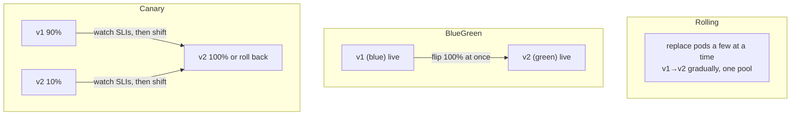
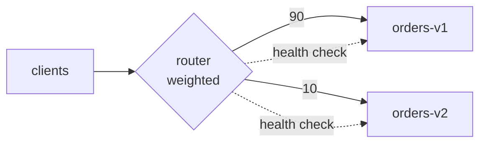

# Day 17 — Service mesh + deployment / rollout architecture

*After today you can: roll out a new service version with a bounded blast radius, tie an automated rollback to your SLIs, and say when a service mesh is overkill.*

## The core problem

Your service works. Now you have to ship **v2** — new code, maybe a new schema,
into a system real users depend on. A bad deploy is one of the top causes of
outages (right up there with capacity and dependency failures). The naive move —
replace all instances of v1 with v2 at once — makes every user your test
subject simultaneously. If v2 is broken, 100% of traffic is broken, and rollback
is a second full deploy under pressure.

Two intertwined problems:

1. **How do I release change safely?** Decouple *deploy* (code is running) from
   *release* (code serves user traffic), so I can expose v2 to 1% of traffic,
   watch, and back out cheaply. This is **progressive delivery**.
2. **How do I run cross-cutting concerns** — mTLS, retries, timeouts, traffic
   routing, telemetry — **consistently across many services** without
   re-implementing them in every codebase? This is what a **service mesh** offers
   (at a cost).

Mental model for rollout: **a deploy is an experiment. Limit the sample size,
define the metric that ends the experiment, and automate the "abort."**

## Key concepts

### Deploy vs. release

- **Deploy:** v2 binary is running somewhere. Zero user impact yet.
- **Release:** v2 is receiving user traffic. This is the risky moment.
- **Feature flag:** release a code path to a subset of *users* independent of
  deploy — orthogonal to, and composable with, traffic-level canaries.

### Rollout strategies

| Strategy | Traffic to v2 | Rollback speed | Extra capacity | Best when |
|---|---|---|---|---|
| **Rolling** | grows as pods cycle | slow (cycle back) | ~0 | low-risk changes, resource-constrained |
| **Blue-green** | 0 → 100% instant flip | instant (flip back) | 2× (both stacks live) | need instant switch + easy rollback, can afford double footprint |
| **Canary** | 1% → 5% → … → 100% | fast (drop weight to 0) | small (a few v2 instances) | want to *observe* v2 on real traffic before full commit |

Canary is the default for user-facing services because it's the only one that
**observes real production traffic on v2 at a small blast radius before
committing**.

### Weighted routing (the mechanism behind a canary)

A router (Traefik, nginx, Envoy, an ALB with weighted target groups) splits
traffic by weight across two upstream pools:

Two independent knobs:
- **Weight** — what fraction of traffic *should* go to v2 (90/10 → 0/100 to promote).
- **Health check** — whether an upstream is *eligible* at all. If v2 fails its
  health check, the router removes it from rotation and serves 100% v1, even at a
  10% weight. Weight and health are ANDed.

### Automated rollback on SLO burn

The point of the canary is to make the rollback decision *mechanical*, not
heroic. Wire it to your **Day-11 SLIs**: if v2's error rate or p99 latency
exceeds a threshold (an absolute bar, or v2-vs-v1 comparison) for N seconds,
automatically set v2's weight to 0. Tools: Argo Rollouts / Flagger analysis
steps, or a script watching Prometheus. The trigger must be measurable *before*
you start (see red-team below).

### Service mesh

A mesh puts a **sidecar proxy** (Envoy) next to every service instance and a
**control plane** (Istio, Linkerd) that programs them. It moves cross-cutting
concerns out of app code:

- **mTLS** between all services (identity + encryption) with zero app changes.
- **Traffic management** — weighted routing, retries, timeouts, circuit breaking
  (Day 9), fault injection — configured declaratively, uniformly.
- **Observability** — golden-signal metrics and trace propagation for free at the
  proxy layer.

**Sidecar vs. library.** The alternative to a sidecar is a shared client library
(e.g. gRPC interceptors, Netflix's Hystrix/Ribbon era). Library = no per-hop proxy
latency, but you must ship it in every language and force-upgrade every service to
change behavior. Sidecar = language-agnostic and centrally controllable, but adds
a proxy hop (~0.5–2ms), memory per pod, and real operational complexity.

## The decision / tradeoffs

**Which rollout strategy?** Match risk and constraints:

| Criterion | Rolling | Blue-green | Canary |
|---|---|---|---|
| Blast radius during rollout | medium (growing pool) | **zero then all-at-once** | **smallest, controlled** |
| Rollback | slow | instant | fast |
| Cost | low | high (2×) | low–medium |
| Observability of the new version | poor | poor (all-or-nothing) | **excellent** |
| Schema/data-migration risk | same | same | canary *doesn't* protect you if v2 writes bad data (see gotchas) |

**Mesh vs. no mesh.** A mesh is justified by **scale and cross-cutting need**, not
by "microservices exist." For 3 services you can get retries/timeouts from a
library or your router and mTLS from your platform, without sidecars.

## When NOT this

- **Don't run a full service mesh for a handful of services.** The sidecar +
  control-plane operational cost (upgrades, debugging an extra network hop,
  proxy resource overhead, a new failure domain) dwarfs the benefit until you
  have *many* services and *real* cross-cutting requirements (org-wide mTLS,
  uniform traffic policy across polyglot teams). Alternative that wins below that
  scale: retries/timeouts in a shared client library or at your ingress/router,
  mTLS via the platform (e.g. ALB + ACM, or app-level TLS). Adopt the mesh when
  the per-service cost of *not* having it exceeds the sidecar tax.
- **Don't canary a change whose risk isn't observable at 10% traffic.** A schema
  migration or a data-corrupting bug can look perfectly healthy on the canary's
  metrics while quietly poisoning data for the 10% (see red-team). Canaries
  protect against *availability/latency* regressions, not silent correctness
  regressions — those need expand/contract migrations, shadow traffic, or
  dual-writes with verification.
- **Don't blue-green when you can't afford 2× capacity** or when the cutover
  can't be atomic (long-lived connections, stateful sessions). Rolling or canary
  fits better.

## Real-world

- **Istio + the sidecar model.** Envoy sidecars + a control plane give mTLS,
  routing, and telemetry uniformly. *Lesson:* decouple *deploy* from *release*
  and push cross-cutting concerns to a layer teams don't each re-implement — but
  only once the fleet is large enough to amortize the complexity.
- **Progressive delivery (canary / blue-green / feature flags; Argo Rollouts,
  Flagger, LaunchDarkly).** *Lesson:* automate the rollback on an SLO burn so the
  decision doesn't depend on a human noticing a graph at 3am.
- **AWS ALB weighted target groups / CodeDeploy canary.** The same
  weighted-routing primitive at the load balancer, no mesh required. *Lesson:*
  you can get a safe canary from the LB you already run.

(Log takeaways in `reference/real-world-case-studies.md` → Day 17.)

## Common mistakes / gotchas

1. **Canary with no automated abort.** A canary you have to *watch* and manually
   roll back is barely better than a full deploy at 3am. Wire the rollback to a
   metric threshold.
2. **The "healthy" canary that corrupts data.** v2 has a schema mismatch; its
   `/health` and latency look fine while it writes malformed rows. Availability
   metrics won't catch it. Use expand/contract migrations and verify data.
3. **Session affinity defeating the split.** Sticky sessions pin a user to v1 or
   v2 for their whole session — your "10%" becomes 10% of *users* forever, and
   comparisons get skewed. Know which one you want.
4. **Weight without health checks (or vice-versa).** Weight alone keeps sending
   10% to a dead v2; health checks alone (no weight control) can't do a gradual
   ramp. You need both.
5. **Comparing v2 to an absolute SLO instead of to v1.** If v1 is already
   degraded, an absolute bar passes a bad v2. Compare canary-vs-baseline.
6. **Mesh adopted for prestige.** Adding Istio to 4 services to "be
   cloud-native" — now every incident has an extra Envoy layer to rule out.

## Practice

**1. Design the v1→v2 canary with an automated rollback trigger.**
Define the exact metric, threshold, and window that aborts the rollout, using
Day-11 SLIs.

Hint 1

What SLIs did Day 11 define (availability, p99 latency, error rate)? Which of
those can you compute per-version at the router or in Prometheus?

Hint 2

Absolute threshold vs. relative-to-baseline. What breaks if v1 is already
slightly degraded?

Solution sketch

Steps: 90/10 for 10 min → 50/50 for 10 min → 0/100. Abort trigger:
`error_rate(v2) > 2%` **or** `p99(v2) > 1.5 × p99(v1)` sustained ≥ 60s → set v2
weight to 0 and page. Compare v2 to v1 (relative), not to a fixed SLO, so a
pre-degraded v1 doesn't mask a bad v2. The metric must exist *before* rollout —
label metrics by version at the router or instrument each version to emit a
`version` label (RED metrics, Day 11).

**2. A canary that looks healthy but corrupts data — how do you catch it?**

Hint

Which class of bug is invisible to availability/latency metrics?

Solution sketch

v2 writes rows with a wrong/renamed column or truncated field; `/health` is 200,
latency is normal → the canary "passes." Availability metrics can't see
correctness. Defenses: expand/contract (backward-compatible) schema migrations so
v2 can't write shapes v1 can't read; shadow/mirror traffic to v2 with output
comparison (no user impact); dual-write + verify; canary *analysis* that checks
business invariants (e.g. row counts, checksum of written records), not just RED
signals. The lesson: canaries bound availability risk, not correctness risk.

**3. Would you put a service mesh in front of 3 services? Defend both answers.**

Solution sketch

Usually no: 3 services get retries/timeouts from a client library or the router,
and mTLS from the platform (ALB+ACM), without the sidecar tax (extra hop, per-pod
memory, control-plane upgrades, a new failure domain to debug). You'd say *yes*
only if those 3 are the seed of a fast-growing polyglot fleet and you want the
uniform policy layer in place before the sprawl, or you have a hard org-wide mTLS
mandate you can't meet otherwise. The deciding question: does the per-service cost
of NOT having the mesh exceed the sidecar tax yet?

**4. Blue-green vs. canary for a stateful, connection-heavy service.**

Solution sketch

Canary shifting weight gradually works only if requests are independent and
short. Long-lived connections (WebSockets, gRPC streams) and sticky sessions make
"10% of traffic" fuzzy and cutover messy. Blue-green with connection draining can
be cleaner: bring green up, drain blue's connections, flip. But blue-green costs
2× capacity and the flip is all-or-nothing (no gradual observation). Choose by
whether you value gradual observation (canary) or a clean atomic cutover
(blue-green) more — and whether you can afford the double footprint.

## Go deeper (offline-friendly)

- **Google SRE Workbook — "Canarying Releases"** (the canary analysis mindset,
  error-budget-based rollback).
- **DDIA Ch. 4 "Encoding and Evolution"** — backward/forward compatibility, the
  root of the "healthy canary corrupts data" problem (rolling upgrades need
  compatible encodings).
- **Istio docs — "Traffic Management"** (VirtualService weighted routing,
  DestinationRule) and **Linkerd docs** (lighter mesh, contrast).
- **Argo Rollouts / Flagger docs — "Analysis" / automated canary** (how the
  rollback trigger is wired to metrics).
- **AWS — "Deploy an application with weighted target groups"** and CodeDeploy
  canary deployment configs.
- **Martin Fowler — "BlueGreenDeployment" and "CanaryRelease"** articles.

## Check yourself

- What's the difference between deploy and release, and why does it matter?
- Rolling vs. blue-green vs. canary: one situation each wins.
- What are the *two* knobs in weighted routing, and what happens if you set one
  without the other?
- Why does a healthy-looking canary not protect you from a schema-mismatch bug?
- When would you NOT adopt a service mesh, and what do you use instead?
- What exactly would your automated rollback trigger measure, and over what window?
