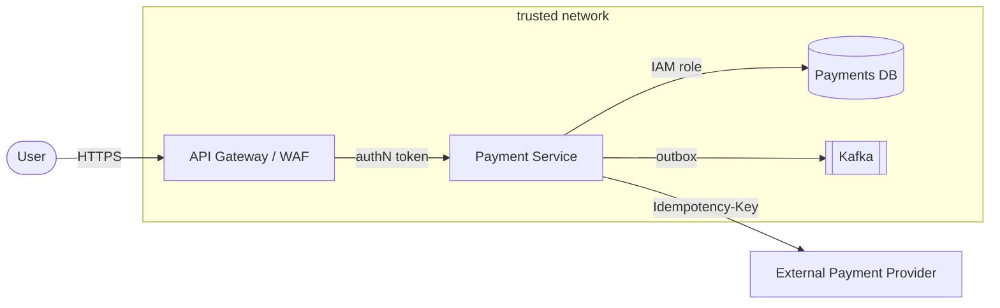

# Day 20 — Security architecture, cost/FinOps, platform thinking

After today you can threat-model a design with STRIDE, reason about authN/authZ,
secrets, and least privilege, build a unit-economics cost model ($/1K requests) with
a 10× sensitivity check, and right-size the rigor of both to the data and the scale.

## The core problem

Security and cost are **cross-cutting**: they touch every component, and they are
brutally expensive to bolt on late. A design that ignored them until launch gets a
security review that says "re-architect auth" and a finance review that says "your
egress bill is 6× your compute." Both are the architect's job, and both obey the same
meta-rule: **right-size the rigor to the data sensitivity and the scale.** Five nines
of security theater on a throwaway prototype is as much a failure as no auth on a
payments system.

Two disciplines make these tractable and defensible:
- **Threat modeling (STRIDE):** a structured way to enumerate *what can go wrong*
  per component, so you design mitigations on purpose instead of discovering them in
  an incident.
- **Unit economics / FinOps:** a cost model that reduces the whole system to **$ per
  1,000 requests**, names the dominant cost lever, and shows what happens at 10× —
  so you optimize the line item that matters, not the one that's easy.

## Key concepts

### STRIDE — the six threat categories

STRIDE (Microsoft) enumerates threats per component and per data flow. Each category
maps to the security property it violates and the class of mitigation:

| Threat | Violates | Question | Typical mitigation |
|--------|----------|----------|--------------------|
| **S**poofing | Authentication | Is this actor who they claim? | strong authN (mTLS, OIDC, signed tokens) |
| **T**ampering | Integrity | Was data/code altered? | signing, checksums, WORM, input validation |
| **R**epudiation | Non-repudiation | Can they deny doing it? | audit logs, signed receipts, immutable trails |
| **I**nformation disclosure | Confidentiality | Can data leak? | encryption at rest/in transit, least privilege, redaction |
| **D**enial of service | Availability | Can they exhaust it? | rate limits, quotas, autoscaling, load shedding |
| **E**levation of privilege | Authorization | Can they do more than allowed? | least-privilege IAM, authZ checks, sandboxing |

You apply STRIDE against a **data-flow diagram with trust boundaries** — the lines
where data crosses from a less- to a more-trusted zone (internet → edge, service →
DB, tenant A → tenant B). Threats concentrate at boundaries.

Walk each arrow and each box through S-T-R-I-D-E. The `user → edge` arrow invites
Spoofing and DoS; the `svc → db` arrow invites Info-disclosure and Elevation; the
`svc → ext` arrow invites Tampering and Repudiation (ambiguous charge — see Day 8).

### authN vs. authZ, zero-trust, least privilege

- **Authentication (authN):** *who are you* — establish identity (OIDC/JWT, mTLS,
  API keys). **Authorization (authZ):** *what may you do* — enforce per-resource,
  per-action. They are separate stages; a valid token (authN) does not imply access
  (authZ). Most breaches are authZ failures (broken object-level authorization).
- **Zero-trust:** never trust the network position. "Inside the VPC" is not a
  credential. Every call authenticates and authorizes, even service-to-service.
- **Least privilege:** every principal (user, service, IAM role) gets the minimum
  permissions for its job, and no more. This is the single highest-leverage control:
  it shrinks the blast radius of every other failure, including prompt injection
  (Day 19) and a leaked credential.
- **Defense in depth:** layered controls so one failure isn't catastrophic (WAF +
  authN + authZ + encryption + audit).

### Secrets management

Secrets (DB passwords, API keys, signing keys) must not live in code, images, env
vars that get logged, or config repos. Use a secrets manager (AWS Secrets Manager /
Parameter Store, Vault) or, better, **short-lived identity** (IAM roles / IRSA /
instance profiles) so there's no long-lived secret to steal. Rotate on a schedule and
on suspected exposure. Never log a secret; scrub them at the logging boundary.

### Cost drivers and unit economics

Every system's monthly bill decomposes into a handful of drivers:

| Driver | Scales with | Watch out for |
|--------|-------------|---------------|
| **Compute** | requests × CPU-time | idle over-provisioning; steady vs. spiky (autoscaling/spot) |
| **Storage** | data size × retention × replication | never-deleted logs; hot vs. cold tiers |
| **Egress / data transfer** | bytes out (cross-AZ, cross-region, internet) | the silent killer — often invisible until it dominates |
| **Managed / per-request** | requests (API GW, Lambda, NAT, queues) | per-invoke fees at high QPS |
| **LLM tokens** | requests × tokens × model price | the new egress — can dwarf everything (Day 18) |

**Unit economics** collapses this to **$ per 1,000 requests**: monthly total ÷
(monthly requests / 1,000). This is the number that tells you whether the business
model works — if a request costs $0.02 to serve and earns $0.01, no amount of scale
saves you. It also makes cost a *first-class NFR* you can compare options against.

### Sensitivity / 10× analysis

Take your assumptions and multiply traffic (or data, or token count) by 10, then see
**which line item dominates.** Costs are rarely linear: egress and LLM tokens usually
scale with traffic and blow past compute (which you can amortize with reserved
capacity), while a per-request managed service fee can suddenly dominate at high QPS.
The dominant line at 10× is your **top cost lever** — optimize that first.

### FinOps levers

- **Right-size + autoscale + spot** for compute; reserved/savings plans for the
  steady baseline.
- **Cache** (Day 6) — cuts compute *and* egress *and* LLM tokens (semantic caching).
  Often the single biggest lever.
- **Tiered storage + lifecycle policies** — move cold data to cheap tiers, expire
  logs.
- **Kill egress** — keep traffic in-AZ/in-region, use private endpoints, compress.
- **Right-size the model** (Day 18) — a smaller model or fewer tokens per request.

## The decision / tradeoffs

The recurring tension is **rigor vs. velocity/cost**. You cannot max both, so you
size rigor to the stakes:

| Data sensitivity / scale | Security posture | Cost posture |
|--------------------------|------------------|--------------|
| Prototype, no real data | authN only, don't gold-plate | on-demand, ignore reserved capacity |
| Internal tool, low-sensitivity | authN + basic authZ + audit | right-size, alerting on spend |
| Regulated / money / PII, high scale | full STRIDE, least privilege, encryption, zero-trust, DR | unit economics, reserved + spot, egress design |

Every extra nine of availability *and* every extra layer of security control costs
roughly an order of magnitude (see `reference/nfr-checklist.md`). Buy what the data
and the business need — no more.

## When NOT this

- **Don't gold-plate security on a prototype.** A weekend spike with synthetic data
  does not need a full STRIDE pass, HSM-backed key rotation, and a zero-trust mesh.
  The alternative — a lightweight "authN + don't store real data" posture — wins when
  the data is non-sensitive and the thing may not survive the month. *Right-size to
  the data sensitivity.*
- **Don't buy reserved capacity / five-nines / multi-region before PMF.** On-demand
  and a single region win until you have steady, predictable load and a business that
  depends on the uptime. Committing spend or DR complexity early is cost rigor applied
  to a scale you don't have yet. *Right-size to the scale.*
- The failure mode both share: applying money-grade rigor to a prototype (wasted
  effort) or prototype-grade rigor to a payments system (a breach or a bill). The
  skill is matching the rigor to the stakes.

## Real-world

- **STRIDE + AWS Well-Architected (Security & Cost pillars).** The industry-standard
  pairing: STRIDE to enumerate threats, Well-Architected's six pillars (Operational
  Excellence, Security, Reliability, Performance, Cost, Sustainability) as the review
  lens. Lesson: threat modeling and cost review are *repeatable rituals*, not
  one-time gates — re-run them when the design changes.
- **Capital One (2019).** A misconfigured WAF let an attacker perform SSRF, reach the
  instance metadata endpoint, steal the over-privileged IAM role's credentials, and
  read 100M records from S3. This is STRIDE end to end: **Elevation** (over-broad IAM
  role), **Information disclosure** (S3 read), enabled by a **Tampering/Spoofing**
  entry (SSRF). Lesson: **least privilege on the role** would have shrunk the blast
  radius to near zero — the highest-leverage control, again.
- **The egress surprise.** Teams routinely discover that cross-AZ replication chatter,
  NAT-gateway data processing, or S3-to-internet transfer is a larger line item than
  all their compute. Lesson: **egress is invisible in the architecture diagram and
  dominant in the bill** — model it explicitly, and design to keep bytes in-region.

## Common mistakes / gotchas

1. **Secrets in env vars or logs.** They end up in log aggregators, crash dumps, and
   git history. Use a secrets manager or short-lived roles; scrub at the log boundary.
2. **Trusting the network perimeter.** "It's inside the VPC" is not authZ. Zero-trust
   every hop.
3. **Over-permissive IAM.** `Action: "*"` / `Resource: "*"` is the Capital One
   pattern. Least privilege, scoped per principal.
4. **Ignoring egress in the cost model.** Modeling compute + storage and forgetting
   data transfer is how you miss the line item that actually dominates.
5. **No unit economics.** A monthly total tells you nothing about whether the business
   works. Always reduce to $/1K requests.
6. **Threat-modeling once.** A STRIDE table from before three redesigns is fiction.
   Re-run it when the data flows change.

## Practice

### 1. STRIDE one component
Take the Payment Service from the notification/payment system (Problem 2 in
`reference/interview-problems.md`). Enumerate one threat per STRIDE category for it
and give a mitigation for each.

Hint 1

Walk the arrows into and out of it: client → service, service → DB, service →
external provider. Each is a trust boundary.

Hint 2

"Double charge under retry" is a Tampering/Repudiation problem you already solved on
Day 8 with idempotency keys — reuse it.

Solution sketch

- **S (spoofing):** attacker forges a caller identity → require authN (OIDC/mTLS) on
  the service; sign the external-provider webhook.
- **T (tampering):** replayed or altered charge request → idempotency key stored with
  the charge; validate/verify signatures on provider callbacks.
- **R (repudiation):** user/ops denies a charge happened → immutable audit log +
  signed charge receipt; correlation id from request → event → provider.
- **I (info disclosure):** card/PII leak → encrypt at rest + in transit; tokenize PAN
  (don't store it); least-privilege DB role; redact logs.
- **D (denial of service):** flood the charge path → rate-limit per API key, quota,
  autoscale, shed load with 429s.
- **E (elevation):** the service role can read every tenant's data → scope the IAM
  role/DB grants to exactly what the charge path needs; per-tenant authZ checks.

### 2. Build a unit-economics cost model
Using your Day-2 capacity estimate for a system (say the URL shortener or the RAG
service), build a monthly cost model down to **$ per 1,000 requests**, and name the
top-2 cost levers.

Hint

Line items: compute (instances/Fargate hrs), storage (GB × $/GB), egress (GB out ×
$/GB), managed/per-request (API GW, NAT, queue), LLM tokens if applicable. Sum →
divide by (monthly requests / 1000).

Solution sketch

For a RAG service (from Day 18): dominant lines are usually **LLM tokens** (requests
× tokens × price) and **egress** (responses out + vector-store chatter). Compute and
the vector DB are steadier and reservable. Worked structure:
`monthly = compute + storage + egress + managed + tokens`;
`$/1K = monthly / (monthly_requests/1000)`. If tokens are 70% of the bill, the top
lever is *fewer/cheaper tokens* (semantic caching, smaller model, shorter context) —
optimize that before touching a 5%-of-bill compute line. See
`lab/cost-model.md` for a filled example, and `reference/estimation-cheatsheet.md`
for the request/byte math.

### 3. Find the dominant lever at 10×
Take your cost model and 10× the traffic. Which line item dominates now, and why
isn't it the same proportion as at 1×?

Solution sketch

Compute you can amortize with reserved/spot, so its per-request cost *drops* with
scale. Egress and LLM tokens scale ~linearly with traffic and don't amortize, so they
grow to dominate — commonly egress (bytes out) or tokens. A per-request managed fee
(API GW, NAT processing) can also jump to the top at high QPS. The lever you optimize
is whatever dominates *at your target scale*, which is often not what dominated in
the prototype. This is the whole point of the 10× check.

### 4. Secrets without long-lived secrets
Design credential handling for a service that talks to a DB and an external API,
with zero long-lived secrets on disk.

Solution sketch

Use workload identity: an IAM role/instance profile (or IRSA on EKS) the service
assumes → short-lived, auto-rotated credentials, nothing to leak. For the external
API key that must exist, store it in a secrets manager, fetch at startup with the
role's permission, keep it in memory only, and rotate on a schedule. Audit every
fetch. Scrub secrets at the logging boundary. Result: a stolen disk image or leaked
env dump yields no usable credential.

## Go deeper (offline-friendly)

- Adam Shostack, **"Threat Modeling: Designing for Security"** — the definitive STRIDE
  treatment; the four-question frame ("what are we building / what can go wrong / what
  do we do / did we do a good job").
- **AWS Well-Architected Framework** — the **Security** and **Cost Optimization**
  pillar whitepapers; concrete, checklist-driven.
- J.R. Storment & Mike Fuller, **"Cloud FinOps"** — unit economics, showback/
  chargeback, the inform/optimize/operate loop.
- **OWASP Top 10** and **OWASP ASVS** — the concrete web-app threat and verification
  lists; pair with STRIDE.
- AWS re:Invent talks on **data transfer / egress cost** — the "hidden" bill; search
  the titles ("Do you know how much your data transfer costs?").

## Check yourself

- Can you name the six STRIDE categories and the security property each violates?
- What's the difference between authN and authZ, and which one do most breaches
  exploit?
- Why is least privilege the highest-leverage control, and how does it bound the
  Capital One and prompt-injection blast radii?
- How do you reduce a monthly bill to $/1K requests, and why does that number matter
  more than the total?
- After a 10× traffic increase, which line item usually dominates and why isn't it
  compute?
- When would you NOT do a full STRIDE pass or buy reserved capacity?
