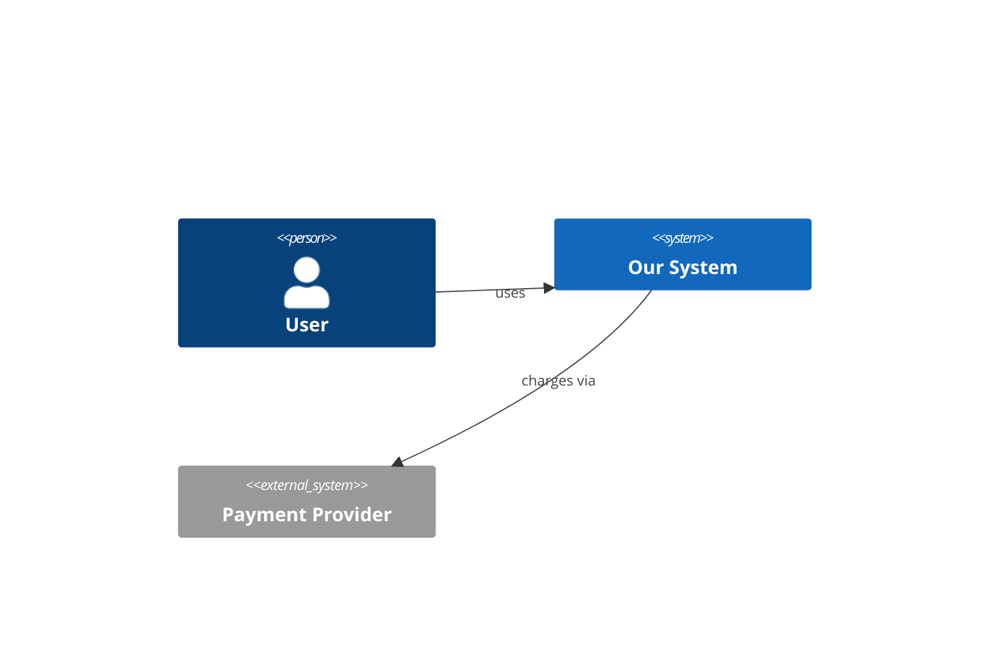

# Software System Architecture Design Mastery — Implementation Plan

> **For the learner:** This plan is executed by you, not by an agent — each day
> is a study/design/lab session, not a code change made on your behalf. Work the
> four beats in order every day: **teardown warm-up → design core (design +
> self-red-team + ADR) → hands-on lab (build/measure/break) → journal.** Check
> off every step as you complete it. Do not skip ahead — later phases reuse the
> designs, ADRs, and the shared `labs/` docker stack built earlier. Saving your
> work (git or otherwise) is entirely your own responsibility; nothing in this
> plan runs version control on your behalf. Tear down docker stacks and AWS
> resources at the end of each day — a scheduled step, not an afterthought.

**Goal:** Reach production-credible competence in software system architecture
design in ~21 days (2–3 hrs/day, extendable) — able to run a repeatable design
method on a novel problem, produce capacity estimates and communicable artifacts
(C4 + ADRs), self-red-team a design, defend it in a mock review, and reason about
"when NOT this" for every major pattern. System-design interviews pass as a
byproduct.

**Architecture:** Six cumulative phases — Phase 0 (the architect's method, Day 1),
Phase 1 (scale & data, Days 2–7), Phase 2 (resilience & failure, Days 8–11),
Phase 3 (modern distributed patterns, Days 12–17), Phase 4 (AI/LLM, Days 18–19),
Phase 5 (integration & capstone, Days 20–21). Every day writes to `days/dayNN/`
(design docs, C4 diagrams, ADRs, journal). Hands-on labs reuse one shared
docker-compose stack in `labs/`, extended per day. The capstone (Day 21)
integrates every prior concept into one architecture package.

**Tech Stack:** Docker + docker-compose, Go 1.22+, PostgreSQL 16 (+ pgvector),
Redis 7, Apache Kafka (KRaft mode, Confluent or `apache/kafka` image), k6 (load),
Toxiproxy (fault injection), OpenTelemetry + Jaeger + Prometheus (observability
day), gRPC + protobuf + buf, Mermaid/PlantUML (C4 diagrams, text-based),
AWS sandbox (Days 10 and optionally 17). LLM access via AWS Bedrock (leverages
existing `aws_bedrock_agent_gw` setup) or any available API.

## Global Constraints

- **Produce, don't consume.** Every day ends with a written design + at least one
  ADR + a running/broken lab you diagnosed. Reading counts only if you immediately
  design or build with it.
- **Run the design method every day, in order:** requirements → constraints →
  NFRs → options → tradeoffs → decision → how-it-breaks. It lives in
  `reference/design-method.md`; do not shortcut it, even when the answer feels
  obvious.
- **"When NOT this" is mandatory** for every pattern/technology each day — write
  it in the journal. If you can't name the alternative and its breaking point,
  you haven't learned the pattern.
- **The break-it step is mandatory.** Every lab ends by deliberately
  misconfiguring or overloading the system and diagnosing it with the right tool.
  This is the primary mechanism for failure-mode intuition.
- **Narrate-to-consolidate.** End every day with a `journal.md` entry explaining
  the concept as if to a junior engineer, in 3–5 sentences.
- **Teardown every day.** `docker compose down -v` at the end of local days;
  `terraform destroy` / delete resources at the end of AWS days (10, 17). AWS
  session cost target: $1–3.
- **Diagrams are text-based** (Mermaid `.mmd` or PlantUML `.puml`) and committed
  under `days/dayNN/diagrams/` so they diff and render in-repo.
- **ADR format is fixed** — copy `reference/adr-template.md`; number ADRs globally
  and monotonically (`0001`, `0002`, …) across all days, not per-day.
- **Real systems, not toys.** Each day's teardown targets a named real
  architecture; log every case study into `reference/real-world-case-studies.md`.

## Project Layout

Built up incrementally across 21 days — this is the target end-state, not
something to create all at once. Pre-flight creates the scaffold; each day adds
its `days/dayNN/` folder and extends `labs/`.

```
system_architect_design/
├── README.md                     # the map + "how to add a day" instructions
├── BACKLOG.md                    # prioritized future topics
├── journal.md                    # one narrate-to-consolidate entry per day
├── reference/
│   ├── design-method.md          # the 7-step method (the spine)
│   ├── nfr-checklist.md          # the "-ilities" checklist
│   ├── estimation-cheatsheet.md  # numbers every engineer should know + formulas
│   ├── c4-guide.md               # how to draw C1–C4 in Mermaid
│   ├── adr-template.md           # the fixed ADR format
│   └── real-world-case-studies.md# living best-practices/use-case library
├── templates/
│   └── day-template.md           # the 4-beat template every day copies
├── labs/
│   ├── docker-compose.yml        # shared base stack (extended per day)
│   ├── services/                 # small Go services reused across labs
│   │   └── echo/ (main.go, Dockerfile)
│   ├── k6/                       # load scripts
│   └── README.md                 # how to bring the stack up/down
├── days/
│   ├── day01-architects-os/
│   │   ├── README.md             # the day's filled-in 4-beat plan
│   │   ├── design/               # design docs
│   │   ├── diagrams/             # C4 .mmd files
│   │   ├── adr/                  # ADRs authored this day
│   │   └── lab/                  # lab code/config/results
│   └── … day02 … day21 …
└── docs/superpowers/
    ├── specs/2026-07-24-system-architecture-design-mastery-design.md
    └── plans/2026-07-24-system-architecture-design-mastery-plan.md   (this file)
```

## Template (copy per day into `days/dayNN-*/README.md`)

```markdown
### Day N — <topic>
**Teardown target:** <real system to study>
**Design brief:** <the system/subsystem to design today>
**ADR topic:** <the key decision to defend>
**Lab:** <the one concept to build/measure/break>
**When NOT this:** <the alternative + its breaking point>

Beats:
1. Teardown warm-up (~20m): <what to extract>
2. Design core (~60–75m): design → self-red-team → ADR
3. Hands-on lab (~40–60m): build → measure → break
4. Journal (~10m): narrate-to-consolidate
```

---

## Pre-flight: Prerequisites & Scaffold

Complete once before Day 1. This is one task ending in a working shared stack.

- [ ] **Step 1: Verify tools.**

```bash
docker --version              # expect Docker 24+
docker compose version        # expect v2.x
go version                    # expect go1.22+
k6 version                    # expect k6 v0.5x  (brew install k6)
```

Install any missing: `brew install go k6`; Docker Desktop for the daemon.
`buf` (Day 13) and `aws` CLI (Days 10, 17) can wait — noted in those days.

- [ ] **Step 2: Create the directory scaffold.**

```bash
cd system_architect_design
mkdir -p reference templates labs/services/echo labs/k6 days
touch README.md BACKLOG.md journal.md
```

- [ ] **Step 3: Write `reference/design-method.md`** — the spine you rehearse daily:

```markdown
# The Design Method (run this every day, in order)
1. Requirements — functional (what it does) + who/scale (users, RPS, data size).
2. Constraints — budget, team, latency SLA, compliance, existing stack.
3. NFRs — pick the top 3 "-ilities" that dominate (see nfr-checklist.md).
4. Options — generate ≥2 viable designs. Never evaluate a single option.
5. Tradeoffs — compare options against the top-3 NFRs in a table.
6. Decision — choose, and state WHY this over the runner-up in one sentence.
7. How it breaks — enumerate failure modes: load spike, dependency down,
   network partition, 10x growth, bad deploy. This is the red-team pass.
```

- [ ] **Step 4: Write `reference/nfr-checklist.md`, `estimation-cheatsheet.md`, `c4-guide.md`, `adr-template.md`.**

`nfr-checklist.md` — the "-ilities": scalability, availability, latency,
consistency, durability, security, observability, operability, cost,
evolvability. One line each on how to measure it.

`estimation-cheatsheet.md` — Jeff Dean's latency numbers (L1 0.5ns, mem ref
100ns, SSD read 150μs, network RT within DC 0.5ms, disk seek 10ms, RT
CA↔NL 150ms); throughput formula `QPS = daily_events / 86400`, peak ≈ 2–10×
average; storage `= records × bytes/record × replication × retention`.

`c4-guide.md` — Mermaid recipes for C1 (system context), C2 (containers),
C3 (components). Example:



`adr-template.md` — the fixed format:

```markdown
# ADR NNNN: <title>
Date: YYYY-MM-DD | Status: proposed | accepted | superseded
## Context
<forces at play, constraints, the NFRs that dominate>
## Decision
<what we chose>
## Alternatives considered
<option B, option C — and WHY they lost>
## Consequences
<positive, negative, and what we now have to live with>
```

- [ ] **Step 5: Write `templates/day-template.md`** (the block shown above) and
  seed `README.md` (paste the Project Layout + a "How to add a day: copy
  `templates/day-template.md` into `days/dayNN-topic/README.md`, tick it off
  `BACKLOG.md`" note) and `BACKLOG.md` (the deferred-topics list from the spec:
  analytics/lakehouse & stream processing, real-time/WebSockets & CDN/geo, chaos
  engineering, GraphQL federation, deeper LLM eval & fine-tuning-vs-RAG, platform
  engineering/IDP, extra interview problem sets).

- [ ] **Step 6: Build the shared lab stack `labs/docker-compose.yml`.**

```yaml
services:
  postgres:
    image: postgres:16
    environment: { POSTGRES_PASSWORD: pass, POSTGRES_DB: app }
    ports: ["5432:5432"]
  redis:
    image: redis:7
    ports: ["6379:6379"]
  kafka:
    image: apache/kafka:3.7.0        # KRaft mode, no Zookeeper
    ports: ["9092:9092"]
    environment:
      KAFKA_NODE_ID: 1
      KAFKA_PROCESS_ROLES: broker,controller
      KAFKA_LISTENERS: PLAINTEXT://:9092,CONTROLLER://:9093
      KAFKA_ADVERTISED_LISTENERS: PLAINTEXT://localhost:9092
      KAFKA_CONTROLLER_QUORUM_VOTERS: 1@localhost:9093
      KAFKA_CONTROLLER_LISTENER_NAMES: CONTROLLER
      KAFKA_OFFSETS_TOPIC_REPLICATION_FACTOR: 1
```

- [ ] **Step 7: Write the reusable `labs/services/echo` Go service** — an HTTP
  service with a `/work?ms=` endpoint (simulates latency), `/health`, and a
  Postgres + Redis client. This is the clay for most labs.

```go
// labs/services/echo/main.go — minimal HTTP service used across labs
package main

import ("net/http"; "os"; "strconv"; "time"; "log")

func main() {
    http.HandleFunc("/health", func(w http.ResponseWriter, r *http.Request) {
        w.WriteHeader(200); w.Write([]byte("ok"))
    })
    http.HandleFunc("/work", func(w http.ResponseWriter, r *http.Request) {
        ms, _ := strconv.Atoi(r.URL.Query().Get("ms"))
        time.Sleep(time.Duration(ms) * time.Millisecond)
        w.Write([]byte("done"))
    })
    port := os.Getenv("PORT"); if port == "" { port = "8080" }
    log.Fatal(http.ListenAndServe(":"+port, nil))
}
```

- [ ] **Step 8: Bring the stack up and verify, then down.**

```bash
cd labs && docker compose up -d
docker compose ps            # expect postgres, redis, kafka healthy/running
docker compose down -v       # teardown
```

Expected: all three containers reach running state; `down -v` removes them.
The pre-flight is complete when this round-trips cleanly.

---

## Phase 0 — The architect's operating system

---

## Day 1 — How architects reason (method, NFRs, C4, ADRs)

**Teardown target:** any system you already operate at work.
**Design brief:** reverse-engineer that known system.
**ADR topic:** a real past decision in it (re-justify it with the method).
**Lab:** produce a C4 (L1+L2) diagram + your first ADR.
**When NOT this:** when a whiteboard sketch suffices (throwaway spikes) — C4/ADR
overhead is for decisions others must understand or that are expensive to reverse.
**Builds on:** nothing. **Sets up for:** the method + artifacts used every later day.

- [ ] **Step 1 (20m): Read theory.** Create `content/day01.md` stub (fill during
  study). Study: NFRs & the "-ilities" (`reference/nfr-checklist.md`), the C4
  model levels, the anatomy of a good ADR, and AWS Well-Architected's 6 pillars
  as an NFR lens. Extract: what makes an architecture *decision* (vs a detail)?

- [ ] **Step 2 (60m): Design core — reverse-engineer a system you know.**
  Pick a real system you've worked on. Run the 7-step method on it *as if
  designing it fresh*: write its requirements, the top-3 NFRs that dominated,
  the options that existed, and the tradeoff table. Save to
  `days/day01-architects-os/design/reverse-engineer.md`.
  Self-red-team: list 5 ways it breaks.

- [ ] **Step 3 (30m): Lab — C4 + ADR.**
  - Draw C1 (context) and C2 (containers) in Mermaid →
    `days/day01-architects-os/diagrams/context.mmd`, `containers.mmd`.
  - Write ADR `0001` for one real decision in that system using
    `reference/adr-template.md` → `days/day01-architects-os/adr/0001-*.md`.
  - Verify the Mermaid renders (paste into a Mermaid live editor or VS Code
    preview). **Expected:** two valid diagrams + one complete ADR with a
    populated "Alternatives considered" section.

- [ ] **Step 4 (10m): Journal + log case study.** `journal.md` entry (key concept,
  "when NOT C4/ADR"). Add the studied system to `real-world-case-studies.md`.

---

## Phase 1 — Scale & data foundations (Days 2–7)

---

## Day 2 — Back-of-envelope estimation & workload characterization

**Teardown target:** Jeff Dean "Numbers Everyone Should Know" (Google).
**Design brief:** size a URL shortener at 100M new URLs/day, 10:1 read:write.
**ADR topic:** chosen ID scheme (counter vs hash vs KGS) and why.
**Lab:** estimate QPS/storage/bandwidth, then validate observed throughput with k6.
**When NOT this:** premature capacity math for a product with no users — estimate
to the order of magnitude that changes the design, not to 3 sig figs.
**Builds on:** the method. **Sets up for:** every design now leads with numbers.

- [ ] **Step 1 (20m): Read theory** (`content/day02.md`): the estimation cheatsheet,
  peak-vs-average multipliers, back-pressure of storage growth over retention.

- [ ] **Step 2 (60m): Design core — estimate the shortener.**
  Compute: write QPS (avg + peak), read QPS, 5-year storage, egress bandwidth,
  and cache working-set size (hot 20%). Produce ≥2 ID-generation options
  (base62 counter, hash-of-URL, key-generation-service) with a tradeoff table.
  Save `days/day02-estimation/design/sizing.md`. Red-team: what breaks at 10×?

- [ ] **Step 3 (50m): Lab — validate an estimate empirically.**
  Bring up `labs` stack. Point the `echo` service at Postgres with an
  insert-and-read endpoint. Write `labs/k6/shortener.js` to drive your
  *estimated peak write QPS* for 60s:

```javascript
import http from 'k6/http';
export const options = { vus: 50, duration: '60s' };
export default function () { http.post('http://localhost:8080/shorten', JSON.stringify({url:'https://x'}), {headers:{'Content-Type':'application/json'}}); }
```

  Run `k6 run labs/k6/shortener.js`. Record p95 latency and achieved RPS in
  `days/day02-estimation/lab/results.md`. **Break-it:** push VUs until p95 blows
  past your latency budget; note the RPS ceiling of a single instance and
  compare to your estimate. Was your estimate right?

- [ ] **Step 4 (10m): Journal + teardown.** `docker compose down -v`.

---

## Day 3 — Storage selection (SQL / NoSQL / NewSQL, access patterns, indexing)

**Teardown target:** Uber's storage evolution (MySQL → Schemaless) + DynamoDB
single-table design.
**Design brief:** choose storage for the shortener + a social feed's data.
**ADR topic:** Postgres vs a KV store for the read-heavy lookup path.
**Lab:** same access pattern on Postgres vs Redis-as-KV; measure both.
**When NOT this:** reaching for NoSQL for relational data with ad-hoc queries —
you'll rebuild joins in the app layer. NoSQL wins on known access patterns at scale.
**Builds on:** Day 2 sizing. **Sets up for:** Day 4 replicates the chosen store.

- [ ] **Step 1 (20m): Read theory** (`content/day03.md`): access-pattern-driven
  modeling, B-tree vs LSM-tree, when indexes help/hurt, single-table design.

- [ ] **Step 2 (60m): Design core.** Model the shortener's lookup and the feed's
  fan-out both ways (normalized SQL vs denormalized KV). Tradeoff table on
  read latency, write amplification, query flexibility, operational cost. ADR
  for the lookup path. Save `days/day03-storage/`. Red-team: a new query the
  chosen model can't serve cheaply.

- [ ] **Step 3 (50m): Lab — Postgres vs Redis for point lookups.**
  Load 1M short-code→URL rows into both Postgres (indexed) and Redis. Write two
  tiny Go benchmarks (or k6 with the echo service fronting each) hitting random
  keys. Record p50/p95 for each in `lab/results.md`. **Break-it:** run a *range*
  query ("all codes created today") against the Redis KV model — feel the full
  scan / missing-index pain that the SQL model handles trivially. Note which
  workload each store wins.

- [ ] **Step 4 (10m): Journal + teardown.**

---

## Day 4 — Replication & consistency models; CAP/PACELC in practice

**Teardown target:** Google Spanner (PACELC: PC/EC) + Amazon Dynamo eventual
consistency.
**Design brief:** add read replicas to the shortener; decide read consistency.
**ADR topic:** read-from-replica vs read-from-primary for the redirect path.
**Lab:** Postgres primary + streaming replica; induce lag; observe stale reads.
**When NOT this:** strong consistency for a like-count — you pay latency/
availability you don't need. Match consistency to the business cost of staleness.
**Builds on:** Day 3 store. **Sets up for:** Day 5 partitions the replicated store.

- [ ] **Step 1 (20m): Read theory** (`content/day04.md`): sync vs async replication,
  read-your-writes, monotonic reads, CAP during a partition, PACELC's
  else-latency axis.

- [ ] **Step 2 (55m): Design core.** Decide which reads tolerate staleness
  (redirects: yes; "my URLs" list: read-your-writes required). Tradeoff table:
  primary-only vs replica reads vs quorum. ADR. Red-team: a failover mid-write.

- [ ] **Step 3 (55m): Lab — replication lag → stale reads.**
  Extend `labs/docker-compose.yml` with a `postgres-replica` using streaming
  replication (`primary_conninfo`, `hot_standby=on`). Write a row to primary,
  immediately read from replica — usually fine. Now inject lag: pause WAL replay
  (`SELECT pg_wal_replay_pause();` on the replica) or add network latency to the
  replica container with Toxiproxy. Write to primary, read from replica →
  observe the **stale read**. Record the window in `lab/results.md`.
  **Break-it (already the core):** show a read-your-writes violation, then fix it
  by routing that specific read to the primary.

- [ ] **Step 4 (10m): Journal + teardown.**

---

## Day 5 — Partitioning / sharding & consistent hashing

**Teardown target:** Discord's message-store sharding + Uber Ringpop.
**Design brief:** shard the shortener's key space across nodes.
**ADR topic:** hash (modulo) vs range vs consistent-hash partitioning.
**Lab:** client-side sharding across 2 Postgres nodes; add a 3rd; feel the reshard.
**When NOT this:** sharding before a single node is saturated — it adds cross-shard
query pain and rebalancing risk for no benefit. Vertical-scale first.
**Builds on:** Day 4. **Sets up for:** Day 7 load-levels the sharded writes.

- [ ] **Step 1 (20m): Read theory** (`content/day05.md`): partition strategies,
  hot partitions, the rebalancing problem, consistent hashing + virtual nodes.

- [ ] **Step 2 (55m): Design core.** Design a routing layer. Options: modulo-N,
  range, consistent hash. Tradeoff on rebalancing cost, hot-spotting, range-query
  support. ADR. Red-team: a celebrity key (hot partition).

- [ ] **Step 3 (55m): Lab — resharding pain.**
  Run two Postgres containers (`pg0`, `pg1`). In a Go script, route keys by
  `hash(key) % 2`. Load 100k keys; confirm even split. Now add `pg2` and switch
  to `% 3`: measure **what fraction of keys must move** (~2/3). Reimplement with
  a consistent-hash ring (`stathat/consistent` or hand-rolled) and repeat —
  measure the far smaller fraction moved (~1/3). Record both in `lab/results.md`.
  **Break-it:** force all traffic to one key and watch one shard's load spike.

- [ ] **Step 4 (10m): Journal + teardown.**

---

## Day 6 — Caching strategies

**Teardown target:** Facebook's memcached scaling paper (leases, thundering herd).
**Design brief:** add caching to the shortener redirect path.
**ADR topic:** cache-aside vs write-through; TTL & invalidation policy.
**Lab:** Redis cache-aside; measure hit ratio & latency; trigger a stampede; fix it.
**When NOT this:** caching write-heavy or strongly-consistent data — invalidation
cost and staleness bugs outweigh the hit-rate gain.
**Builds on:** Day 3 store. **Sets up for:** Day 7 (cache + queue together).

- [ ] **Step 1 (20m): Read theory** (`content/day06.md`): cache-aside/read-through/
  write-through/write-back, TTL vs explicit invalidation, cache stampede /
  thundering herd, singleflight, negative caching.

- [ ] **Step 2 (50m): Design core.** Choose a strategy per data type (URL mapping:
  cache-aside + long TTL; click counts: write-back). ADR. Red-team: mass key
  expiry after a deploy.

- [ ] **Step 3 (55m): Lab — cache-aside + stampede.**
  Add cache-aside to the `echo` lookup: check Redis → miss → Postgres → set with
  TTL. Run k6 read load; record hit ratio (Redis `INFO stats`) and p95 with vs
  without cache. **Break-it:** set a hot key's TTL to expire, blast concurrent
  reads → observe the **stampede** (many simultaneous DB queries / latency
  spike). Fix with Go `singleflight` (or a Redis lock) so only one request
  refills. Re-measure. Record in `lab/results.md`.

- [ ] **Step 4 (10m): Journal + teardown.**

---

## Day 7 — Load balancing, queuing & load-leveling, backpressure

**Teardown target:** AWS "queue-based load leveling" pattern + rate-limiter designs.
**Design brief:** protect a write path from a 10× traffic spike.
**ADR topic:** synchronous write vs queue-buffered write; bounded vs unbounded queue.
**Lab:** k6 spike a sync service (watch it fall over) → add a queue → watch it absorb.
**When NOT this:** queueing a request that needs a synchronous answer (a payment
authorization) — you turn a latency problem into a correctness/UX problem.
**Builds on:** Days 2–6. **Sets up for:** Phase 2 resilience.

- [ ] **Step 1 (20m): Read theory** (`content/day07.md`): L4 vs L7 LB, algorithms
  (round-robin, least-conn, consistent-hash), load leveling, backpressure,
  bounded queues, rate limiting (token bucket).

- [ ] **Step 2 (50m): Design core.** Design the spike-protected write path with a
  queue + workers. ADR on queue bound + overflow policy (429 vs shed vs block).
  Red-team: queue grows unbounded → OOM / infinite latency.

- [ ] **Step 3 (55m): Lab — queue absorbs a spike.**
  Stage A: k6 sends a spike (`stages: ramp to 500 VUs`) at a sync `echo` endpoint
  doing 50ms "work" → record p95 latency exploding / errors. Stage B: insert a
  Kafka (or Redis list) queue: the HTTP handler enqueues and returns 202; a Go
  worker consumes at a fixed rate. Re-run the spike → p95 of the HTTP layer stays
  flat, queue depth absorbs the burst. Record queue-depth over time in
  `lab/results.md`. **Break-it:** remove the queue bound and drive sustained
  over-capacity load → watch depth grow unbounded; add a bound + 429 and observe
  graceful shedding.

- [ ] **Step 4 (10m): Journal + teardown.**

- [ ] **▶ Phase 1 interview rep (45m, timed):** *Design a URL shortener with a
  rate limiter.* Whiteboard/markdown, method in order, produce a C2 diagram and
  a capacity estimate. Self-grade against `reference/design-method.md`. Save to
  `days/day07-loadleveling/interview-rep.md`.

---

## Phase 2 — Resilience & failure (Days 8–11)

---

## Day 8 — Timeouts, retries, idempotency, backoff + jitter

**Teardown target:** Stripe idempotency keys + AWS Builders' Library "Timeouts,
retries, and backoff with jitter."
**Design brief:** a payment/charge endpoint safe under client retries.
**ADR topic:** idempotency-key storage + retention; retry policy.
**Lab:** Go charge service with idempotency keys; induce duplicate delivery.
**When NOT this:** retrying non-idempotent writes without a key — you double-charge.
Retries amplify load during an outage; always pair with jitter + a budget.
**Builds on:** Phase 1. **Sets up for:** Day 9 breakers.

- [ ] **Step 1 (20m): Read theory** (`content/day08.md`): at-least-once vs
  exactly-once, idempotency keys, retry storms, exponential backoff + full jitter,
  retry budgets, timeout tuning.

- [ ] **Step 2 (55m): Design core.** Design the charge flow: client sends
  `Idempotency-Key`; server stores `(key → result)` in Postgres in the same tx
  as the charge; replays return the stored result. ADR. Red-team: two concurrent
  requests with the same key (race).

- [ ] **Step 3 (55m): Lab — prove no double-charge.**
  Implement `/charge` in Go: `INSERT ... ON CONFLICT (idempotency_key) DO NOTHING`
  guarded charge, returning the persisted result on replay. Fire the same key 100×
  concurrently → assert exactly one charge row. **Break-it:** remove the
  idempotency key handling and repeat → observe N charges. Add backoff+jitter to
  a simulated flaky downstream (Toxiproxy) and compare retry-storm behavior with
  fixed vs jittered backoff. Record in `lab/results.md`.

- [ ] **Step 4 (10m): Journal + teardown.**

---

## Day 9 — Circuit breakers, bulkheads, graceful degradation

**Teardown target:** Netflix Hystrix + the bulkhead pattern.
**Design brief:** protect service A from a failing dependency B.
**ADR topic:** breaker thresholds + fallback behavior.
**Lab:** inject latency/failure into B with Toxiproxy → watch A cascade → add breaker.
**When NOT this:** a breaker on a call that has no safe fallback — you just fail
faster. Breakers need a meaningful degraded mode (cache, default, queue).
**Builds on:** Day 8. **Sets up for:** Day 10 blast-radius containment.

- [ ] **Step 1 (20m): Read theory** (`content/day09.md`): cascading failure, thread/
  connection-pool exhaustion, circuit-breaker states (closed/open/half-open),
  bulkheads, load shedding, graceful degradation.

- [ ] **Step 2 (55m): Design core.** Design A→B with a breaker + bulkhead +
  fallback. ADR on thresholds (error %, volume, sleep window). Red-team: the
  half-open probe stampede.

- [ ] **Step 3 (55m): Lab — cascade then contain.**
  Two `echo` services: A calls B. Put B behind **Toxiproxy**; add a `latency`
  toxic (e.g. +3000ms). Drive load at A with a small connection pool → observe
  A's pool exhaust and A's own latency collapse (the cascade). Wrap A's client in
  a breaker (`sony/gobreaker`) + timeout + bounded pool (bulkhead) + a cached
  fallback. Re-run → A stays responsive, serves degraded results. Record before/
  after p95 & error rate in `lab/results.md`. **Break-it:** already core (inject
  the fault); additionally flap B up/down to exercise half-open transitions.

- [ ] **Step 4 (10m): Journal + teardown.**

---

## Day 10 — Cell-based architecture, blast radius, multi-region (AWS day)

**Teardown target:** AWS cell-based architecture + Shopify pods + Slack's cellular
migration.
**Design brief:** partition users into isolated cells; contain blast radius.
**ADR topic:** cell routing key + sizing; single-region multi-cell vs multi-region.
**Lab (AWS):** build 2 isolated cells + a thin router; kill one; prove containment.
**When NOT this:** cells for a small service — the routing/ops overhead dwarfs the
availability gain below a certain scale.
**Builds on:** Day 9. **Sets up for:** Phase 3 (services deployed into this topology).

- [ ] **Step 0: AWS prep.** `aws --version` (v2), `AWS_PROFILE=sandbox`,
  `aws sts get-caller-identity`. Region `ap-southeast-1`.

- [ ] **Step 1 (20m): Read theory** (`content/day10.md`): blast radius, cell as a
  fully-independent stack, router thinness, poison-pill isolation, region vs AZ
  vs cell.

- [ ] **Step 2 (55m): Design core.** Design cell routing (hash of tenant_id →
  cell), cell sizing, and how a bad deploy / poison request is contained. ADR.
  Red-team: the router becomes the shared fate you tried to avoid.

- [ ] **Step 3 (55m): Lab — 2 cells + containment (keep it partial).**
  Simplest credible build: two identical `echo`+RDS-free stacks as two ECS
  services (or two EC2 instances) = cell-a, cell-b, each behind its own target
  group; one ALB with a Lambda@Edge/host-header router by tenant hash. Send
  traffic split across tenants. **Break-it (core):** take cell-a's instances
  unhealthy → confirm cell-a tenants fail but cell-b tenants are **unaffected**
  (blast radius contained). Record in `lab/results.md`. If time-boxed out, finish
  as a design + diagram and note it.

- [ ] **Step 4 (10m): Journal + TEARDOWN (mandatory).**
  Delete ALB, target groups, ECS services/EC2, any Lambda. Confirm with
  `aws elbv2 describe-load-balancers` returns none of yours. AWS cost check.

---

## Day 11 — Observability-as-design (SLI/SLO, tracing, metrics)

**Teardown target:** Google SRE book (SLO/error budgets) + OpenTelemetry.
**Design brief:** make the multi-service lab stack observable by design.
**ADR topic:** the 3–5 SLIs and their SLO targets + error budget policy.
**Lab:** add OTel tracing + Prometheus metrics + correlation IDs; view a trace.
**When NOT this:** 100% tracing sampling on a high-RPS path in prod — cost/overhead;
sample intelligently. Vanity metrics without an SLO are noise.
**Builds on:** Days 8–10. **Sets up for:** every later design states its SLIs.

- [ ] **Step 1 (20m): Read theory** (`content/day11.md`): three pillars (logs/
  metrics/traces), RED & USE methods, SLI/SLO/error-budget, correlation/trace IDs,
  cardinality traps.

- [ ] **Step 2 (55m): Design core.** Define SLIs (availability, p99 latency,
  error rate) + SLO targets + error-budget burn policy for the shortener. ADR.
  Red-team: an SLO you can't actually measure with current instrumentation.

- [ ] **Step 3 (55m): Lab — instrument the stack.**
  Add Jaeger + Prometheus + an OTel collector to `labs/docker-compose.yml`.
  Instrument A→B (Day 9 services) with OTel: propagate a trace/correlation ID
  across the hop; export spans to Jaeger and RED metrics to Prometheus. Fire a
  request, open Jaeger UI (`localhost:16686`), and read the end-to-end trace with
  both spans. Add a Prometheus query for p95. **Break-it:** inject latency in B
  (Toxiproxy) and *find it from the trace/metrics alone* without reading code.
  Record the trace screenshot/notes in `lab/results.md`.

- [ ] **Step 4 (10m): Journal + teardown.**

- [ ] **▶ Phase 2 interview rep (45m, timed):** *Design a resilient
  notification/payment system* (timeouts, idempotency, breakers, SLOs). Save
  `days/day11-observability/interview-rep.md`; self-grade.

---

## Phase 3 — Modern distributed patterns (Days 12–17)

---

## Day 12 — Microservices boundaries vs modular monolith; DDD strategic design

**Teardown target:** Segment's monolith→microservices→monolith + Amazon Prime
Video's re-monolith.
**Design brief:** decide service boundaries for a mid-size domain (e-commerce).
**ADR topic:** modular monolith vs microservices for this team/scale.
**Lab (D facet):** in Go, split one package into two bounded contexts with a clean
interface; identify aggregate roots.
**When NOT this:** microservices before you understand the domain — you cement wrong
boundaries into network calls. Modular monolith first; extract when a seam proves real.
**Builds on:** Phases 1–2. **Sets up for:** Days 13–17 (communication between the
services you carve out).

- [ ] **Step 1 (20m): Read theory** (`content/day12.md`): bounded contexts,
  aggregates, ubiquitous language, coupling/cohesion, Conway's law, the
  distributed-monolith anti-pattern.

- [ ] **Step 2 (55m): Design core.** Context-map the e-commerce domain (Catalog,
  Cart, Orders, Payments, Inventory, Shipping). Draw boundaries; mark
  synchronous vs asynchronous relationships. ADR: monolith-modular vs micro.
  Red-team: the boundary that will generate the most cross-service chatter.

- [ ] **Step 3 (55m): Lab — enforce a boundary in code.**
  Take a small Go module mixing two concerns (e.g. `orders` calling `inventory`
  internals). Refactor into two packages communicating **only** through an
  interface + DTOs (no shared structs). Add a compile-time boundary test.
  **Break-it:** deliberately reach across the boundary (import the other
  package's internals) and observe how nothing stops you without discipline;
  discuss how a network boundary (Day 13) would have.

- [ ] **Step 4 (10m): Journal.**

---

## Day 13 — Service communication: sync (gRPC/REST) vs async; API design & versioning

**Teardown target:** gRPC at scale + public API versioning strategies (Stripe's
date-based versions).
**Design brief:** choose comms for the Orders↔Inventory↔Payments edges.
**ADR topic:** gRPC vs REST per edge; versioning/compat strategy.
**Lab:** two Go services over gRPC; evolve the proto; prove back-compat; break it.
**When NOT this:** gRPC across a public browser edge (use REST/JSON there); sync
calls on a critical path that should be async (couples availability).
**Builds on:** Day 12 boundaries. **Sets up for:** Day 14 async events.

- [ ] **Step 0:** `buf --version` (`brew install bufbuild/buf/buf`).

- [ ] **Step 1 (20m): Read theory** (`content/day13.md`): sync vs async tradeoffs,
  gRPC vs REST vs GraphQL, contract-first, backward/forward compatibility,
  field-numbering rules, versioning strategies.

- [ ] **Step 2 (50m): Design core.** Assign each edge sync/async and a protocol.
  ADR with a compatibility policy (additive-only, reserved field numbers, no
  renumbering). Red-team: a breaking change shipped without a version bump.

- [ ] **Step 3 (60m): Lab — proto evolution.**
  Define `order.proto`; `buf generate` Go stubs; wire an Orders client → Inventory
  server. Run a call. Now **evolve** the proto additively (new optional field) →
  regenerate → old client still works against new server (forward/back compat).
  **Break-it:** renumber or change the type of an existing field → regenerate →
  observe the wire-level break / garbled field. Record in `lab/results.md`.

- [ ] **Step 4 (10m): Journal + teardown.**

---

## Day 14 — Event-driven architecture & the log as source of truth

**Teardown target:** Kleppmann "Turning the database inside out" + LinkedIn's log.
**Design brief:** make Orders emit domain events consumed by Inventory & Analytics.
**ADR topic:** event carried state vs event notification; topic/partition design.
**Lab (Kafka):** produce order events; two independent consumer groups; replay.
**When NOT this:** events for a request needing an immediate synchronous answer;
event-driven where you actually need a transaction across consumers.
**Builds on:** Day 13. **Sets up for:** Days 15–16 (CQRS, outbox on this log).

- [ ] **Step 1 (20m): Read theory** (`content/day14.md`): the log abstraction,
  ordering per partition, consumer groups, offsets, retention/compaction,
  event notification vs event-carried-state-transfer.

- [ ] **Step 2 (55m): Design core.** Design the `orders` topic: key (order_id for
  ordering), partition count, event schema, and how a new consumer bootstraps.
  ADR. Red-team: a poison message blocking a partition.

- [ ] **Step 3 (55m): Lab — produce, fan-out, replay.**
  Go producer emits `OrderPlaced` events to Kafka (keyed by order_id). Two
  consumer groups: `inventory` (decrements stock) and `analytics` (counts). Show
  both receive every event independently. **Replay:** reset the `analytics`
  group's offsets to earliest → it rebuilds its counts from the log alone
  (log as source of truth). **Break-it:** send a malformed event → watch the
  naive consumer stall the partition → add a dead-letter path. Record in
  `lab/results.md`.

- [ ] **Step 4 (10m): Journal + teardown.**

---

## Day 15 — CQRS / event sourcing

**Teardown target:** event-sourcing case studies + explicit "when NOT" writeups.
**Design brief:** event-source the Orders aggregate; build a read projection.
**ADR topic:** event sourcing vs CRUD for Orders; snapshotting policy.
**Lab:** append events, rebuild state by folding, project a separate read model.
**When NOT this:** event-sourcing a simple CRUD domain — you pay huge complexity
(versioning, projections, replay) for no benefit. Reserve for audit/temporal needs.
**Builds on:** Day 14 log. **Sets up for:** Day 16 outbox/saga on the same store.

- [ ] **Step 1 (20m): Read theory** (`content/day15.md`): command/query split,
  event store, folding/rehydration, projections, snapshots, eventual consistency
  of read models, schema/versioning of events.

- [ ] **Step 2 (50m): Design core.** Design Order events (`Placed`, `Paid`,
  `Shipped`, `Cancelled`), the fold function, and a read model for "order status".
  ADR. Red-team: a projection lagging behind the write model (stale reads).

- [ ] **Step 3 (60m): Lab — tiny event-sourced aggregate.**
  In Go: append events to a Postgres `events` table (append-only); rebuild an
  Order's current state by folding its event stream; build a projector that
  updates an `order_status_view` table. Demonstrate: replaying the stream
  reconstructs identical state. **Break-it:** introduce a projection bug, then
  **fix it and replay** to correct all read models — the superpower of event
  sourcing. Record in `lab/results.md`.

- [ ] **Step 4 (10m): Journal + teardown.**

---

## Day 16 — Sagas, distributed transactions, the outbox pattern

**Teardown target:** the dual-write problem + saga pattern (orchestration vs
choreography).
**Design brief:** Order→Payment→Inventory as a saga with compensations.
**ADR topic:** orchestration vs choreography; transactional outbox for reliability.
**Lab:** transactional outbox (Postgres+Kafka); kill the relay; prove no lost events.
**When NOT this:** a saga where a real ACID transaction fits (single DB) — sagas
trade atomicity for complexity and eventual consistency.
**Builds on:** Days 14–15. **Sets up for:** Day 17 rollout of these services.

- [ ] **Step 1 (20m): Read theory** (`content/day16.md`): the dual-write problem,
  outbox + relay/CDC, saga orchestration vs choreography, compensating
  transactions, idempotent consumers.

- [ ] **Step 2 (55m): Design core.** Design the order saga: happy path + each
  compensation (refund, restock). ADR: outbox vs direct publish; orchestrated vs
  choreographed. Red-team: a compensation that itself fails.

- [ ] **Step 3 (55m): Lab — outbox survives a crash.**
  Implement the transactional outbox: `/placeOrder` writes the order row **and** an
  `outbox` row in **one Postgres transaction**; a separate relay polls `outbox` and
  publishes to Kafka, marking rows sent. Run it end-to-end. **Break-it (core):**
  kill the relay *after* the DB commit but *before* publish → restart it → prove
  the event is still published exactly once (no lost event, dual-write solved).
  Then simulate a duplicate publish and show the idempotent consumer dedupes.
  Record in `lab/results.md`.

- [ ] **Step 4 (10m): Journal + teardown.**

---

## Day 17 — Service mesh + deployment/rollout architecture

**Teardown target:** Istio + progressive delivery (canary/blue-green, feature flags).
**Design brief:** safely roll out v2 of the Orders service.
**ADR topic:** blue-green vs canary vs rolling; automated rollback trigger.
**Lab:** weighted/canary routing — shift 10% traffic to v2, watch metrics, promote/roll back.
**When NOT this:** a full service mesh for 3 services — the sidecar/ops complexity
isn't justified until you have many services and real cross-cutting needs.
**Builds on:** Days 12–16 + Day 11 observability. **Sets up for:** capstone.

- [ ] **Step 1 (20m): Read theory** (`content/day17.md`): mesh responsibilities
  (mTLS, retries, routing, observability), sidecar vs library, blue-green vs
  canary vs rolling, progressive delivery, automated rollback on SLO burn.

- [ ] **Step 2 (50m): Design core.** Design the v1→v2 rollout with a canary + an
  automated rollback trigger tied to the Day-11 SLIs. ADR. Red-team: a canary
  that looks healthy but corrupts data (schema mismatch).

- [ ] **Step 3 (60m): Lab — canary shift (local default, AWS optional).**
  Local: run `orders-v1` and `orders-v2` behind Traefik/nginx with **weighted**
  upstreams (90/10). Drive traffic; confirm ~10% hits v2 (distinct response/
  metric). Watch v2's error rate on the Day-11 Prometheus. Promote to 100%, then
  simulate v2 errors and **roll back** to v1. (AWS alt: ALB weighted target
  groups.) Record the traffic split + rollback in `lab/results.md`.
  **Break-it:** make v2 fail health checks mid-canary; confirm the router keeps
  serving v1.

- [ ] **Step 4 (10m): Journal + teardown** (AWS teardown if used).

- [ ] **▶ Phase 3 interview rep (45m, timed):** *Design a ride-sharing dispatch or
  a news feed* (boundaries, events, CQRS where justified, rollout). Save
  `days/day17-rollout/interview-rep.md`; self-grade.

---

## Phase 4 — AI/LLM system design (Days 18–19)

---

## Day 18 — LLM application architecture: RAG, embeddings, cost/latency

**Teardown target:** production RAG patterns + semantic caching writeups.
**Design brief:** a document-Q&A system over a private corpus.
**ADR topic:** chunking + retrieval strategy; vector store choice; cache layer.
**Lab:** minimal RAG on pgvector; measure retrieval quality (precision@k) + latency.
**When NOT this:** RAG when fine-tuning or a simple keyword search fits — RAG adds
an embedding pipeline, a vector store, and retrieval-quality risk.
**Builds on:** all prior (this is a distributed system with an LLM in it).
**Sets up for:** Day 19 agents.

- [ ] **Step 0:** confirm LLM/embedding access (Bedrock via existing
  `aws_bedrock_agent_gw`, or another API key). Note model + cost per 1K tokens.

- [ ] **Step 1 (20m): Read theory** (`content/day18.md`): embeddings, vector
  similarity, chunking strategies, top-k retrieval, context-window budgeting,
  hallucination/grounding, prompt-caching & semantic caching, cost/latency
  tradeoffs of model choice.

- [ ] **Step 2 (55m): Design core.** Architect the RAG pipeline (ingest → chunk →
  embed → store → retrieve → prompt → answer). Estimate cost/latency per query.
  ADR on chunk size + top-k + cache. Red-team: retrieval returns irrelevant
  chunks → confident wrong answers.

- [ ] **Step 3 (55m): Lab — RAG + retrieval quality.**
  Swap the Postgres image to `pgvector/pgvector:pg16` (or `CREATE EXTENSION
  vector;` on an image that bundles it) and enable the extension. Ingest ~50
  docs: chunk, embed, store vectors.
  Implement retrieve-top-k → build prompt → call the LLM. Create ~8 labeled
  query→expected-doc pairs and measure **precision@k** for k=3 vs k=5. Measure
  end-to-end p95 latency and estimated $/query. **Break-it:** shrink chunks
  absurdly (or set k=1) → watch retrieval quality drop; add a semantic cache for
  repeated queries and measure the latency/cost win. Record in `lab/results.md`.

- [ ] **Step 4 (10m): Journal + teardown.**

---

## Day 19 — Agent orchestration, tool use, guardrails, evaluation

**Teardown target:** agent architectures + LLM-as-judge evaluation (ties to your
Bedrock AgentCore work).
**Design brief:** a tool-using agent with guardrails and an eval harness.
**ADR topic:** single-agent-with-tools vs multi-agent; guardrail placement.
**Lab:** small agent loop + a guardrail + an eval harness over several cases.
**When NOT this:** a multi-agent swarm for a task a single prompt + one tool solves
— you add latency, cost, and non-determinism for no gain.
**Builds on:** Day 18. **Sets up for:** capstone (may include an AI component).

- [ ] **Step 1 (20m): Read theory** (`content/day19.md`): agent loop (plan→act→
  observe), tool/function calling, input/output guardrails, prompt injection,
  determinism/eval, LLM-as-judge, multi-agent orchestration patterns.

- [ ] **Step 2 (55m): Design core.** Architect an agent that answers using 1–2
  tools (e.g. the Day-18 retriever + a calculator). Place guardrails (input
  validation, output schema/PII check). ADR: single vs multi-agent. Red-team: a
  prompt-injection in retrieved content hijacking a tool call.

- [ ] **Step 3 (55m): Lab — agent + guardrail + eval.**
  Implement a minimal agent loop calling the LLM with tool definitions; wire the
  Day-18 retriever as a tool. Add an output guardrail (reject answers failing a
  schema / containing blocked patterns). Build an **eval harness**: ~6 cases with
  expected properties, scored by rules or LLM-as-judge; print a pass rate.
  **Break-it:** feed a prompt-injection case → confirm the guardrail catches it
  (or observe it doesn't, then harden). Record pass rate + failures in
  `lab/results.md`.

- [ ] **Step 4 (10m): Journal + teardown.**

---

## Phase 5 — Integration & mastery (Days 20–21)

---

## Day 20 — Cross-cutting dimensions: security, cost/FinOps, platform thinking

**Teardown target:** STRIDE threat modeling + AWS Well-Architected security & cost
pillars.
**Design brief:** threat-model AND cost-model one of your earlier designs.
**ADR topic:** the top security mitigation + the biggest cost lever.
**Lab:** produce a STRIDE threat table + a monthly cost model for a prior design.
**When NOT this:** gold-plating security/cost on a prototype — right-size the
rigor to the data sensitivity and the scale.
**Builds on:** all prior designs. **Sets up for:** capstone integrates these axes.

- [ ] **Step 1 (20m): Read theory** (`content/day20.md`): STRIDE, authN vs authZ,
  secrets management, zero-trust, least privilege; cost drivers (compute, egress,
  storage, per-request), unit economics ($/request), FinOps levers.

- [ ] **Step 2 (60m): Design core — threat model.**
  Pick a prior design (e.g. the payment/notification system). Build a STRIDE
  table: per component, enumerate Spoofing/Tampering/Repudiation/Info-disclosure/
  DoS/Elevation threats + a mitigation each. ADR on the top mitigation. Red-team:
  the mitigation you're most likely to get wrong.

- [ ] **Step 3 (45m): Lab — cost model + unit economics.**
  Using the Day-2 capacity estimate, build a spreadsheet/markdown cost model:
  compute (instances/Fargate), storage, egress, managed services, LLM tokens
  (if applicable) → monthly total and **$ per 1K requests**. Identify the top-2
  cost levers. **Break-it:** 10× the traffic assumption and watch which line item
  dominates (usually egress or LLM tokens). Record in `lab/results.md`. (No
  docker teardown; if you spun up anything, tear it down.)

- [ ] **Step 4 (10m): Journal.**

---

## Day 21 — Capstone: full architecture package + mock review

**Teardown target:** re-skim 2–3 case studies most relevant to your chosen system.
**Design brief:** a substantial system of your choice (e.g. a multi-tenant,
event-driven, globally-distributed ride-hailing platform, a real-time
collaborative editor, or an LLM-powered support platform).
**ADR topic:** 3–5 ADRs for the highest-stakes decisions.
**Lab:** assemble and defend the complete package in a mock architecture review.
**When NOT this:** n/a — this is the integration exercise.
**Builds on:** everything. **Sets up for:** ongoing practice via `BACKLOG.md`.

- [ ] **Step 1 (10m): Choose the system + write the requirements** (functional +
  scale) → `days/day21-capstone/design/requirements.md`.

- [ ] **Step 2 (75m): Full design pass (the method, end to end).**
  - Capacity estimate (Day 2 skills).
  - C4 diagrams C1–C3 (`diagrams/`).
  - Data model + storage choice (Days 3–5) with consistency decisions (Day 4).
  - Resilience: timeouts/idempotency/breakers/cells (Days 8–10).
  - Communication + events + saga where justified (Days 13–16).
  - Rollout + observability (Days 11, 17).
  - Security + cost model (Day 20).
  - AI component if relevant (Days 18–19).
  - **3–5 ADRs** for the biggest decisions.

- [ ] **Step 3 (45m): Self-red-team + tradeoff table.**
  Produce a "How it breaks" section covering: 10× load, a region/cell loss, a
  dependency outage, a bad deploy, a hot partition. Build a tradeoff table for
  your single most contested decision. Save `design/red-team.md`.

- [ ] **Step 4 (30m): Mock architecture review.**
  Present the package to yourself as a skeptical senior reviewer: for each ADR,
  answer "why not the alternative?" out loud/in writing. Log every question you
  *couldn't* answer confidently → these become new `BACKLOG.md` entries. Write a
  short review summary in `days/day21-capstone/mock-review.md`.

- [ ] **Step 5 (optional, timed): Final interview rep** — one hard open-ended
  problem you haven't seen, 45 min, method in order.

- [ ] **Step 6 (10m): Journal — the meta-entry.** What changed in how you reason
  about systems over 21 days? What are your top-3 remaining gaps (→ `BACKLOG.md`)?

---

## Success Criteria

The plan is complete when the learner can, unprompted:
1. Run the 7-step design method on a novel problem and produce a C4 + ADRs.
2. Give a defensible back-of-envelope capacity estimate and validate it.
3. State the dominant NFRs and the "when NOT this" for every major pattern used.
4. Self-red-team a design (10× load, partition, dependency down, bad deploy).
5. Defend decisions in a mock review, naming the runner-up and why it lost.
6. Architect an LLM/RAG/agent system with retrieval, cost/latency, guardrail
   reasoning.
7. Pass a 45-minute system-design interview problem as a byproduct.

Extension: pull the next topic from `BACKLOG.md`, copy `templates/day-template.md`
into `days/dayNN-topic/`, and run the same four beats. Nothing is hardcoded to 21.
```
