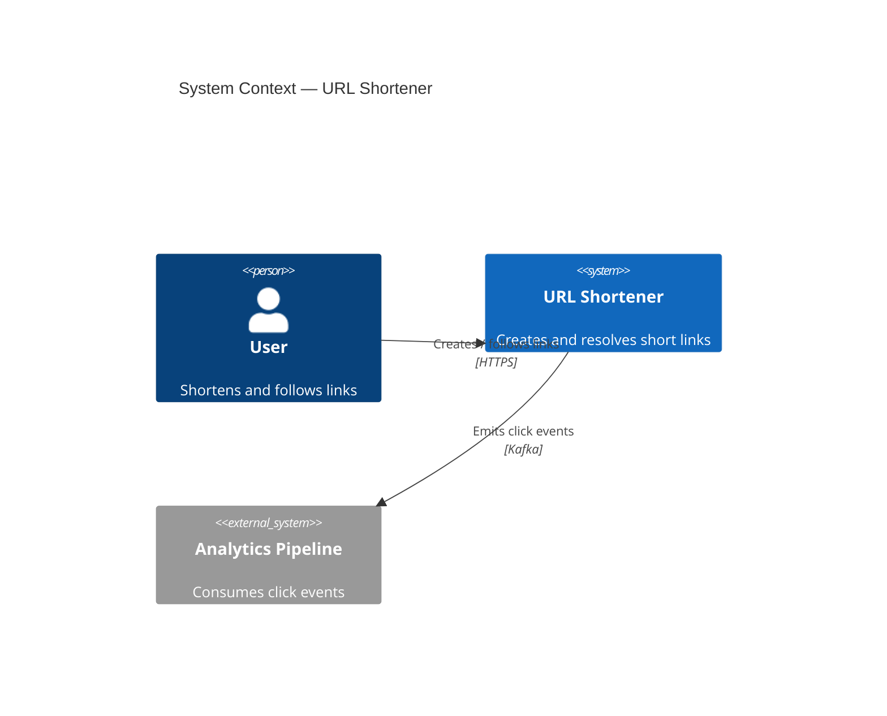
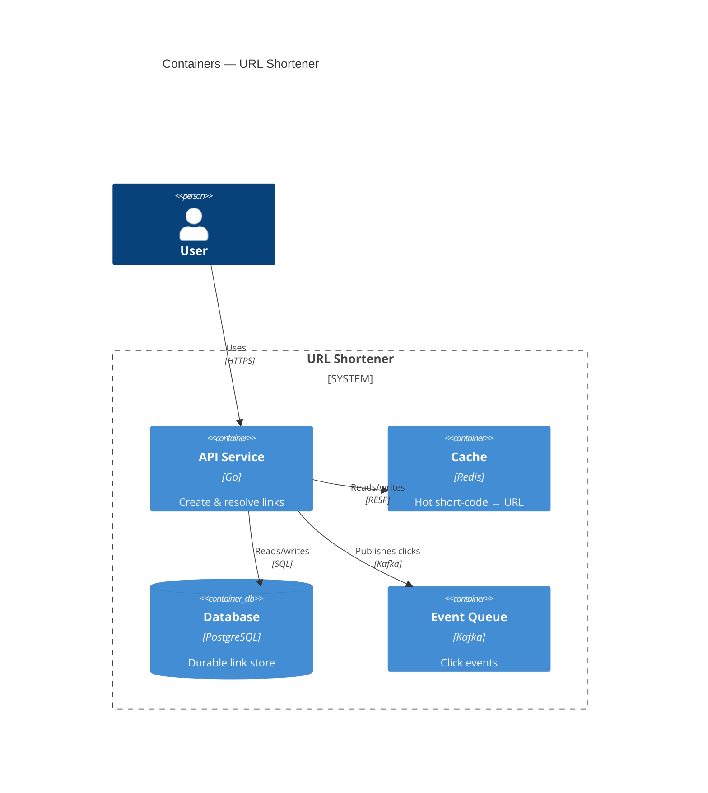
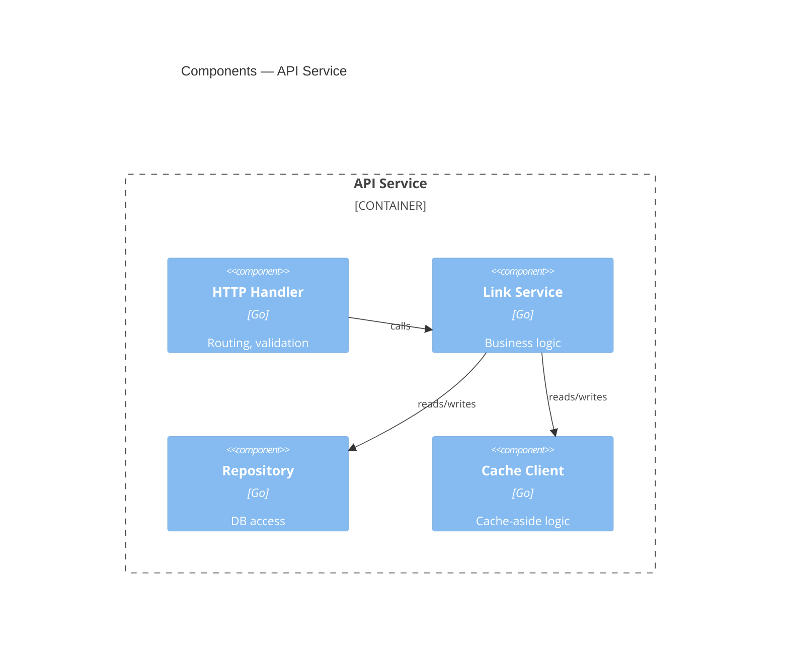
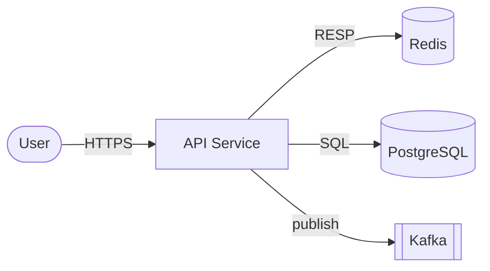

# C4 Model Guide (text-based diagrams)

C4 is four zoom levels for describing software architecture. You mostly use the
first three. Keep diagrams in Mermaid (`.mmd`) so they diff in git and render in
VS Code / GitHub / the Mermaid live editor.

## The four levels

| Level | Name | Audience | Shows |
|-------|------|----------|-------|
| **C1** | System Context | everyone | your system as one box + users + external systems |
| **C2** | Containers | technical | deployable/runnable units (apps, DBs, queues) inside your system |
| **C3** | Components | developers | major components inside one container |
| **C4** | Code | rarely drawn | classes/functions (let the IDE show this) |

**Rule:** one diagram = one level of zoom. Don't mix a database schema into a
context diagram. Draw C1 and C2 for almost everything; C3 only for the container
that's interesting.

## C1 — System Context (Mermaid)

## C2 — Container diagram (Mermaid)

## C3 — Component diagram (Mermaid)

> If the `C4Context`/`C4Container` Mermaid diagrams don't render in your tool,
> plain `graph TD` / `flowchart LR` works everywhere and is a fine fallback:

## Good-diagram checklist

- Every box has a **name + technology + one-line responsibility**.
- Every arrow has a **label** (what flows) and ideally a **protocol**.
- Direction of arrows = direction of the *dependency/call*, not data only.
- No orphan boxes; no more than ~7 elements per diagram (split if more).
- A newcomer can understand the system from C1 + C2 alone.

## Alternatives worth knowing

- **arc42** — a documentation *template* (12 sections); pairs well with C4 for
  the prose around the diagrams.
- **ADRs** (`adr-template.md`) — capture the *decisions* the diagrams imply.
- C4 shows structure; ADRs show *why*; arc42 is the binder. Use all three.
