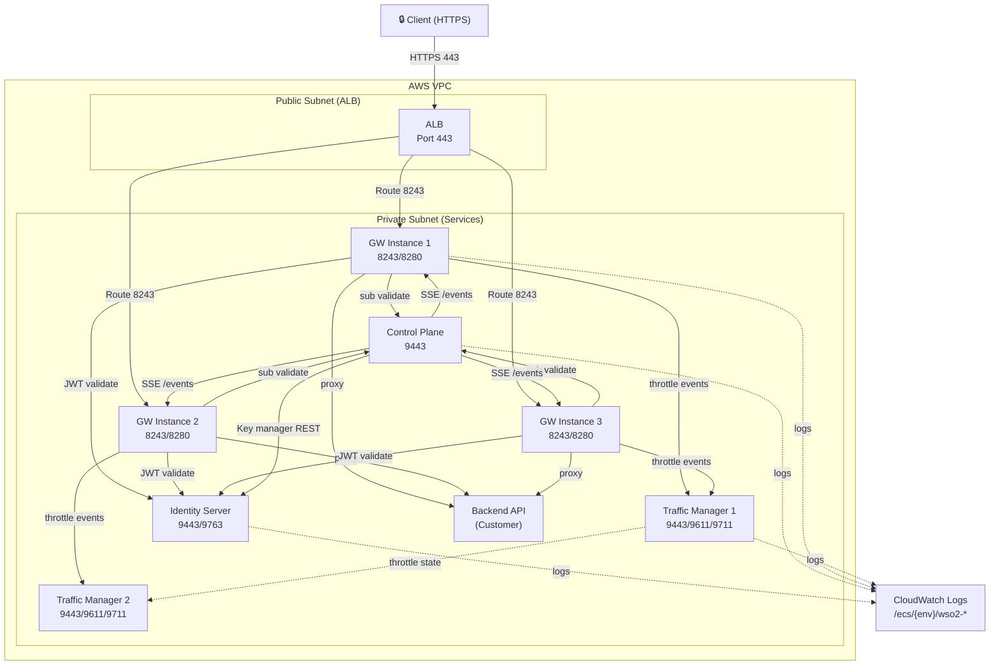
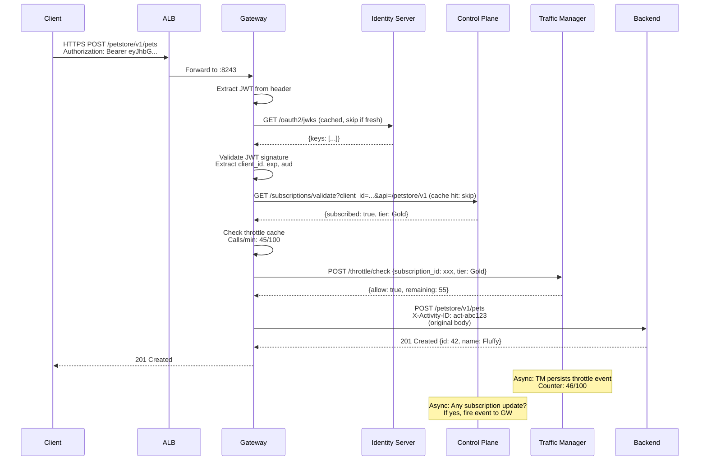
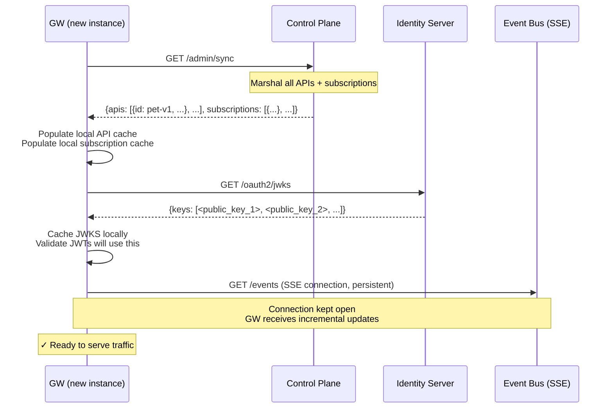

# Day 58 — Capstone: Full System Architecture

## Why This Matters

An architect who cannot draw the system from memory cannot make deployment decisions under time pressure. Today you assemble the full picture — every service, every connection, every state dependency — and verify your mental model against reality by writing it down.

Over 60 days you have built four independent services (IS, CP, GW, TM), each in Go, each serving a specific role in an API gateway ecosystem. Today you zoom out and see them as a single system, synchronized via events and shared caches, running on AWS ECS Fargate, fronted by an ALB, serving real clients.

## Core Concepts

### The Four-Layer Architecture

**Layer 1: Client & ALB (Public)**
- HTTPS clients arrive at the ALB (port 443)
- ALB terminates TLS and routes to the Universal Gateway on port 8243 (secure) or 8280 (dev/testing)
- All traffic to private services (IS, CP, TM) flows through the GW

**Layer 2: Universal Gateway (GW) — Stateless, Auto-Scaling 1–4**
- Validates JWT signature against JWKS cached from IS
- Enforces subscription policies (from CP cache) — returns 403 if subscription is deleted or revoked
- Enforces throttle policies (from CP cache) — returns 429 if limit exceeded
- Proxies authenticated + authorized requests to the backend
- Listens on 8243 (HTTPS) and 8280 (HTTP for internal health checks)
- Syncs with CP on startup: calls `GET /admin/sync` to fetch all published APIs and subscriptions
- Maintains SSE connection to CP `GET /events` to receive real-time updates (new API, subscription deleted, policy changed)

**Layer 3a: Identity Server (IS) — Stateful, Fixed 1**
- Issues and validates JWTs (OAuth2 access tokens)
- Exposes `/oauth2/token` for token endpoints (client_credentials, authorization_code grants)
- Exposes `/oauth2/introspect` for token introspection (opaque token validation)
- Exposes `/oauth2/revoke` for token revocation
- Exposes `/oauth2/jwks` (JWKS endpoint) — GW polls this to refresh public keys
- Maintains token store (in-memory in the lab; Redis in production)
- Listens on 9443 (HTTPS) and 9763 (HTTP for internal calls from CP)

**Layer 3b: Control Plane (CP) — Stateful, Fixed 1**
- Registry of published APIs, their versions, backend URLs, policies
- Subscription store: which client app has access to which API at which tier (Bronze, Silver, Gold)
- Throttle policy store: rate limits per tier per API
- Event bus (JMS in real WSO2; in-memory event hub in the lab)
- Exposes:
  - `POST /apis` — publish a new API (Day 37)
  - `GET /apis` — list all published APIs
  - `POST /subscriptions` — subscribe a client app to an API
  - `GET /subscriptions/validate` — is client X subscribed to API Y? (cache miss → direct check)
  - `GET /admin/sync` — for GW startup: returns all APIs + subscriptions
  - `GET /events` (SSE) — stream real-time updates to connected GWs
- Listens on 9443 (HTTPS)
- Internal only: no public ALB, no direct client access

**Layer 3c: Traffic Manager (TM) — Semi-Stateful, Auto-Scaling 1–2**
- Maintains per-subscription throttle counters
- Resets counters at policy window boundaries (e.g., every minute for rate limits)
- GW sends throttle events asynchronously; TM responds with allow/deny decision
- Exposes:
  - `POST /throttle/check` — is this subscription over quota?
  - `POST /throttle/event` — log a successful API call for quota tracking
- Listens on 9443 (HTTPS), 9611 (binary protocol for throttle events), 9711 (SSL throttle binary)
- Internal only

**Layer 4: Backend Services (Customer-Owned)**
- The actual business logic (PetStore API, CRM, etc.)
- Behind a private security group; only GW can reach it
- Unaware of WSO2; sees authenticated requests from GW

### Data Sync Flows

**Startup Sync (GW Initialization)**
1. GW calls `GET /admin/sync` on CP → receives {apis: […], subscriptions: […]}
2. GW calls `GET /oauth2/jwks` on IS → caches public keys
3. GW opens SSE connection to `GET /events` on CP
4. GW is now ready to serve traffic

**Runtime Sync (Real-Time Updates)**
- CP publishes API: fires `API_PUBLISHED` event → all connected GWs receive via SSE → update their API cache
- Subscription deleted: fires `SUBSCRIPTION_REMOVED` event → all connected GWs receive → remove from cache
- Policy updated: fires `POLICY_CHANGED` event → all connected GWs receive → refresh throttle limits
- IS rotates keystore: fires event → GW must reload JWKS (manual: `GET /oauth2/jwks` again)

**Eventual Consistency Model**
- GW cache is the source of truth for fast decisions
- CP is the source of truth for correctness
- Lag is bounded: SSE is near-instant; periodic fallback to `/admin/sync` (per Day 39) = max 5–60 seconds staleness
- Design decisions must account for this lag

### The Full Request Flow

```
Client → HTTPS POST /petstore/v1/pets
  ↓ (ALB routes to GW:8243)
GW receives request
  1. Extract JWT from Authorization header
  2. Validate JWT signature against cached JWKS from IS
     - If invalid: return 401
  3. Extract client_id from JWT claims
  4. Check local subscription cache: is client_id subscribed to /petstore/v1?
     - If not: return 403
     - If cache miss: call `GET /subscriptions/validate?client_id=...&api=/petstore/v1`
  5. Check local throttle cache: is subscription over limit?
     - If yes: return 429
     - If cache miss: ask TM (async or sync call)
  6. Enrich request headers with X-Request-ID, X-Activity-ID
  7. Proxy to backend: POST /petstore/v1/pets
Backend responds: 201 Created
  8. GW proxies response back to client
  ← 201 Created
TM (async path): throttle event received; counter incremented
CP (async path): if subscription was just deleted, fires event; GW receives; removes from cache
```

## Go Port → WSO2 Mapping

This course taught you the real WSO2 through Go reimplementations:

| Phase | Days | Go File | WSO2 Equivalent | Concept |
|---|---|---|---|---|
| Phase 1 | 4–6 | `labs/phase1/day04/main.go` | `JWTTokenGenerator` in Identity Server | OAuth2 token issuance |
| Phase 1 | 7–9 | `labs/phase1/day07/main.go` | `IntrospectionDataProvider` | Token introspection + revocation |
| Phase 1 | 10–12 | `labs/phase1/day10/main.go` | `KeyManagerInterface` in APIM | Key manager REST API |
| Phase 2 | 16–18 | `labs/phase2/day16/main.go` | Synapse `AbstractMediator` chain | Message handlers |
| Phase 2 | 19–21 | `labs/phase2/day19/main.go` | `JWTValidator` in Gateway | JWT validation + subscription check |
| Phase 3 | 31–33 | `labs/phase3/day33/main.go` | `APIProviderImpl` in Control Plane | API registry |
| Phase 3 | 37–39 | `labs/phase3/day39/main.go` | `EventHub` + JMS in Control Plane | Event bus + SSE + sync |
| Phase 4 | 47–48 | `labs/phase4/day48/main.go` | `ActivityIDHandler` observability | Log correlation |
| Phase 4 | 50 | `labs/phase4/day50/main.go` | `APIHandler` extension interface | Custom extension point |
| Phase 4 | 51 | `labs/phase4/day51/main.go` | `AbstractAuthorizationGrantHandler` | Custom OAuth2 grant |

## System Diagram

### Component Map

| Component | Port(s) | ECS Scaling | State | Replica Strategy |
|---|---|---|---|---|
| IS (Identity Server) | 9443 (HTTPS), 9763 (HTTP) | Fixed 1 | Stateful (token store, session store) | Not scaled; needs external session store for HA |
| CP (Control Plane) | 9443 (HTTPS) | Fixed 1 | Stateful (API registry, subscription store) | Not scaled; needs DB failover |
| GW (Universal Gateway) | 8243 (HTTPS), 8280 (HTTP) | Auto 1–4 | Stateless (JWT/subscription/throttle caches) | Horizontal; cache warm-up via `/admin/sync` |
| TM (Traffic Manager) | 9443, 9611, 9711 | Auto 1–2 | Semi-stateful (throttle counters in memory) | Horizontal; counters reset per window; sticky routing optional |
| ALB (AWS Application Load Balancer) | 443 (public) | N/A | N/A | Terminates TLS, routes to GW:8243 |
| Backend | Custom | Customer-owned | N/A | Behind private security group |

### Architecture Diagram (Mermaid)



### Request Sequence Diagram



### GW Startup Sync Flow



## Exercises

### Exercise 1: GW Startup Sequence

**Scenario:** A new Universal Gateway instance starts up in the ECS cluster.

**Task:** List the sequence of calls it makes to IS and CP, in order, before it can serve the first API request.

**Hint:** Review Phase 3 Day 39 (event bus / SSE / startup sync). The calls must happen in a specific order because later calls depend on earlier caches being warm.

**Solution Sketch:**
1. GW calls `GET /admin/sync` on CP → receives all published APIs + subscriptions in one response
2. GW populates two local in-memory caches: `apis[]` and `subscriptions[]`
3. GW calls `GET /oauth2/jwks` on IS → receives the current public key(s)
4. GW caches the JWKS locally; future JWT validation uses this cache (no call to IS for every token)
5. GW opens a persistent SSE connection to CP `GET /events`
6. GW is now ready: it can validate JWTs (locally), check subscriptions (locally), throttle (locally or via TM), and proxy requests

**Why this order:** If GW tried to serve a request before step 5, it would have no APIs registered, so all requests would return 404. After step 5, any real-time changes (new API, deleted subscription) arrive via SSE before the next request.

---

### Exercise 2: Subscription Deletion During Request Handling

**Scenario:** A client has a valid JWT and a valid subscription. As the client makes a request, the CP admin deletes the subscription. Trace what happens at each layer.

**Task:** Write out what GW decides at each decision point, and when the client sees the failure.

**Hint:** Think about event sync timing (SSE is not instant; there can be a small lag). What happens if the event hasn't arrived yet?

**Solution Sketch:**
1. **First request (subscription exists):**
   - GW receives request with valid JWT → passes signature validation
   - GW checks local subscription cache → HIT: subscription exists and is active
   - GW sends request to backend → 200 OK
   - **Client sees: 200 OK**

2. **Admin action:** Subscription deleted in CP
   - CP fires `SUBSCRIPTION_REMOVED` event to the event bus
   - SSE connection to GW receives the event (typically <100ms, but could be up to several seconds)

3. **Second request (event received in time):**
   - GW receives request with same JWT (still valid)
   - GW checks local subscription cache → MISS: subscription was removed by the event handler
   - GW returns 403 Forbidden (or optionally calls CP to double-check)
   - **Client sees: 403 Forbidden**

4. **Second request (event NOT received yet — lag case):**
   - GW receives request
   - GW checks local subscription cache → still HIT: event hasn't arrived yet
   - GW sends request to backend → 200 OK
   - **Client briefly sees: 200 OK (stale)**
   - Event arrives moments later; next request → 403

**Key insight:** The system is eventually consistent. There is always a small window where GW serves stale data. Production designs must account for this.

---

### Exercise 3: Identity Server Keystore Rotation

**Scenario:** The IS team rotates the keystore (e.g., certificate renewal). A new public key is added to JWKS. Old JWTs signed with the old key are no longer valid.

**Task:** List the minimum set of actions GW must take to handle this transition smoothly. What breaks if GW doesn't do them?

**Hint:** Think about JWKS caching and token validation. What state on GW becomes stale?

**Solution Sketch:**

**Minimum actions:**
1. **Reload JWKS from IS:**
   - GW calls `GET /oauth2/jwks` again
   - IS returns both old and new public keys (during a grace period)
   - GW replaces its local JWKS cache

2. **Invalidate JWT token cache (if any):**
   - Any pre-computed JWT verification results for old tokens are now invalid
   - If GW caches "this JWT is valid," that cache must be flushed

3. **Continue serving:**
   - New JWTs signed with the new key will validate
   - Old JWTs signed with the old key will fail (401 Unauthorized)

**What breaks if GW doesn't do these:**

| Missing Action | Consequence |
|---|---|
| Don't reload JWKS | GW still validates against the old public key; new JWTs fail validation (401). Service degradation. |
| Don't invalidate JWT cache | Old cached "valid" entries remain trusted; security risk if old key was compromised. |

**Best practice (rolling rotation):**
- IS adds the new key to JWKS *before* retiring the old key
- Existing JWTs keep working (old key still in JWKS)
- New JWTs use the new key
- After grace period (~24h), IS retires old key
- GW reloads JWKS; no existing client sessions are invalidated
- Zero downtime

---

## Anti-Patterns to Avoid

1. **Putting CP behind the public ALB**
   - ❌ CP has no authentication on its admin endpoints in the Go labs
   - ❌ In production, a malicious client could call `POST /apis` and inject fake APIs, or `POST /subscriptions` and grant unauthorized access
   - ✅ CP must be internal only, reachable only from GW (via private SG rules)

2. **Assuming GW caches are consistent with CP immediately**
   - ❌ Designing a system that expects instant cache invalidation
   - ❌ "Delete this subscription and the next request should fail" — this can fail during the SSE lag
   - ✅ Design around eventual consistency: assume 1–5 second lag, use idempotency keys, etc.

3. **Scaling IS without external session/token store**
   - ❌ Deploying multiple IS instances each with separate in-memory token stores
   - ❌ A token issued by IS-1 is unknown to IS-2
   - ❌ Client refresh-token calls hit IS-2, which has no record of the session
   - ✅ Use shared Redis or database (e.g., MySQL) for token store; all IS replicas read/write the same store

---

## What You've Built This Week

This is the final day of architecture assembly. By now, you have:
- **Phase 1:** IS in Go (token issuance, introspection, JWKS endpoint)
- **Phase 2:** GW in Go (JWT validation, subscription enforcement, proxy, throttle integration)
- **Phase 3:** CP in Go (API registry, subscription store, event bus with SSE)
- **Phase 4:** Observability (log correlation, failure classification, triage scripts)

Today you see them as one system. Tomorrow, you write the playbook for when it fails. Day 60, you reflect on what you've learned.

---

## Reading

- Review Phase 1 Days 4–12 (IS implementation details)
- Review Phase 2 Days 16–21 (GW implementation details)
- Review Phase 3 Days 31–39 (CP and event sync implementation)
- Review Phase 4 Day 46 (activity ID logging and correlation)
