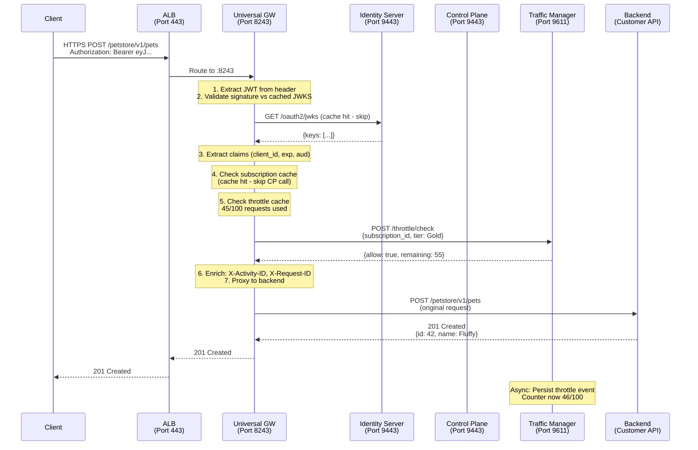
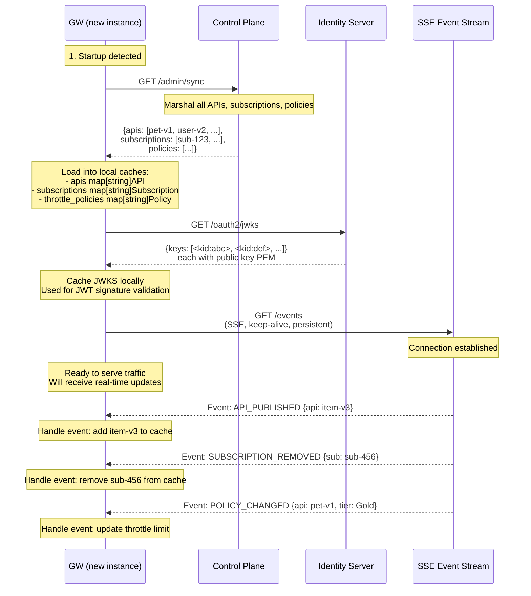
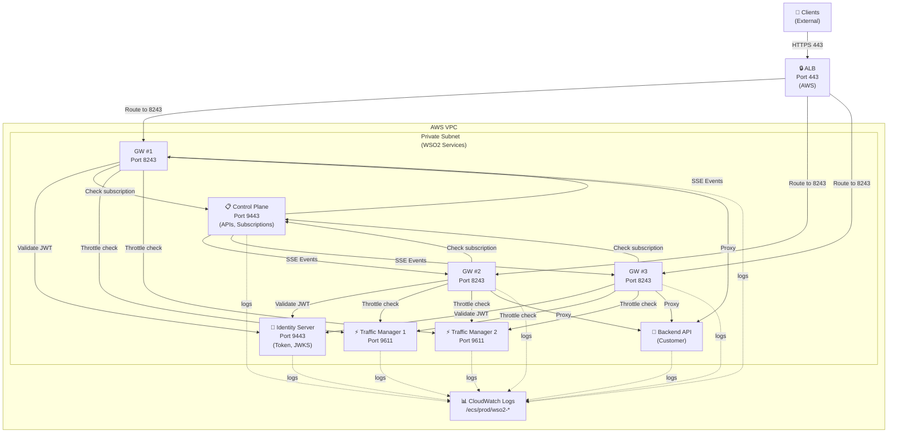
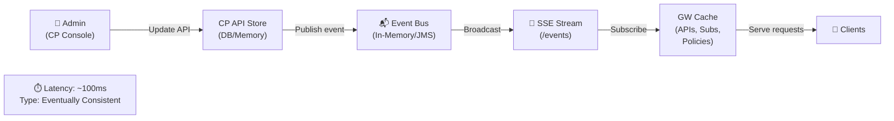

# WSO2 Production Architecture — Full System

## Component Map

| Component | Port(s) | ECS Scaling | State | HA Strategy |
|---|---|---|---|---|
| IS (Identity Server) | 9443 (HTTPS), 9763 (HTTP) | Fixed 1 | Stateful (token store, session store) | External Redis for session store; multi-replica requires shared storage |
| CP (Control Plane) | 9443 (HTTPS) | Fixed 1 | Stateful (API registry, subscription store) | External RDS; multi-replica requires DB replication |
| GW (Universal Gateway) | 8243 (HTTPS), 8280 (HTTP) | Auto 1–4 | Stateless (JWT/subscription/throttle caches) | Horizontal scaling; cache warm-up via `/admin/sync` |
| TM (Traffic Manager) | 9443, 9611, 9711 | Auto 1–2 | Semi-stateful (throttle counters in memory) | Horizontal scaling; counters reset per window |
| ALB (AWS ALB) | 443 (public) | Managed by AWS | N/A | Multi-AZ, cross-region (optional) |
| Backend | Customer-defined | Customer-owned | N/A | Behind private security group; independent of WSO2 |

---

## Request Flow



---

## GW Startup Sync Flow



---

## Service Dependency Graph



---

## Data Flow: Event Sync



---

## Scaling Strategy

### Gateway (GW) — Stateless, Scales Horizontally

- **Min replicas:** 1
- **Max replicas:** 4
- **Scale out trigger:** CPU > 70% OR active connections > 1000 per instance
- **Scale in trigger:** CPU < 30% AND active connections < 100 per instance (wait 10 min)
- **Startup:** `GET /admin/sync` from CP; SSE connection to CP; ready in ~5 seconds
- **Shutdown:** Drain in-flight requests; close SSE connection; exit

### Traffic Manager (TM) — Semi-Stateless, Scales Horizontally

- **Min replicas:** 1
- **Max replicas:** 2
- **Scale out trigger:** CPU > 80% OR throttle check latency > 100ms
- **Stateless aspect:** Throttle counters reset every minute; no need to sync state between replicas
- **Sticky routing optional:** If you want to minimize counter coordination, route same subscription to same TM

### Identity Server (IS) — Stateful, Fixed 1 Replica

- **Replicas:** Fixed at 1 (not scaled)
- **Reason:** Token store is in-memory; two replicas have disjoint token stores
- **HA strategy:** Add external session store (Redis) for replication; or use database-backed store
- **Startup:** Load keystore; initialize token store; wait for JVM warmup (~10 seconds)
- **Health check:** `HEAD /oauth2/token` (returns 200 if ready)

### Control Plane (CP) — Stateful, Fixed 1 Replica

- **Replicas:** Fixed at 1 (not scaled)
- **Reason:** API registry is the source of truth; multi-replica requires distributed consensus
- **HA strategy:** Database-backed registry (RDS); multi-replica with read-write coordination
- **Startup:** Load API registry; initialize event bus; wait for DB connection (~5 seconds)
- **Event bus:** In-memory (lab); switch to JMS broker for production

---

## Go Port Mapping

Each phase of this course taught you one part of the system by rebuilding it in Go:

| Phase | Days | Go Lab | WSO2 Equivalent | Functionality |
|---|---|---|---|---|
| Phase 1 | 4–6 | `labs/phase1/day04/` | `JWTTokenGenerator` in IS | OAuth2 token issuance |
| Phase 1 | 7–9 | `labs/phase1/day07/` | `IntrospectionDataProvider` | Token validation, revocation |
| Phase 1 | 10–12 | `labs/phase1/day10/` | `KeyManagerInterface` | Key manager REST API |
| Phase 2 | 16–18 | `labs/phase2/day16/` | Synapse `AbstractMediator` | Message handler chain |
| Phase 2 | 19–21 | `labs/phase2/day19/` | `JWTValidator` in GW | JWT + subscription enforcement |
| Phase 3 | 31–33 | `labs/phase3/day33/` | `APIProviderImpl` | API registry |
| Phase 3 | 37–39 | `labs/phase3/day39/` | `EventHub` + `JMS` in CP | Full CP: registry + events + SSE |
| Phase 4 | 46–48 | `labs/phase4/day46-48/` | `ActivityIDHandler` | Log correlation across services |
| Phase 4 | 50 | `labs/phase4/day50/` | `APIHandler` extension | Custom extension point |
| Phase 4 | 51 | `labs/phase4/day51/` | `AbstractAuthorizationGrantHandler` | Custom OAuth2 grant type |

---

## Deployment Checklist

### Pre-Deployment

- [ ] All images built and pushed to ECR
- [ ] Terraform variables reviewed (no hardcoded secrets)
- [ ] Security groups configured: ALB → GW, GW → IS/CP/TM
- [ ] RDS DB created (if not using H2/in-memory)
- [ ] CloudWatch log groups created: `/ecs/prod/wso2-{gw,is,cp,tm}`
- [ ] ALB health check path verified: `GET /services/Version` on GW
- [ ] ECS task definitions reviewed for resource limits (memory, CPU)

### Deployment Steps

1. **Deploy TM first** (no dependencies)
   ```bash
   terraform apply -target=aws_ecs_service.tm
   ```

2. **Deploy IS** (needed by GW)
   ```bash
   terraform apply -target=aws_ecs_service.is
   ```

3. **Deploy CP** (needed by GW)
   ```bash
   terraform apply -target=aws_ecs_service.cp
   ```

4. **Deploy GW** (depends on IS + CP)
   ```bash
   terraform apply -target=aws_ecs_service.gw
   ```

5. **Deploy ALB** (routes to GW)
   ```bash
   terraform apply -target=aws_lb.main
   ```

### Post-Deployment

- [ ] All ECS tasks running (check AWS Console)
- [ ] Health checks passing on ALB targets
- [ ] CloudWatch Logs populated with startup messages
- [ ] Smoke test: `GET /petstore/v1/pets` returns 200 or 401 (JWT required)
- [ ] Monitor GW startup logs for `/admin/sync` success

---

## Troubleshooting

### GW Cannot Start (502 from ALB)

**Causes:**
1. CP not reachable (SG rule missing for port 9443)
2. CP `/admin/sync` endpoint failed
3. IS JWKS endpoint down
4. GW startup timeout exceeded

**Debug:**
```bash
# Check GW logs
aws logs tail /ecs/prod/wso2-gw --follow
# Look for: "admin/sync" error, "jwks" error, timeout

# Check CP health
curl -s -k https://cp.wso2.internal:9443/health | jq .

# Check SG rules
aws ec2 describe-security-groups --group-ids <sg-id>
```

### Requests Failing with 403 (Subscription Not Found)

**Causes:**
1. Subscription not published in CP
2. GW cache stale (SSE event not delivered)
3. GW restarted; `/admin/sync` didn't fetch subscriptions

**Debug:**
```bash
# Check CP subscriptions
curl -s -k https://cp.wso2.internal:9443/subscriptions | jq .

# Restart GW to force /admin/sync
aws ecs update-service --cluster prod --service wso2-gw --force-new-deployment

# Check GW logs for event sync
aws logs filter-log-events \
  --log-group-name /ecs/prod/wso2-gw \
  --filter-pattern "SUBSCRIPTION" \
  --start-time $(date -d '5 minutes ago' +%s000)
```

### Requests Failing with 429 (Throttle Exceeded Unexpectedly)

**Causes:**
1. Throttle policy is correct; client genuinely over limit
2. Throttle window reset not synchronized (clock skew)
3. TM counter corrupted (restart needed)

**Debug:**
```bash
# Check TM health
curl -s -k https://tm.wso2.internal:9443/services/Version

# Check GW throttle events
aws logs filter-log-events \
  --log-group-name /ecs/prod/wso2-gw \
  --filter-pattern "throttle" \
  --start-time $(date -d '5 minutes ago' +%s000)

# Restart TM to reset counters
aws ecs update-service --cluster prod --service wso2-tm --force-new-deployment
```

---

## What's Next

1. **Run the Docker Compose end-to-end test:** All 4 services on localhost
2. **Deploy with Terraform:** Real ECS Fargate deployment
3. **Load test:** Use Apache Bench or K6 to generate traffic; watch autoscaling
4. **Add observability:** Enable DEBUG logging; correlate traces across services
5. **Incident simulation:** Kill a service; follow the runbook to recover
6. **Extend the system:** Add Redis for IS session store; add RDS for CP persistence

---

## References

- [Day 58 Content](../../../content/phase4/day58.md) — Full architecture explanation
- [Day 59 Runbook](./day59/runbook.md) — Production incident response
- [Phase 3 Day 39 Lab](../day39/main.go) — Full CP implementation (event bus, SSE)
- [Day 56 Terraform](../day56/) — ECS autoscaling configuration
- [CloudWatch Logs Guide](https://docs.aws.amazon.com/AmazonCloudWatch/latest/logs/) — Querying logs
